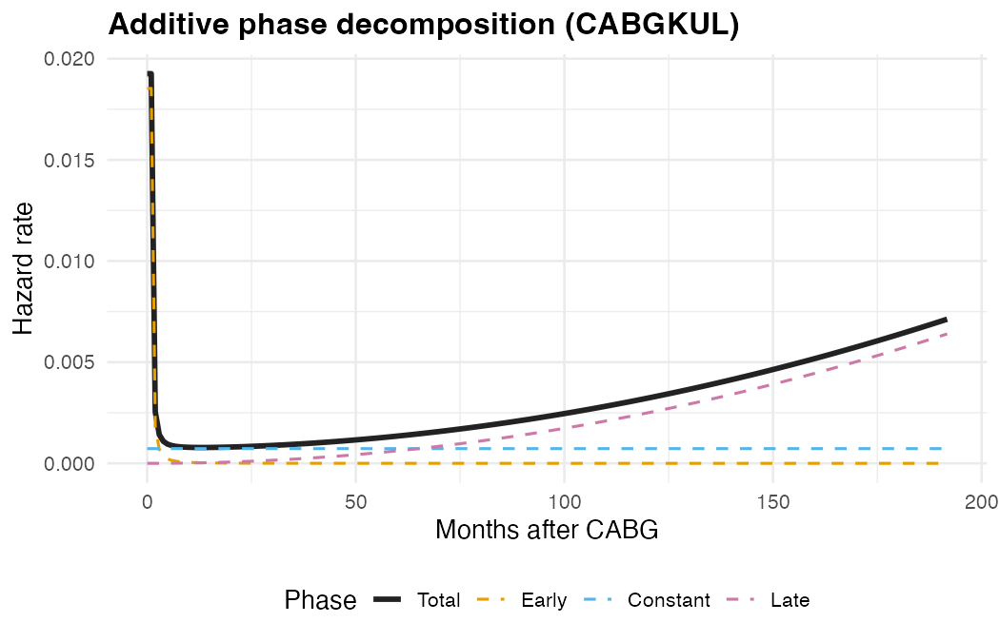
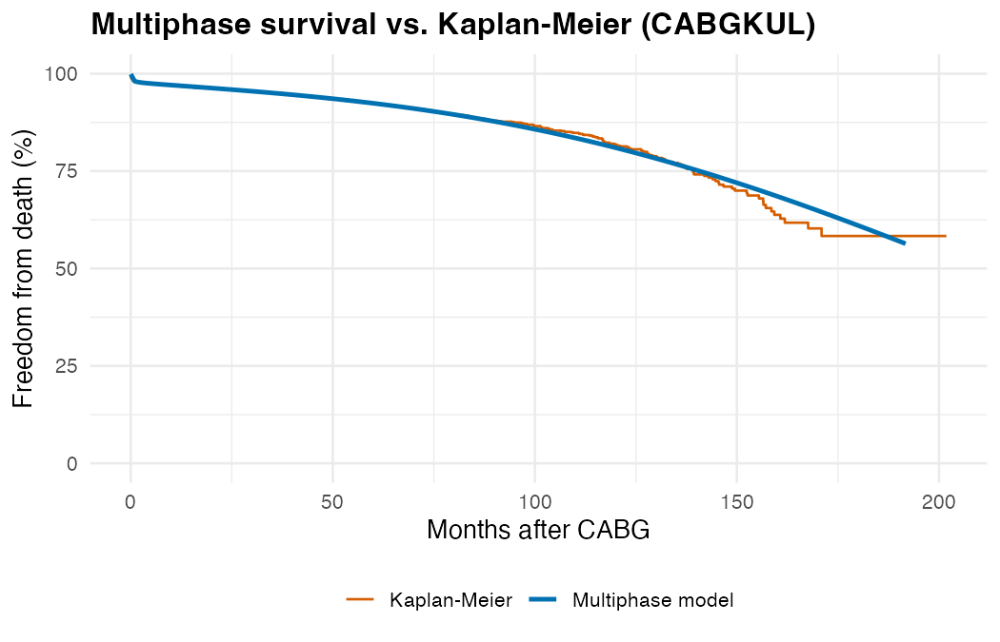

# TemporalHazard

<!-- badges: start -->
[](https://github.com/ehrlinger/temporal_hazard)
[](https://github.com/ehrlinger/temporal_hazard/actions/workflows/R-CMD-check.yaml)
[](https://app.codecov.io/gh/ehrlinger/temporal_hazard?branch=main)
[](https://github.com/ehrlinger/temporal_hazard/actions/workflows/lint.yaml)
[](https://ehrlinger.github.io/temporal_hazard/)

<!-- badges: end -->

**TemporalHazard** is a pure-R implementation of the multiphase parametric
hazard model of Blackstone, Naftel, and Turner (1986). It decomposes the
overall hazard of an event into additive temporal phases --- early, constant,
and late --- each governed by the generalized temporal decomposition family.
This structure captures real clinical risk patterns that standard single-distribution
models (Weibull, log-normal) cannot represent.

## Provenance and maintenance

The original SAS/C HAZARD code was developed at the University of Alabama at
Birmingham (UAB). The SAS/C code and this R package are currently developed
and maintained at The Cleveland Clinic Foundation. The R code in
TemporalHazard was wholly developed at The Cleveland Clinic Foundation.

## Why multiphase?

After cardiac surgery, the risk of death is not constant. It starts high in
the immediate post-operative period (early phase), settles to a low background
rate (constant phase), and eventually rises again as patients age (late phase).
A single Weibull curve forces a monotone shape; a multiphase model captures all
three regimes simultaneously.



The resulting survival curve closely tracks the nonparametric Kaplan-Meier estimate
while providing a smooth, parametric representation that supports covariate
adjustment, prediction, and extrapolation.



## Key capabilities

| Feature | Status |
|:---|:---:|
| Multi-phase hazard modeling (early, constant, late phases) | :white_check_mark: |
| Five parametric distributions (Weibull, exponential, log-logistic, log-normal, multiphase) | :white_check_mark: |
| Right, left, interval, and counting-process censoring | :white_check_mark: |
| Repeating events (epoch decomposition via `Surv(start, stop, event)`) | :white_check_mark: |
| Time-varying covariates (piecewise windows) | :white_check_mark: |
| Weighted events across all distributions | :white_check_mark: |
| Automatic stepwise covariate selection (forward, backward, stepwise; Wald or AIC) | :white_check_mark: |
| Conservation of Events theorem for numerically stable parameter estimation | :white_check_mark: |
| Covariance and correlation matrix estimation | :white_check_mark: |
| Delta-method confidence limits on `predict()` (`se.fit = TRUE`) | :white_check_mark: |
| Seven `hzr_*` utility functions (Kaplan-Meier, Nelson, GOF, deciles, calibration, bootstrap, competing risks) | :white_check_mark: |

:white_check_mark: = implemented | :construction: = planned

## Installation

```r
# Install from GitHub (requires remotes or devtools)
install.packages("remotes")
remotes::install_github("ehrlinger/temporal_hazard")
```

TemporalHazard requires R >= 4.1.0 and depends on the
[survival](https://CRAN.R-project.org/package=survival) package.
Optional packages for visualization and vignettes include ggplot2, numDeriv,
and quarto.

## Quick start

### Single-phase model

```r
library(TemporalHazard)
data(cabgkul)

# Intercept-only Weibull on 5,880 CABG patients
fit <- hazard(
  survival::Surv(int_dead, dead) ~ 1,
  data  = cabgkul,
  dist  = "weibull",
  theta = c(mu = 0.10, nu = 1.0),
  fit   = TRUE
)
summary(fit)
```

### Multiphase model

```r
# Three-phase additive hazard decomposition
fit_mp <- hazard(
  survival::Surv(int_dead, dead) ~ 1,
  data   = cabgkul,
  dist   = "multiphase",
  phases = list(
    early    = hzr_phase("cdf", t_half = 0.2, nu = 1, m = 1,
                          fixed = "shapes"),
    constant = hzr_phase("constant"),
    late     = hzr_phase("g3",  tau = 1, gamma = 3, alpha = 1, eta = 1,
                          fixed = "shapes")
  ),
  fit = TRUE
)
summary(fit_mp)

# Per-phase decomposition of cumulative hazard
t_grid <- seq(0.01, max(cabgkul$int_dead) * 0.9, length.out = 200)
predict(fit_mp, newdata = data.frame(time = t_grid),
        type = "cumulative_hazard", decompose = TRUE)
```

Each phase is specified with `hzr_phase()`, which sets the temporal shape
type and starting values. The optimizer estimates both the phase-specific
scale parameters and shape parameters jointly. Covariates are supported via
the formula interface (see `vignette("fitting-hazard-models")`).

## Documentation

- **[Clinical Analysis Walkthrough](https://ehrlinger.github.io/temporal_hazard/articles/clinical-analysis-walkthrough.html)** --- complete end-to-end workflow from Kaplan-Meier baseline through validated multivariable model.
- **[Getting Started](https://ehrlinger.github.io/temporal_hazard/articles/getting-started.html)** --- first fit-predict workflow with visualizations.
- **[Fitting Hazard Models](https://ehrlinger.github.io/temporal_hazard/articles/fitting-hazard-models.html)** --- intercept-only through multiphase and multi-endpoint models.
- **[Prediction & Visualization](https://ehrlinger.github.io/temporal_hazard/articles/prediction-visualization.html)** --- survival curves, decomposed hazard, patient-specific risk profiles.
- **[Inference & Diagnostics](https://ehrlinger.github.io/temporal_hazard/articles/inference-diagnostics.html)** --- bootstrap CIs, decile-of-risk validation, sensitivity analysis.
- **[Mathematical Foundations](https://ehrlinger.github.io/temporal_hazard/articles/mf-mathematical-foundations.html)** --- the generalized decomposition, additive hazard model, censoring likelihood, and time-varying covariates.
- **[Package Architecture](https://ehrlinger.github.io/temporal_hazard/articles/ar-architecture.html)** --- internal design, golden fixtures, and dataset catalog.
- **[SAS-to-R Migration](https://ehrlinger.github.io/temporal_hazard/articles/sas-to-r-migration.html)** --- statement-by-statement mapping from SAS HAZARD syntax.

## Development

```r
install.packages(c("devtools", "roxygen2", "pkgdown", "testthat"))
devtools::install_deps(dependencies = TRUE)
devtools::test()
devtools::check()
```

GitHub Actions runs multi-platform `R CMD check` on every push and pull request. Coverage is published to Codecov and the pkgdown site deploys automatically from `main`.

See [`inst/dev/DEVELOPMENT-PLAN.md`](inst/dev/DEVELOPMENT-PLAN.md) for the full roadmap covering the C/SAS migration, multiphase implementation, CRAN release, and planned feature parity work.
See [`.github/BRANCH_PROTECTION.md`](.github/BRANCH_PROTECTION.md) for recommended required-check settings that block merges when CI fails.
