# Complete Clinical Analysis Walkthrough

This vignette demonstrates the **complete analytical workflow** for a
temporal parametric hazard analysis, mirroring the disciplined sequence
used in the original SAS HAZARD system:

1.  **Nonparametric baseline** — Kaplan-Meier life table
2.  **Shape fitting** — start simple, build to multiphase
3.  **Variable screening** — calibrate covariates, assess functional
    form
4.  **Multivariable model** — covariate entry with fixed shapes
5.  **Prediction** — patient-specific risk profiles
6.  **Validation** — decile-of-risk calibration

This corresponds to the SAS programs `ac.*` → `hz.*` → `lg.*` → `hm.*` →
`hp.*` → `hs.*`.

We use the **AVC** dataset (310 patients, atrioventricular canal repair)
which has rich covariates and two identifiable hazard phases.

## 1 Data preparation

``` r
library(TemporalHazard)
if (has_ggplot2) library(ggplot2)

data(avc)
avc <- na.omit(avc)
str(avc)
#> 'data.frame':    305 obs. of  11 variables:
#>  $ study   : chr  "001C" "002C" "004C" "005C" ...
#>  $ status  : int  3 3 1 2 2 3 1 1 3 3 ...
#>  $ inc_surg: int  4 3 2 3 1 2 3 2 3 3 ...
#>  $ opmos   : num  9.46 34.07 51.58 55 60.65 ...
#>  $ age     : num  69.2 53.7 286.1 154.6 48.4 ...
#>  $ mal     : int  0 0 0 1 0 0 0 0 0 0 ...
#>  $ com_iv  : int  1 1 1 1 1 1 1 1 1 1 ...
#>  $ orifice : int  0 0 0 0 0 0 0 0 0 0 ...
#>  $ dead    : int  1 1 0 0 0 0 0 0 0 1 ...
#>  $ int_dead: num  0.0534 0.3778 91.5337 111.608 106.8112 ...
#>  $ op_age  : num  654 1828 14759 8505 2933 ...
#>  - attr(*, "na.action")= 'omit' Named int [1:5] 12 90 138 144 146
#>   ..- attr(*, "names")= chr [1:5] "12" "90" "138" "144" ...
```

The AVC dataset contains 305 patients after removing incomplete cases.
Key covariates include age at repair (`age`, in months), NYHA functional
class (`status`), presence of malalignment (`mal`), and interventricular
communication (`com_iv`).

## 2 Step 1: Nonparametric baseline

Before fitting any parametric model, establish the empirical survival
curve using the Kaplan-Meier estimator. This is the benchmark against
which all parametric fits will be compared.

``` r
km <- survival::survfit(survival::Surv(int_dead, dead) ~ 1, data = avc)

km_df <- data.frame(
  time     = km$time,
  survival = km$surv * 100,
  lower    = km$lower * 100,
  upper    = km$upper * 100
)

ggplot(km_df, aes(time, survival)) +
  geom_step(colour = "#D55E00", linewidth = 0.8) +
  geom_ribbon(aes(ymin = lower, ymax = upper),
              stat = "identity", alpha = 0.15, fill = "#D55E00") +
  labs(x = "Months after AVC repair", y = "Survival (%)") +
  coord_cartesian(ylim = c(0, 100)) +
  theme_minimal()
#> Warning: Removed 1 row containing missing values or values outside the scale range
#> (`geom_ribbon()`).
```

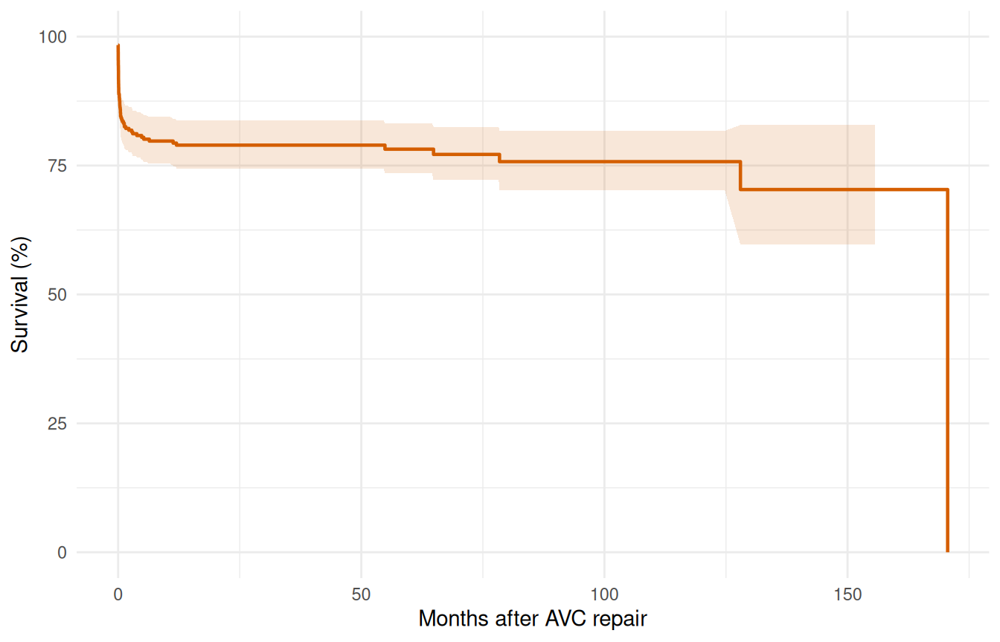

Figure 1: Kaplan-Meier survival estimate for AVC patients (n = 310)

The KM curve shows a sharp early drop (operative mortality) followed by
a roughly constant attrition rate. This two-phase pattern suggests an
early CDF phase plus a constant phase — no obvious late rising hazard.

## 3 Step 2: Shape fitting — simple to complex

### 3.1 2a. Single-phase Weibull

Start with the simplest parametric model to establish a baseline fit.

``` r
fit_weib <- hazard(
  survival::Surv(int_dead, dead) ~ 1,
  data  = avc,
  dist  = "weibull",
  theta = c(mu = 0.05, nu = 0.5),
  fit   = TRUE
)
summary(fit_weib)
#> hazard model summary
#>   observations: 305 
#>   predictors:   0 
#>   dist:         weibull 
#>   engine:       native-r-m2 
#>   converged:    TRUE 
#>   log-lik:      -234.775 
#>   evaluations: fn=34, gr=9
#> 
#> Coefficients:
#>        estimate   std_error   z_stat      p_value
#> mu 3.498711e-05 0.000034554 1.012534 3.112826e-01
#> nu 2.043444e-01 0.023324005 8.761118 1.933229e-18
```

The Weibull forces a monotone hazard shape. Let’s overlay it on the
Kaplan-Meier to see where it fits well and where it doesn’t.

``` r
t_grid <- seq(0.01, max(avc$int_dead) * 0.9, length.out = 200)
surv_weib <- predict(fit_weib,
                     newdata = data.frame(time = t_grid),
                     type = "survival") * 100

ggplot() +
  geom_step(data = km_df, aes(time, survival),
            colour = "#D55E00", linewidth = 0.6) +
  geom_line(data = data.frame(time = t_grid, survival = surv_weib),
            aes(time, survival), colour = "#0072B2", linewidth = 0.8) +
  labs(x = "Months after AVC repair", y = "Survival (%)") +
  coord_cartesian(ylim = c(0, 100)) +
  theme_minimal()
```

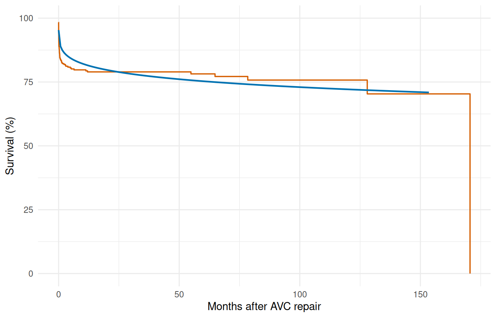

Figure 2: Single Weibull vs. Kaplan-Meier

The single Weibull typically misses the sharp early drop — it
compromises between the early and late time frames.

### 3.2 2b. Two-phase model (early CDF + constant)

Based on the KM shape, fit an early phase (resolving operative risk)
plus a constant phase (background attrition).

``` r
fit_mp <- hazard(
  survival::Surv(int_dead, dead) ~ 1,
  data   = avc,
  dist   = "multiphase",
  phases = list(
    early    = hzr_phase("cdf", t_half = 0.5, nu = 1, m = 1,
                          fixed = "shapes"),
    constant = hzr_phase("constant")
  ),
  fit     = TRUE,
  control = list(n_starts = 5, maxit = 1000)
)
summary(fit_mp)
#> Multiphase hazard model (2 phases)
#>   observations: 305 
#>   predictors:   0 
#>   dist:         multiphase 
#>   phase 1:      early - cdf (early risk)
#>   phase 2:      constant - constant (flat rate)
#>   engine:       native-r-m2 
#>   converged:    TRUE 
#>   log-lik:      -228.029 
#>   evaluations: fn=32, gr=10
#> 
#> Coefficients (internal scale):
#> 
#>   Phase: early (cdf)
#>                estimate  std_error    z_stat       p_value
#>   log_mu     -1.4132735 0.04410012 -32.04693 2.422767e-225
#>   log_t_half -0.6931472         NA        NA            NA
#>   nu          1.0000000         NA        NA            NA
#>   m           1.0000000         NA        NA            NA
#> 
#>   Phase: constant (constant)
#>           estimate std_error z_stat p_value
#>   log_mu -7.609476        NA     NA      NA
```

Note the use of `fixed = "shapes"` — we fix the temporal shape
parameters and only estimate the scale (log_mu) for each phase. This
matches the standard HAZARD workflow: shapes are set from clinical
knowledge or preliminary exploration, then scales and covariates are
estimated.

``` r
surv_mp <- predict(fit_mp,
                   newdata = data.frame(time = t_grid),
                   type = "survival") * 100

ggplot() +
  geom_step(data = km_df, aes(time, survival),
            colour = "#D55E00", linewidth = 0.6) +
  geom_line(data = data.frame(time = t_grid, survival = surv_mp),
            aes(time, survival), colour = "#0072B2", linewidth = 0.8) +
  labs(x = "Months after AVC repair", y = "Survival (%)") +
  coord_cartesian(ylim = c(0, 100)) +
  theme_minimal()
```

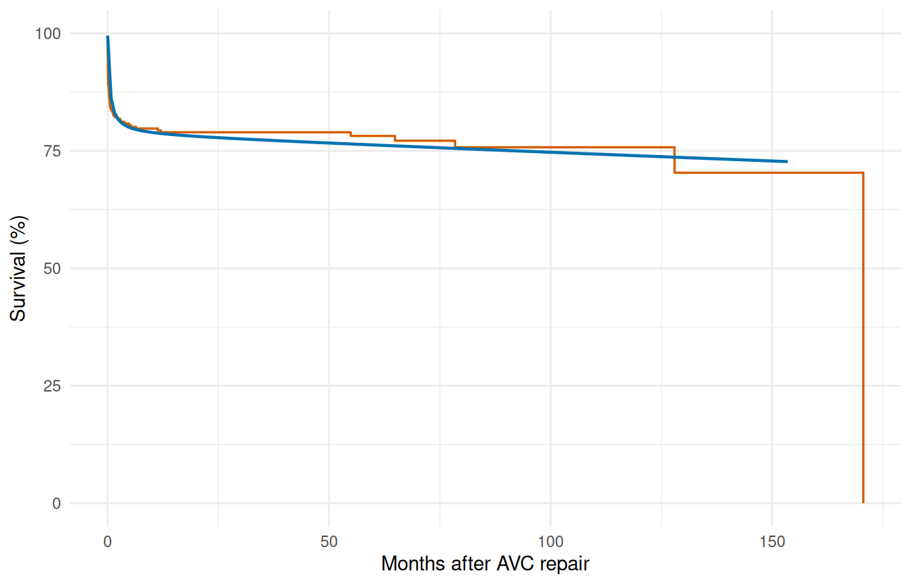

Figure 3: Two-phase parametric model vs. Kaplan-Meier

### 3.3 2c. Decomposed hazard

Visualize the per-phase contributions to the cumulative hazard.

``` r
decomp <- predict(fit_mp,
                  newdata = data.frame(time = t_grid),
                  type = "cumulative_hazard",
                  decompose = TRUE)

decomp_df <- data.frame(
  time  = t_grid,
  total = decomp[, "total"],
  early = decomp[, "early"],
  const = decomp[, "constant"]
)

ggplot(decomp_df, aes(x = time)) +
  geom_line(aes(y = total), linewidth = 0.9, colour = "black") +
  geom_line(aes(y = early), linewidth = 0.7, colour = "#E69F00",
            linetype = "dashed") +
  geom_line(aes(y = const), linewidth = 0.7, colour = "#56B4E9",
            linetype = "dashed") +
  labs(x = "Months after AVC repair", y = "Cumulative hazard") +
  theme_minimal()
```

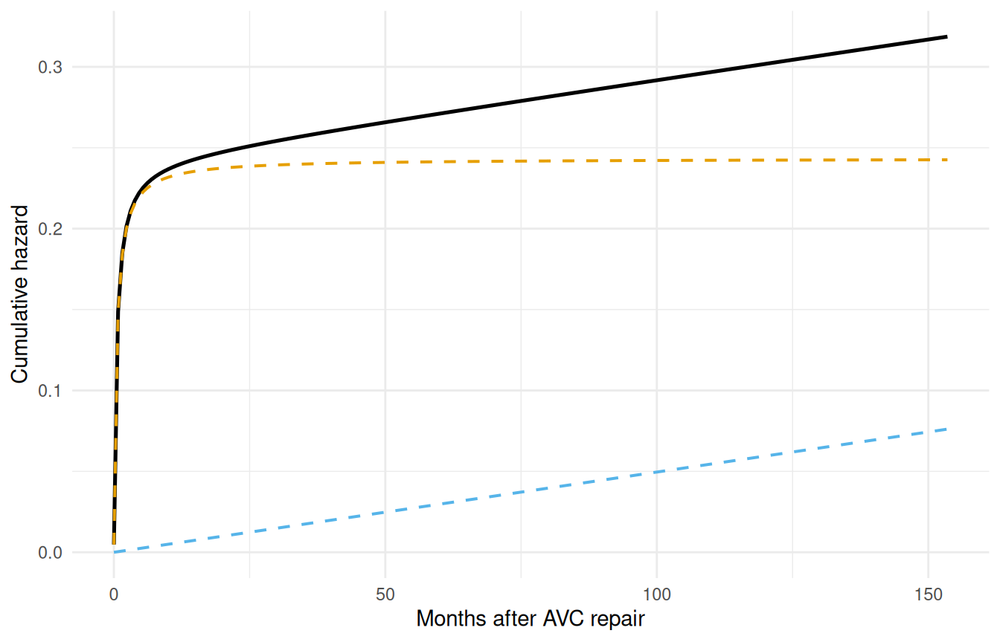

Figure 4: Phase decomposition of cumulative hazard

The early phase contributes most of its risk in the first few months,
then levels off. The constant phase accumulates linearly over time.

## 4 Step 3: Variable screening

Before entering covariates into the hazard model, screen them for
association with the outcome. This step corresponds to the `lg.*`
programs in the SAS workflow.

### 4.1 3a. Univariable logistic screening

Use simple logistic regression of the event indicator on each covariate
to get a quick ranking by strength of association.

``` r
covariates <- c("age", "status", "mal", "com_iv", "orifice",
                "inc_surg", "opmos")

screen_results <- data.frame(
  variable = covariates,
  coef     = numeric(length(covariates)),
  p_value  = numeric(length(covariates))
)

for (i in seq_along(covariates)) {
  v <- covariates[i]
  fml <- as.formula(paste("dead ~", v))
  lg <- glm(fml, data = avc, family = binomial)
  s <- summary(lg)$coefficients
  if (nrow(s) >= 2) {
    screen_results$coef[i] <- s[2, 1]
    screen_results$p_value[i] <- s[2, 4]
  }
}

screen_results <- screen_results[order(screen_results$p_value), ]
screen_results$significant <- ifelse(screen_results$p_value < 0.05,
                                      "*", "")
screen_results
#>   variable         coef      p_value significant
#> 2   status  0.965232352 2.538365e-08           *
#> 4   com_iv  1.413423027 4.916970e-06           *
#> 3      mal  1.027084963 6.478986e-04           *
#> 1      age -0.004914258 1.683468e-03           *
#> 5  orifice  1.635755221 3.440489e-03           *
#> 6 inc_surg  0.293339962 1.144172e-02           *
#> 7    opmos  0.001458721 6.552347e-01
```

### 4.2 3b. Functional form assessment

For continuous covariates that appear significant, examine whether the
relationship with outcome is linear on the logit scale using LOESS
smoothing. Non-linear patterns suggest a transformation may be needed.

``` r
ggplot(avc, aes(age, dead)) +
  geom_point(alpha = 0.2, size = 1) +
  geom_smooth(method = "loess", formula = y ~ x, se = TRUE,
              colour = "#0072B2", fill = "#0072B2", alpha = 0.2) +
  labs(x = "Age at repair (months)", y = "P(death)") +
  theme_minimal()
```

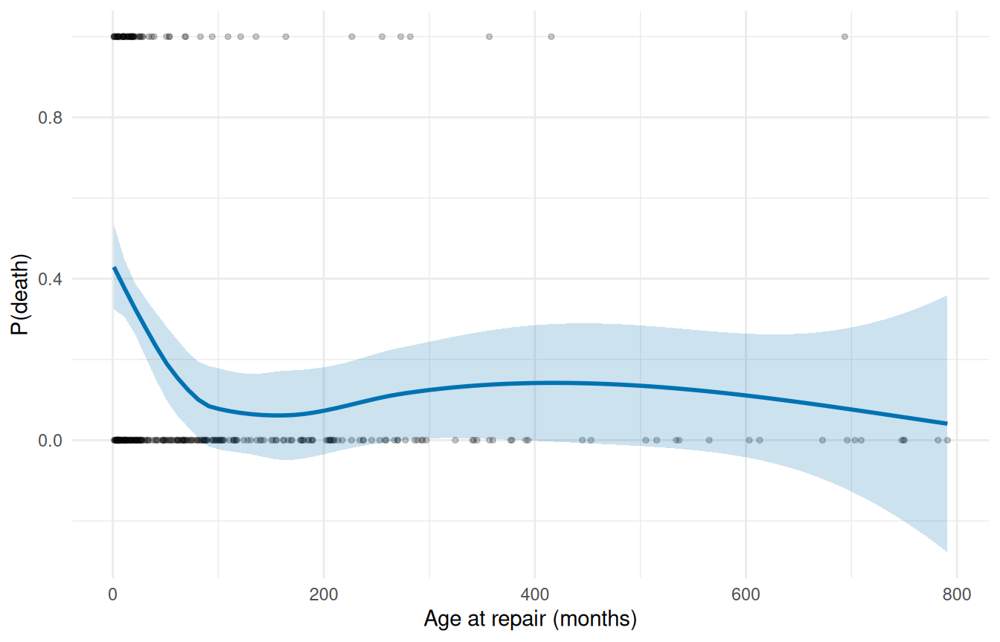

Figure 5: LOESS smooth: age vs. mortality probability

If the LOESS curve is roughly linear (or monotone), the covariate can
enter the model untransformed. S-shaped or U-shaped curves suggest
transformations (log, quadratic) may improve the fit.

## 5 Step 4: Multivariable model

Enter the significant covariates into the two-phase hazard model. With
the current package, variable selection is done manually — identify the
promising covariates from screening, then fit the full model.

``` r
fit_mv <- hazard(
  survival::Surv(int_dead, dead) ~ age + status + mal + com_iv,
  data   = avc,
  dist   = "multiphase",
  phases = list(
    early    = hzr_phase("cdf", t_half = 0.5, nu = 1, m = 1,
                          fixed = "shapes"),
    constant = hzr_phase("constant")
  ),
  fit     = TRUE,
  control = list(n_starts = 5, maxit = 1000)
)
summary(fit_mv)
#> Warning in sqrt(d): NaNs produced
#> Multiphase hazard model (2 phases)
#>   observations: 305 
#>   predictors:   4 
#>   dist:         multiphase 
#>   phase 1:      early - cdf (early risk)
#>   phase 2:      constant - constant (flat rate)
#>   engine:       native-r-m2 
#>   converged:    TRUE 
#>   log-lik:      -190.808 
#>   evaluations: fn=11, gr=1
#> 
#> Coefficients (internal scale):
#> 
#>   Phase: early (cdf)
#>                  estimate  std_error    z_stat     p_value
#>   log_mu     -3.605695584        NaN        NA          NA
#>   log_t_half -0.693147181         NA        NA          NA
#>   nu          1.000000000         NA        NA          NA
#>   m           1.000000000         NA        NA          NA
#>   age        -0.002934522 0.00146656 -2.000956 0.045397123
#>   status      0.619850638        NaN        NA          NA
#>   mal         0.467467697 0.17964265  2.602209 0.009262544
#>   com_iv      1.162696955        NaN        NA          NA
#> 
#>   Phase: constant (constant)
#>               estimate   std_error     z_stat    p_value
#>   log_mu -9.6560397496          NA         NA         NA
#>   age    -0.0008940274 0.002475644 -0.3611292 0.71800288
#>   status  1.0450950870 0.454449391  2.2996952 0.02146549
#>   mal     0.6012599050 1.088336795  0.5524576 0.58063489
#>   com_iv -1.0598349603 1.211734851 -0.8746426 0.38176838
```

The coefficient table shows phase-specific covariate effects. A positive
coefficient means higher hazard (worse prognosis). Interpretation:
covariates scale the phase-specific hazard multiplicatively via exp(x \*
beta).

## 6 Step 5: Prediction

### 6.1 5a. Baseline survival curve

Generate the survival curve for a reference patient (median age, NYHA
class 1, no malalignment, no interventricular communication).

``` r
ref_patient <- data.frame(
  time   = t_grid,
  age    = median(avc$age),
  status = 1,
  mal    = 0,
  com_iv = 0
)

surv_ref <- predict(fit_mv, newdata = ref_patient,
                    type = "survival") * 100

ggplot() +
  geom_step(data = km_df, aes(time, survival),
            colour = "#D55E00", linewidth = 0.6, alpha = 0.7) +
  geom_line(data = data.frame(time = t_grid, survival = surv_ref),
            aes(time, survival), colour = "#0072B2", linewidth = 0.8) +
  labs(x = "Months after AVC repair", y = "Survival (%)") +
  coord_cartesian(ylim = c(0, 100)) +
  theme_minimal()
```

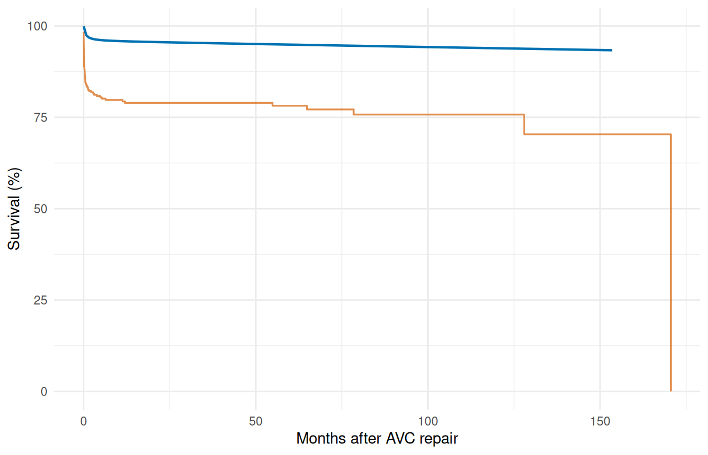

Figure 6: Reference patient survival with Kaplan-Meier overlay

### 6.2 5b. Sensitivity analysis — risk factor comparison

Compare survival curves for a low-risk vs. high-risk patient profile to
visualize the effect of covariates on long-term outcome.

``` r
low_risk <- data.frame(
  time   = t_grid,
  age    = quantile(avc$age, 0.25),
  status = 1,
  mal    = 0,
  com_iv = 0
)
#> Warning in data.frame(time = t_grid, age = quantile(avc$age, 0.25), status = 1,
#> : row names were found from a short variable and have been discarded

high_risk <- data.frame(
  time   = t_grid,
  age    = quantile(avc$age, 0.90),
  status = 4,
  mal    = 1,
  com_iv = 1
)
#> Warning in data.frame(time = t_grid, age = quantile(avc$age, 0.9), status = 4,
#> : row names were found from a short variable and have been discarded

surv_lo <- predict(fit_mv, newdata = low_risk, type = "survival") * 100
surv_hi <- predict(fit_mv, newdata = high_risk, type = "survival") * 100

sens_df <- data.frame(
  time = rep(t_grid, 2),
  survival = c(surv_lo, surv_hi),
  profile = rep(c("Low risk", "High risk"), each = length(t_grid))
)

ggplot(sens_df, aes(time, survival, colour = profile)) +
  geom_line(linewidth = 0.8) +
  scale_colour_manual(values = c("Low risk" = "#0072B2",
                                  "High risk" = "#D55E00")) +
  labs(x = "Months after AVC repair", y = "Survival (%)",
       colour = NULL) +
  coord_cartesian(ylim = c(0, 100)) +
  theme_minimal() +
  theme(legend.position = "bottom")
```

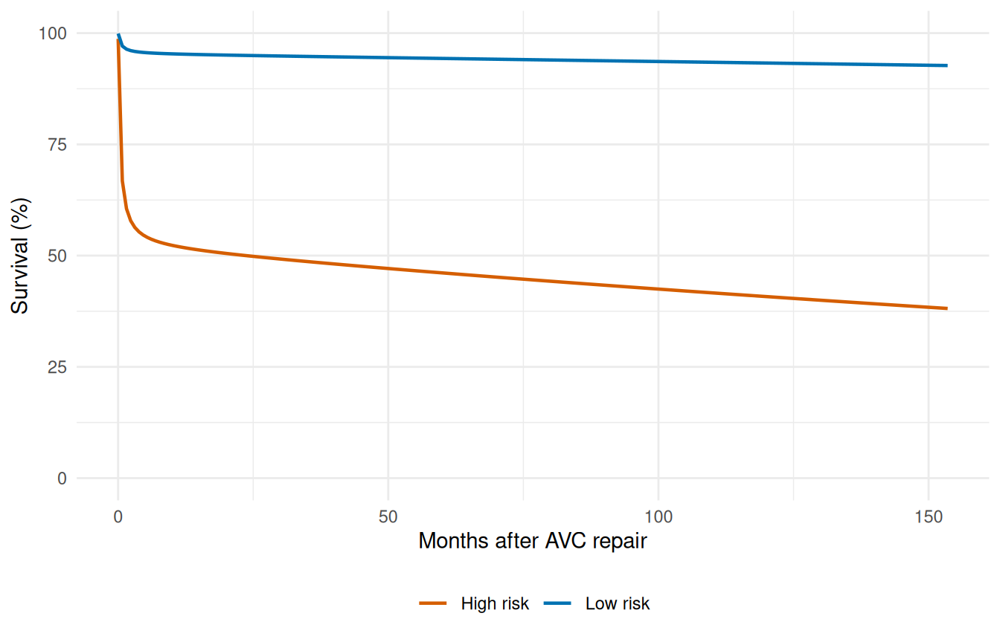

Figure 7: Survival by risk profile: low-risk (blue) vs. high-risk (red)

## 7 Step 6: Validation — decile-of-risk calibration

Partition patients into deciles by predicted risk and compare observed
vs. expected event rates. Good calibration means the two track each
other. This implements the workflow of the SAS `deciles.hazard.sas`
macro.

``` r
cal <- hzr_deciles(fit_mv, time = max(avc$int_dead))
print(cal)
#> Decile-of-risk calibration at time = 170.5826 
#> Included 68 observations (excluded 237 censored before horizon).
#> 10 groups, 68 observed events, 29.9 expected
#> 
#>  group n events expected observed_rate expected_rate chi_sq  p_value
#>      1 6      6    0.849             1         0.142 31.200 2.29e-08
#>      2 7      7    1.800             1         0.258 15.000 1.09e-04
#>      3 7      7    2.040             1         0.292 12.100 5.18e-04
#>      4 7      7    2.390             1         0.342  8.870 2.89e-03
#>      5 7      7    2.710             1         0.388  6.770 9.25e-03
#>      6 6      6    2.470             1         0.412  5.050 2.46e-02
#>      7 7      7    3.250             1         0.464  4.330 3.74e-02
#>      8 7      7    3.830             1         0.547  2.630 1.05e-01
#>      9 7      7    4.770             1         0.682  1.040 3.08e-01
#>     10 7      7    5.780             1         0.826  0.255 6.13e-01
#>  mean_survival mean_cumhaz
#>          0.858       0.153
#>          0.742       0.298
#>          0.708       0.345
#>          0.658       0.418
#>          0.612       0.491
#>          0.588       0.530
#>          0.536       0.624
#>          0.453       0.800
#>          0.318       1.150
#>          0.174       1.820
#> 
#> Overall: chi-sq = 87.2 on 9 df, p = 5.9e-15
```

``` r
ggplot(cal, aes(x = group)) +
  geom_col(aes(y = observed_rate), fill = "#56B4E9", alpha = 0.7) +
  geom_point(aes(y = expected_rate), colour = "#D55E00", size = 3) +
  geom_line(aes(y = expected_rate), colour = "#D55E00", linewidth = 0.5) +
  scale_x_continuous(breaks = seq_len(nrow(cal))) +
  labs(x = "Risk decile (1 = lowest)", y = "Event rate",
       caption = paste("Overall chi-sq =",
                        round(attr(cal, "overall")$chi_sq, 2),
                        ", p =",
                        format.pval(attr(cal, "overall")$p_value,
                                     digits = 3))) +
  theme_minimal()
```

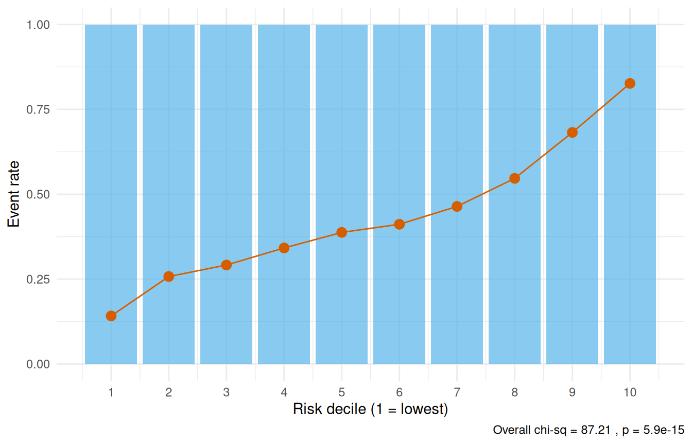

Figure 8: Decile calibration: observed (bars) vs. expected (points)
event rates

A non-significant overall chi-square statistic (p \> 0.05) indicates
adequate calibration — the model’s predictions are consistent with
observed event rates across the risk spectrum.

### 7.1 Conservation of events check

The conservation-of-events principle states that a well-fitting model
should predict the same total number of events as actually observed.
[`hzr_gof()`](https://ehrlinger.github.io/temporal_hazard/reference/hzr_gof.md)
tracks this cumulatively over time — the residual (expected minus
observed) should stay near zero.

``` r
gof <- hzr_gof(fit_mv)
print(gof)
#> Goodness-of-fit: observed vs. expected events
#> Distribution: multiphase  | n = 305 
#> 
#> Total observed events: 68 
#> Total expected events: 43.062 
#> Final residual (E - O): -24.938 
#> Conservation ratio (E/O): 0.633 
#> 
#> Use plot columns: time, km_surv, par_surv, cum_observed, cum_expected, residual
```

``` r
ggplot(gof, aes(x = time)) +
  geom_step(aes(y = km_surv * 100), colour = "#D55E00", linewidth = 0.6) +
  geom_line(aes(y = par_surv * 100), colour = "#0072B2", linewidth = 0.8) +
  labs(x = "Months after AVC repair", y = "Survival (%)") +
  coord_cartesian(ylim = c(0, 100)) +
  theme_minimal()
```

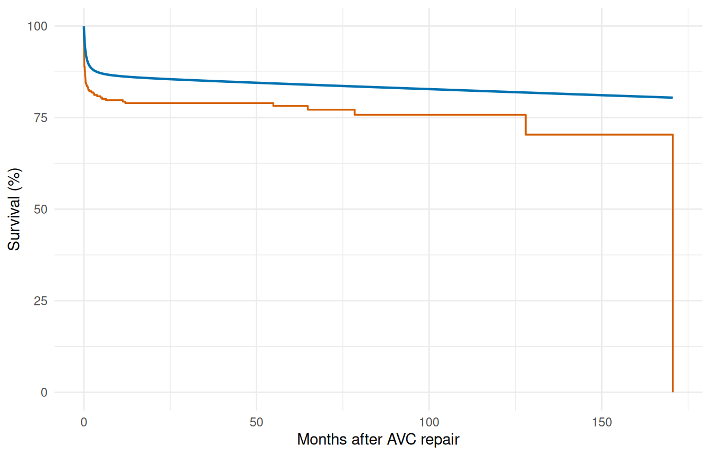

Figure 9: Parametric (blue) vs. Kaplan-Meier (orange) survival

``` r
ggplot(gof, aes(x = time)) +
  geom_line(aes(y = cum_observed), colour = "#D55E00", linewidth = 0.8) +
  geom_line(aes(y = cum_expected), colour = "#0072B2",
            linewidth = 0.8, linetype = "dashed") +
  labs(x = "Months after AVC repair", y = "Cumulative events") +
  theme_minimal()
```

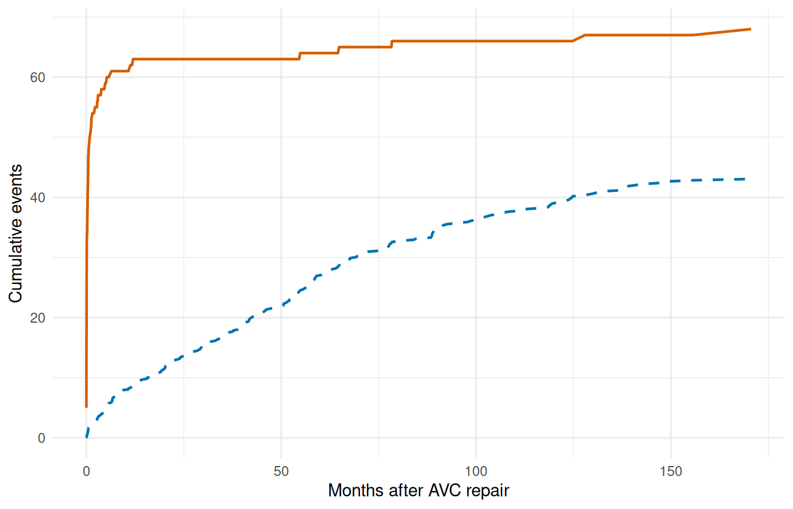

Figure 10: Cumulative observed (orange) vs. expected (blue) events

``` r
ggplot(gof, aes(x = time, y = residual)) +
  geom_line(linewidth = 0.7, colour = "grey30") +
  geom_hline(yintercept = 0, linetype = "dashed", colour = "grey60") +
  labs(x = "Months after AVC repair",
       y = "Residual (expected - observed)") +
  theme_minimal()
```

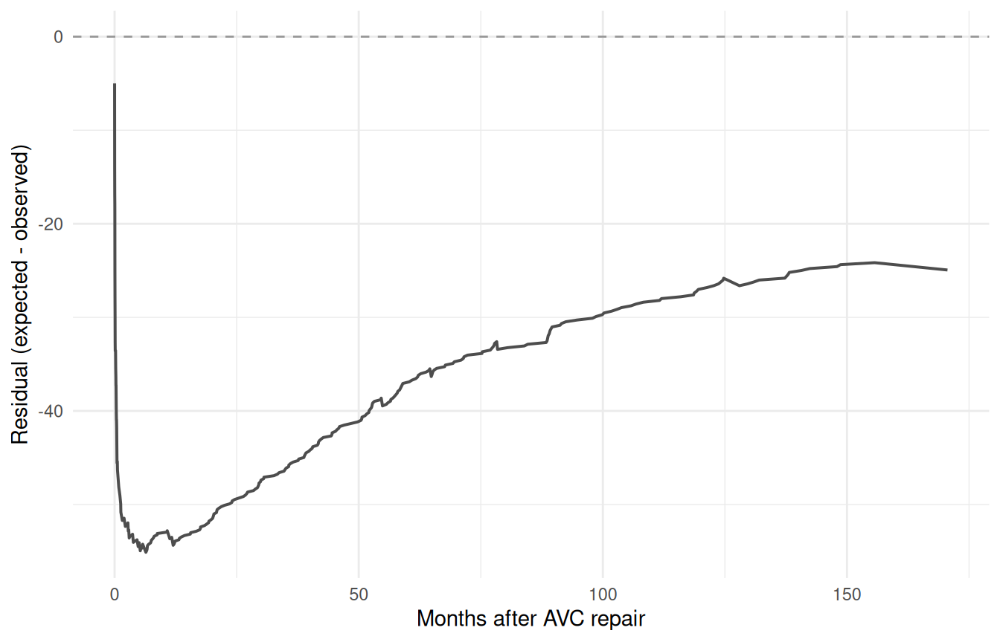

Figure 11: Conservation-of-events residual (expected minus observed)
over time

A residual that hovers near zero across the full time range indicates
the model conserves events well. Persistent positive residual means the
model overpredicts risk; persistent negative means it underpredicts.

## 8 Why not Cox regression?

The temporal parametric approach offers several advantages over Cox
proportional hazards for this type of analysis:

| Feature                              | Cox (`coxph`) |                                    TemporalHazard                                     |
|:-------------------------------------|:-------------:|:-------------------------------------------------------------------------------------:|
| Proportional hazards required        |      Yes      |                                          No                                           |
| Baseline hazard specified            |      No       |                                   Yes (parametric)                                    |
| Multiple hazard phases               |      No       |                                    Yes (additive)                                     |
| Patient-specific survival prediction |  Approximate  |                                         Exact                                         |
| Smooth extrapolation beyond data     |      No       |                                          Yes                                          |
| Conservation of events check         |      No       | Yes ([`hzr_gof()`](https://ehrlinger.github.io/temporal_hazard/reference/hzr_gof.md)) |
| Interval censoring                   | Not standard  |                                       Supported                                       |

The key insight is that many clinical outcomes exhibit
**non-proportional hazards**: the risk factors that dominate early
mortality (e.g., surgical complexity) differ from those driving late
attrition (e.g., age, comorbidity). The multiphase model captures this
naturally through phase-specific covariate effects.

## 9 Summary

The complete analytical workflow follows a disciplined sequence:

1.  **Kaplan-Meier baseline** — establish the empirical survival pattern
2.  **Shape fitting** — match the temporal shape, simple to complex
3.  **Variable screening** — logistic screening, LOESS functional form
4.  **Multivariable model** — enter covariates with fixed shapes
5.  **Prediction** — reference curves, sensitivity analysis
6.  **Validation** — decile calibration, conservation-of-events check

This sequence ensures that the temporal shape is established before
covariates are introduced, and that the final model is validated against
the observed data. See
[`vignette("getting-started")`](https://ehrlinger.github.io/temporal_hazard/articles/getting-started.md)
for the minimal API workflow and
[`vignette("mf-mathematical-foundations")`](https://ehrlinger.github.io/temporal_hazard/articles/mf-mathematical-foundations.md)
for the mathematical details.
