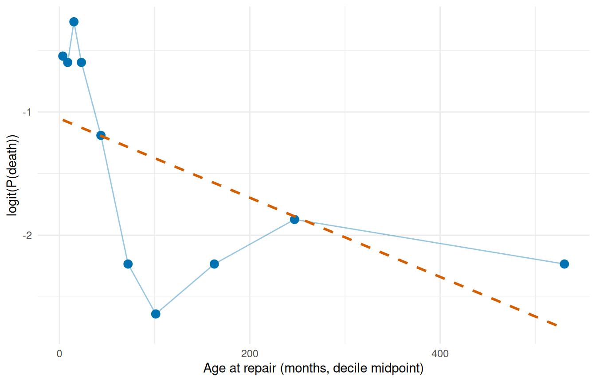

# Complete Clinical Analysis Walkthrough

The previous vignettes covered each piece of the analytical workflow in
isolation — how to fit a model, how to predict from it, how to validate
it. This vignette runs all of those pieces together on a single dataset,
in the order you’d actually run them in a real clinical analysis. The
point isn’t to introduce new functions; it’s to show how the pieces
chain into a disciplined sequence that turns raw covariates into a
fitted, validated, defensible hazard model.

The sequence mirrors the one in the original SAS HAZARD system, which
codified what cardiothoracic-surgery biostatisticians had been doing
informally for decades:

1.  **Nonparametric baseline** — Kaplan-Meier life table to see what the
    data is saying before any model intervenes.
2.  **Shape fitting** — start with a single-distribution Weibull, build
    up to a multiphase decomposition when the KM curve demands it.
3.  **Variable screening** — univariable association tests and
    calibration plots to decide which covariates enter the model and in
    what functional form.
4.  **Multivariable model** — covariates layered onto a hazard shape you
    already trust.
5.  **Prediction** — patient-specific risk profiles for clinical
    reporting and decision support.
6.  **Validation** — decile-of-risk calibration to verify the model is
    honest across the risk spectrum, not just on average.

This corresponds to the SAS programs `ac.*` → `hz.*` → `lg.*` → `hm.*` →
`hp.*` → `hs.*`. If you’re familiar with the SAS workflow, the section
structure should feel familiar; if not, treat this as the canonical
analytical sequence to follow on any new dataset.

We use the **AVC** dataset (310 patients, atrioventricular canal repair)
which has rich covariates and two identifiable hazard phases — fewer
phases than the 3-phase CABG example you’ve seen in other vignettes, but
with the covariate complexity needed to exercise the screening,
multivariable-fit, and validation steps.

## 1 Data preparation

Load the package and the AVC dataset, drop incomplete rows so the design
matrix is rectangular for the multivariable fits to come, and inspect
the resulting column types and ranges. The
[`na.omit()`](https://rdrr.io/r/stats/na.fail.html) step is conservative
— losing rows is a real cost — but for a walkthrough we want every later
fit to use the same patient set so the comparisons are apples-to-apples.

``` r

library(TemporalHazard)
if (has_ggplot2) library(ggplot2)

data(avc)
avc <- na.omit(avc)
str(avc)
#> 'data.frame':    305 obs. of  11 variables:
#>  $ study   : chr  "001C" "002C" "004C" "005C" ...
#>  $ status  : int  3 3 1 2 2 3 1 1 3 3 ...
#>  $ inc_surg: int  4 3 2 3 1 2 3 2 3 3 ...
#>  $ opmos   : num  9.46 34.07 51.58 55 60.65 ...
#>  $ age     : num  69.2 53.7 286.1 154.6 48.4 ...
#>  $ mal     : int  0 0 0 1 0 0 0 0 0 0 ...
#>  $ com_iv  : int  1 1 1 1 1 1 1 1 1 1 ...
#>  $ orifice : int  0 0 0 0 0 0 0 0 0 0 ...
#>  $ dead    : int  1 1 0 0 0 0 0 0 0 1 ...
#>  $ int_dead: num  0.0534 0.3778 91.5337 111.608 106.8112 ...
#>  $ op_age  : num  654 1828 14759 8505 2933 ...
#>  - attr(*, "na.action")= 'omit' Named int [1:5] 12 90 138 144 146
#>   ..- attr(*, "names")= chr [1:5] "12" "90" "138" "144" ...
```

The AVC dataset contains 305 patients after removing incomplete cases.
Key covariates include age at repair (`age`, in months), NYHA functional
class (`status`), presence of malalignment (`mal`), and interventricular
communication (`com_iv`).

## 2 Step 1: Nonparametric baseline

Before fitting any parametric model, establish the empirical survival
curve using the Kaplan-Meier estimator. This is the benchmark against
which all parametric fits will be compared.

[`hzr_kaplan()`](https://ehrlinger.github.io/temporal_hazard/reference/hzr_kaplan.md)
wraps
[`survival::survfit()`](https://rdrr.io/pkg/survival/man/survfit.html)
and adds logit-transformed exact confidence limits that respect the
`[0, 1]` boundary — more accurate in the tails than the default
Greenwood intervals. This matches the SAS `kaplan.sas` macro output
structure.

``` r

km <- hzr_kaplan(time = avc$int_dead, status = avc$dead)
head(km)
#> Kaplan-Meier estimate with logit confidence limits
#> Events: 18  | Time points: 6 
#> Survival range: 0.941 to 0.9836 
#> RMST at last event: 0.0472 
#> 
#>         time n_risk n_event n_censor survival std_err cl_lower cl_upper cumhaz
#>  0.001368954    305       5        0   0.9836  0.0073   0.9612   0.9932 0.0165
#>  0.002737907    300       2        0   0.9770  0.0086   0.9527   0.9890 0.0232
#>  0.008213721    298       2        0   0.9705  0.0097   0.9443   0.9846 0.0300
#>  0.016427440    296       5        0   0.9541  0.0120   0.9240   0.9726 0.0470
#>  0.032854880    291       3        0   0.9443  0.0131   0.9122   0.9651 0.0574
#>  0.049282330    288       1        0   0.9410  0.0135   0.9083   0.9625 0.0608
#>   hazard density   life
#>  12.0744 11.9752 0.0014
#>   4.8862  4.7901 0.0027
#>   1.2298  1.1975 0.0081
#>   2.0741  1.9959 0.0160
#>   0.6308  0.5988 0.0317
#>   0.2117  0.1996 0.0472
```

The returned data frame is the life table: one row per event time with
`n_risk`, `n_event`, `survival`, logit-transformed 95% CLs (`cl_lower` /
`cl_upper`), and a KM-based cumulative hazard (`-log(survival)` — use
[`hzr_nelson()`](https://ehrlinger.github.io/temporal_hazard/reference/hzr_nelson.md)
if you need the Nelson-Aalen estimator instead). Plotting just requires
the survival column:

``` r

km_df <- data.frame(
  time     = km$time,
  survival = km$survival * 100,
  lower    = km$cl_lower * 100,
  upper    = km$cl_upper * 100
)

ggplot(km_df, aes(time, survival)) +
  geom_step(colour = "#D55E00", linewidth = 0.8) +
  geom_ribbon(aes(ymin = lower, ymax = upper),
              stat = "identity", alpha = 0.15, fill = "#D55E00") +
  labs(x = "Months after AVC repair", y = "Survival (%)") +
  coord_cartesian(ylim = c(0, 100)) +
  theme_minimal()
```


Figure 1: Kaplan-Meier survival estimate for AVC patients (n = 310)

The KM curve shows a sharp early drop (operative mortality) followed by
a roughly constant attrition rate. This two-phase pattern suggests an
early CDF phase plus a constant phase — no obvious late rising hazard.

## 3 Step 2: Shape fitting — simple to complex

### 3.1 2a. Single-phase Weibull

The discipline here is to start with the simplest parametric model and
earn any added complexity. A single-distribution Weibull intercept-only
fit gives us a smooth two-parameter curve to compare against the KM
baseline. If the Weibull tracks the KM step function reasonably well, we
may be done; if it can’t, the gap tells us exactly where a richer model
needs to go.

``` r

fit_weib <- hazard(
  survival::Surv(int_dead, dead) ~ 1,
  data  = avc,
  dist  = "weibull",
  theta = c(mu = 0.05, nu = 0.5),
  fit   = TRUE
)
summary(fit_weib)
#> hazard model summary
#>   observations: 305 
#>   predictors:   0 
#>   dist:         weibull 
#>   engine:       native-r-m2 
#>   converged:    TRUE 
#>   log-lik:      -234.775 
#>   evaluations: fn=34, gr=9
#> 
#> Coefficients:
#>        estimate   std_error   z_stat      p_value
#> mu 3.498711e-05 0.000034554 1.012534 3.112826e-01
#> nu 2.043444e-01 0.023324005 8.761118 1.933229e-18
```

The Weibull forces a monotone hazard shape. Let’s overlay it on the
Kaplan-Meier to see where it fits well and where it doesn’t.

``` r

t_grid <- seq(0.01, max(avc$int_dead) * 0.9, length.out = 200)
surv_weib <- predict(fit_weib,
                     newdata = data.frame(time = t_grid),
                     type = "survival") * 100

ggplot() +
  geom_step(data = km_df, aes(time, survival),
            colour = "#D55E00", linewidth = 0.6) +
  geom_line(data = data.frame(time = t_grid, survival = surv_weib),
            aes(time, survival), colour = "#0072B2", linewidth = 0.8) +
  labs(x = "Months after AVC repair", y = "Survival (%)") +
  coord_cartesian(ylim = c(0, 100)) +
  theme_minimal()
```


Figure 2: Single Weibull vs. Kaplan-Meier

The single Weibull typically misses the sharp early drop — it
compromises between the early and late time frames.

### 3.2 2b. Two-phase model (early CDF + constant)

The KM curve drops steeply in the first few months — operative mortality
— and then settles into a roughly linear decline. The Weibull tried to
capture both with one shape and ended up compromising. Splitting the
hazard into two phases lets each mechanism have its own
parameterization: an `"cdf"` early phase that saturates as operative
risk resolves, plus a `"constant"` phase that carries the steady
background attrition. Two phases is what AVC actually needs; CABG with
longer follow-up would need a third late-rising phase to handle graft
deterioration, but the AVC follow-up window doesn’t extend far enough to
identify one.

``` r

fit_mp <- hazard(
  survival::Surv(int_dead, dead) ~ 1,
  data   = avc,
  dist   = "multiphase",
  phases = list(
    early    = hzr_phase("cdf", t_half = 0.5, nu = 1, m = 1,
                          fixed = "shapes"),
    constant = hzr_phase("constant")
  ),
  fit     = TRUE,
  control = list(n_starts = 5, maxit = 1000)
)
#> Warning in .hzr_optim_generic(logl_fn = logl_fn, gradient_fn = gradient_fn, :
#> hessian_fn returned a non-conformant result; using numerical Hessian
#> Warning in .hzr_optim_generic(logl_fn = logl_fn, gradient_fn = gradient_fn, :
#> hessian_fn returned a non-conformant result; using numerical Hessian
#> Warning in .hzr_optim_generic(logl_fn = logl_fn, gradient_fn = gradient_fn, :
#> hessian_fn returned a non-conformant result; using numerical Hessian
#> Warning in .hzr_optim_generic(logl_fn = logl_fn, gradient_fn = gradient_fn, :
#> hessian_fn returned a non-conformant result; using numerical Hessian
#> Warning in .hzr_optim_generic(logl_fn = logl_fn, gradient_fn = gradient_fn, :
#> hessian_fn returned a non-conformant result; using numerical Hessian
summary(fit_mp)
#> Multiphase hazard model (2 phases)
#>   observations: 305 
#>   predictors:   0 
#>   dist:         multiphase 
#>   phase 1:      early - cdf (early risk)
#>   phase 2:      constant - constant (flat rate)
#>   engine:       native-r-m2 
#>   converged:    TRUE 
#>   log-lik:      -228.029 
#>   evaluations: fn=32, gr=10
#> 
#> Coefficients (internal scale):
#> 
#>   Phase: early (cdf)
#>                estimate std_error    z_stat     p_value
#>   log_mu     -1.4132735 0.1290435 -10.95192 6.50568e-28
#>   log_t_half -0.6931472        NA        NA          NA
#>   nu          1.0000000        NA        NA          NA
#>   m           1.0000000        NA        NA          NA
#> 
#>   Phase: constant (constant)
#>           estimate std_error    z_stat      p_value
#>   log_mu -7.609476 0.4495827 -16.92564 2.911483e-64
```

Note the use of `fixed = "shapes"` — we fix the temporal shape
parameters and only estimate the scale (log_mu) for each phase. This
matches the standard HAZARD workflow: shapes are set from clinical
knowledge or preliminary exploration, then scales and covariates are
estimated.

``` r

surv_mp <- predict(fit_mp,
                   newdata = data.frame(time = t_grid),
                   type = "survival") * 100

ggplot() +
  geom_step(data = km_df, aes(time, survival),
            colour = "#D55E00", linewidth = 0.6) +
  geom_line(data = data.frame(time = t_grid, survival = surv_mp),
            aes(time, survival), colour = "#0072B2", linewidth = 0.8) +
  labs(x = "Months after AVC repair", y = "Survival (%)") +
  coord_cartesian(ylim = c(0, 100)) +
  theme_minimal()
```


Figure 3: Two-phase parametric model vs. Kaplan-Meier

### 3.3 2c. Decomposed hazard

The overlay plot shows the *total* fit tracks KM well, but it doesn’t
show whether each phase is doing the job we asked of it. Decomposing the
cumulative hazard into per-phase contributions is the diagnostic that
answers that question: the early phase should account for most of the
steep early drop, the constant phase should carry the rest, and neither
phase should be doing implausible work in the wrong time window.

``` r

decomp <- predict(fit_mp,
                  newdata = data.frame(time = t_grid),
                  type = "cumulative_hazard",
                  decompose = TRUE)

decomp_df <- data.frame(
  time  = t_grid,
  total = decomp[, "total"],
  early = decomp[, "early"],
  const = decomp[, "constant"]
)

ggplot(decomp_df, aes(x = time)) +
  geom_line(aes(y = total), linewidth = 0.9, colour = "black") +
  geom_line(aes(y = early), linewidth = 0.7, colour = "#E69F00",
            linetype = "dashed") +
  geom_line(aes(y = const), linewidth = 0.7, colour = "#56B4E9",
            linetype = "dashed") +
  labs(x = "Months after AVC repair", y = "Cumulative hazard") +
  theme_minimal()
```


Figure 4: Phase decomposition of cumulative hazard

The early phase contributes most of its risk in the first few months,
then levels off. The constant phase accumulates linearly over time.

## 4 Step 3: Variable screening

Before entering covariates into the hazard model, screen them for
association with the outcome. This step corresponds to the `lg.*`
programs in the SAS workflow.

### 4.1 3a. Univariable logistic screening

The cheapest screening tool we have is a univariable logistic regression
of the event indicator on each covariate. It throws away the
time-to-event structure but it answers a binary question quickly: does
this covariate have *any* association with mortality at all? Covariates
whose univariable p-value is huge will not suddenly become significant
in the multivariable hazard model either — those can be deprioritized.
Covariates with small univariable p-values deserve closer
functional-form inspection before they enter the formula.

``` r

covariates <- c("age", "status", "mal", "com_iv", "orifice",
                "inc_surg", "opmos")

screen_results <- data.frame(
  variable = covariates,
  coef     = numeric(length(covariates)),
  p_value  = numeric(length(covariates))
)

for (i in seq_along(covariates)) {
  v <- covariates[i]
  fml <- as.formula(paste("dead ~", v))
  lg <- glm(fml, data = avc, family = binomial)
  s <- summary(lg)$coefficients
  if (nrow(s) >= 2) {
    screen_results$coef[i] <- s[2, 1]
    screen_results$p_value[i] <- s[2, 4]
  }
}

screen_results <- screen_results[order(screen_results$p_value), ]
screen_results$significant <- ifelse(screen_results$p_value < 0.05,
                                      "*", "")
screen_results
#>   variable         coef      p_value significant
#> 2   status  0.965232352 2.538365e-08           *
#> 4   com_iv  1.413423027 4.916970e-06           *
#> 3      mal  1.027084963 6.478986e-04           *
#> 1      age -0.004914258 1.683468e-03           *
#> 5  orifice  1.635755221 3.440489e-03           *
#> 6 inc_surg  0.293339962 1.144172e-02           *
#> 7    opmos  0.001458721 6.552347e-01
```

### 4.2 3b. Functional form assessment

For continuous covariates that appear significant, examine whether the
relationship with outcome is monotone on the logit scale.
[`hzr_calibrate()`](https://ehrlinger.github.io/temporal_hazard/reference/hzr_calibrate.md)
implements the SAS `logit.sas` / `logitgr.sas` macros: bin the
continuous covariate into quantile groups, compute the observed event
rate per bin, and transform it to the logit scale.

``` r

cal_age <- hzr_calibrate(x = avc$age, event = avc$dead,
                          groups = 10, link = "logit")
cal_age
#> Variable calibration (logit link, 10 groups)
#> 
#>  group  n events    mean     min     max  prob link_value
#>      1 30     11   3.519   1.051   5.388 0.367     -0.547
#>      2 31     11   8.665   5.421  11.532 0.355     -0.598
#>      3 30     13  15.194  11.631  18.497 0.433     -0.268
#>      4 31     11  23.077  18.990  27.828 0.355     -0.598
#>      5 30      7  43.544  28.124  57.167 0.233     -1.190
#>      6 31      3  72.066  59.730  86.408 0.097     -2.234
#>      7 30      2 101.154  86.507 117.522 0.067     -2.639
#>      8 31      3 162.739 121.169 203.733 0.097     -2.234
#>      9 30      4 247.051 205.343 297.140 0.133     -1.872
#>     10 31      3 530.623 324.573 790.981 0.097     -2.234
```

Plot the logit-transformed event rate against the bin centre (`mean`
column). A straight line means the covariate can enter the model
untransformed; monotone-but-curved shapes suggest a log or square-root
transform; U-shapes call for a quadratic term.

``` r

ggplot(cal_age, aes(mean, link_value)) +
  geom_point(size = 3, colour = "#0072B2") +
  geom_line(colour = "#0072B2", alpha = 0.4) +
  geom_smooth(method = "lm", formula = y ~ x, se = FALSE,
              colour = "#D55E00", linetype = "dashed") +
  labs(x = "Age at repair (months, decile midpoint)",
       y = "logit(P(death))") +
  theme_minimal()
```



Figure 5: Decile calibration: age vs. logit(P(death))

The blue points are the observed decile logits; the dashed red line is a
linear reference. Deviations from linearity flag where a transform is
warranted.

## 5 Step 4: Multivariable model

### 5.1 4a. Manual specification

We’ve already established the two-phase shape and screened the
covariates; the multivariable model is the synthesis. Drop the
covariates that passed screening onto the right-hand side of the formula
and refit. The shape parameters stay fixed (we’ve earned that decision
from §2); the optimizer estimates the two phase scales and one
coefficient per covariate, jointly. This is the working model you’d
report from this analysis.

``` r

fit_mv <- hazard(
  survival::Surv(int_dead, dead) ~ age + status + mal + com_iv,
  data   = avc,
  dist   = "multiphase",
  phases = list(
    early    = hzr_phase("cdf", t_half = 0.5, nu = 1, m = 1,
                          fixed = "shapes"),
    constant = hzr_phase("constant")
  ),
  fit     = TRUE,
  control = list(n_starts = 5, maxit = 1000)
)
#> Warning in .hzr_safe_solve(hess_result): Hessian is ill-conditioned (rcond =
#> 0); standard errors may be unreliable
#> Warning in .hzr_safe_solve(hess_result): Hessian not invertible; standard
#> errors unavailable
#> Warning in .hzr_safe_solve(hess_result): Hessian is ill-conditioned (rcond =
#> 2.78e-10); standard errors may be unreliable
#> Warning in .hzr_safe_solve(hess_result): Hessian is not positive-definite at
#> the optimum; standard errors may be unreliable
#> Warning in .hzr_safe_solve(hess_result): Non-positive variance estimates; the
#> optimum may not be a proper maximum
summary(fit_mv)
#> Multiphase hazard model (2 phases)
#>   observations: 305 
#>   predictors:   4 
#>   dist:         multiphase 
#>   phase 1:      early - cdf (early risk)
#>   phase 2:      constant - constant (flat rate)
#>   engine:       native-r-m2 
#>   converged:    TRUE 
#>   log-lik:      -190.808 
#>   evaluations: fn=11, gr=1
#> 
#> Coefficients (internal scale):
#> 
#>   Phase: early (cdf)
#>                  estimate   std_error    z_stat      p_value
#>   log_mu     -3.605695584 0.566047704 -6.369950 1.890898e-10
#>   log_t_half -0.693147181          NA        NA           NA
#>   nu          1.000000000          NA        NA           NA
#>   m           1.000000000          NA        NA           NA
#>   age        -0.002934522 0.001966501 -1.492256 1.356322e-01
#>   status      0.619850638 0.154362881  4.015542 5.930933e-05
#>   mal         0.467467697 0.273420897  1.709700 8.732137e-02
#>   com_iv      1.162696955 0.395291859  2.941363 3.267711e-03
#> 
#>   Phase: constant (constant)
#>               estimate   std_error     z_stat      p_value
#>   log_mu -9.6560397496 1.447018567 -6.6730586 2.505262e-11
#>   age    -0.0008940274 0.002552774 -0.3502180 7.261751e-01
#>   status  1.0450950870 0.458078547  2.2814757 2.252031e-02
#>   mal     0.6012599050 1.095229751  0.5489806 5.830188e-01
#>   com_iv -1.0598349603 1.220304673 -0.8685003 3.851205e-01
```

The coefficient table shows phase-specific covariate effects. A positive
coefficient means higher hazard (worse prognosis). Interpretation:
covariates scale the phase-specific hazard multiplicatively via exp(x \*
beta).

### 5.2 4b. Automated stepwise selection

The manual approach works when screening has already narrowed the
candidate pool, but with a larger pool it helps to let the model choose.
[`hzr_stepwise()`](https://ehrlinger.github.io/temporal_hazard/reference/hzr_stepwise.md)
runs forward, backward, or two-way selection against an existing
`hazard` fit, scoring candidates with Wald p-values or delta-AIC.
Defaults match SAS `PROC HAZARD` (`SLENTRY = 0.30`, `SLSTAY = 0.20`).

We start from a baseline with no covariates, offer the same screened
candidate pool, and let the algorithm decide. For multiphase models the
scope is a named list of one-sided formulas keyed by phase, so each
phase can advertise its own candidate set; stepping operates per
`(variable, phase)` pair, letting a covariate enter one phase and not
another. Single-distribution models accept either a flat one-sided
formula or a character vector of names.

``` r

base_mp <- hazard(
  survival::Surv(int_dead, dead) ~ 1,
  data   = avc,
  dist   = "multiphase",
  phases = list(
    early    = hzr_phase("cdf", t_half = 0.5, nu = 1, m = 1,
                          fixed = "shapes"),
    constant = hzr_phase("constant")
  ),
  fit     = TRUE,
  control = list(n_starts = 3, maxit = 500)
)
#> Warning in .hzr_optim_generic(logl_fn = logl_fn, gradient_fn = gradient_fn, :
#> hessian_fn returned a non-conformant result; using numerical Hessian
#> Warning in .hzr_optim_generic(logl_fn = logl_fn, gradient_fn = gradient_fn, :
#> hessian_fn returned a non-conformant result; using numerical Hessian
#> Warning in .hzr_optim_generic(logl_fn = logl_fn, gradient_fn = gradient_fn, :
#> hessian_fn returned a non-conformant result; using numerical Hessian

fit_step <- hzr_stepwise(
  base_mp,
  scope     = list(
    early    = ~ age + status + mal + com_iv,
    constant = ~ age + status + mal + com_iv
  ),
  data      = avc,
  direction = "both",
  criterion = "wald",
  trace     = FALSE,
  control   = list(n_starts = 2, maxit = 500)
)
#> Warning in .hzr_safe_solve(hess_result): Hessian is not positive-definite at
#> the optimum; standard errors may be unreliable
#> Warning in .hzr_safe_solve(hess_result): Non-positive variance estimates; the
#> optimum may not be a proper maximum
#> Warning in .hzr_safe_solve(hess_result): Hessian is ill-conditioned (rcond =
#> 8.83e-09); standard errors may be unreliable
#> Warning in .hzr_safe_solve(H_unc): Hessian is ill-conditioned (rcond =
#> 9.89e-10); standard errors may be unreliable
#> Warning in .hzr_safe_solve(H_unc): Hessian is ill-conditioned (rcond =
#> 1.08e-12); standard errors may be unreliable
#> Warning in .hzr_safe_solve(H_unc): Hessian is not positive-definite at the
#> optimum; standard errors may be unreliable
#> Warning in .hzr_safe_solve(H_unc): Non-positive variance estimates; the optimum
#> may not be a proper maximum
#> Warning in .hzr_safe_solve(hess_result): Hessian is not positive-definite at
#> the optimum; standard errors may be unreliable
#> Warning in .hzr_safe_solve(hess_result): Non-positive variance estimates; the
#> optimum may not be a proper maximum
#> Warning in .hzr_safe_solve(hess_result): Hessian is ill-conditioned (rcond =
#> 1.48e-09); standard errors may be unreliable
#> Warning in .hzr_safe_solve(hess_result): Hessian is ill-conditioned (rcond =
#> 1.64e-09); standard errors may be unreliable
#> Warning in .hzr_safe_solve(H_unc): Hessian is ill-conditioned (rcond =
#> 1.85e-10); standard errors may be unreliable
#> Warning in .hzr_safe_solve(hess_result): Hessian is not positive-definite at
#> the optimum; standard errors may be unreliable
#> Warning in .hzr_safe_solve(hess_result): Non-positive variance estimates; the
#> optimum may not be a proper maximum
#> Warning in .hzr_safe_solve(hess_result): Hessian is ill-conditioned (rcond =
#> 1.06e-10); standard errors may be unreliable
#> Warning in .hzr_safe_solve(H_unc): Hessian is ill-conditioned (rcond =
#> 7.3e-12); standard errors may be unreliable
#> Warning in .hzr_safe_solve(hess_result): Hessian is ill-conditioned (rcond =
#> 0); standard errors may be unreliable
#> Warning in .hzr_safe_solve(hess_result): Hessian not invertible; standard
#> errors unavailable
#> Warning in .hzr_safe_solve(hess_result): Hessian is ill-conditioned (rcond =
#> 5.67e-09); standard errors may be unreliable
#> Warning in .hzr_safe_solve(H_unc): Hessian is ill-conditioned (rcond =
#> 3.62e-10); standard errors may be unreliable
#> Warning in .hzr_safe_solve(hess_result): Hessian is ill-conditioned (rcond =
#> 0); standard errors may be unreliable
#> Warning in .hzr_safe_solve(hess_result): Hessian not invertible; standard
#> errors unavailable
#> Warning in .hzr_safe_solve(hess_result): Hessian is ill-conditioned (rcond =
#> 0); standard errors may be unreliable
#> Warning in .hzr_safe_solve(hess_result): Hessian not invertible; standard
#> errors unavailable
fit_step
#> Stepwise selection (direction = both, criterion = wald, slentry = 0.30, slstay = 0.20)
#> 
#> Step 1: ENTER  status  into  early   (p = 0.000)
#> Step 2: ENTER  com_iv  into  early   (p = 0.000)
#> Step 3: ENTER  status  into  constant   (p = 0.065)
#> Step 4: ENTER  mal  into  early   (p = 0.109)
#> Step 5: ENTER  age  into  early   (p = 0.117)
#> (no further action after 5 steps)
#> 
#> Final model: 5 covariates, logLik = -192.10, AIC = 398.21
```

The `$steps` table records every accepted action with its Wald statistic
and p-value:

``` r

fit_step$steps[, c("step_num", "action", "variable", "phase",
                   "p_value", "aic")]
#>   step_num action variable    phase      p_value      aic
#> 1        1  enter   status    early 1.966667e-09 424.9675
#> 2        2  enter   com_iv    early 1.260359e-05 401.5605
#> 3        3  enter   status constant 6.502167e-02 400.3834
#> 4        4  enter      mal    early 1.093687e-01 399.8823
#> 5        5  enter      age    early 1.174920e-01 398.2062
```

The final model is the fit at the top of the object, reachable through
the usual hazard accessors:

``` r

logLik_manual <- fit_mv$fit$objective
logLik_step   <- fit_step$fit$objective
c(manual = logLik_manual, stepwise = logLik_step,
  aic_manual = 2 * length(fit_mv$fit$theta) - 2 * logLik_manual,
  aic_step   = 2 * length(fit_step$fit$theta) - 2 * logLik_step)
#>     manual   stepwise aic_manual   aic_step 
#>  -190.8075  -192.1031   407.6150   404.2062
```

When the screening and stepwise agree on the same covariate set the
log-likelihoods match exactly; when stepwise selects a leaner model AIC
drops. For an AIC-driven run use `criterion = "aic"`; for a forward-only
sweep `direction = "forward"`. See
[`?hzr_stepwise`](https://ehrlinger.github.io/temporal_hazard/reference/hzr_stepwise.md)
for the full argument surface including `force_in`, `force_out`, and the
`max_move` oscillation guard.

## 6 Step 5: Prediction

### 6.1 5a. Baseline survival curve

Generate the survival curve for a reference patient (median age, NYHA
class 1, no malalignment, no interventricular communication).

`predict(..., se.fit = TRUE)` adds a delta-method standard error and 95%
confidence band around every prediction (log(-log) scale for survival so
the band is guaranteed to lie in `[0, 1]`). This is the parametric
analogue of the KM confidence limits from Step 1 — a patient-specific
uncertainty estimate the nonparametric curve cannot provide.

``` r

ref_patient <- data.frame(
  time   = t_grid,
  age    = median(avc$age),
  status = 1,
  mal    = 0,
  com_iv = 0
)

surv_ref <- predict(fit_mv, newdata = ref_patient,
                    type = "survival", se.fit = TRUE)

ref_df <- data.frame(
  time     = t_grid,
  survival = surv_ref$fit * 100,
  lower    = surv_ref$lower * 100,
  upper    = surv_ref$upper * 100
)

ggplot() +
  geom_step(data = km_df, aes(time, survival),
            colour = "#D55E00", linewidth = 0.6, alpha = 0.7) +
  geom_ribbon(data = ref_df, aes(time, ymin = lower, ymax = upper),
              fill = "#0072B2", alpha = 0.15) +
  geom_line(data = ref_df, aes(time, survival),
            colour = "#0072B2", linewidth = 0.8) +
  labs(x = "Months after AVC repair", y = "Survival (%)") +
  coord_cartesian(ylim = c(0, 100)) +
  theme_minimal()
```


Figure 6: Reference patient survival with 95% delta-method CI and KM
overlay

### 6.2 5b. Sensitivity analysis — risk factor comparison

Coefficient tables tell you about effect *direction and magnitude* on
the log-hazard scale. They don’t directly tell a clinician what to
expect at the bedside. Sensitivity analysis closes that gap by scoring
two clinically meaningful profiles — a low-risk patient drawn from the
favorable end of each covariate, and a high-risk patient drawn from the
unfavorable end — through the fitted model and plotting the resulting
survival curves with delta-method confidence bands. The vertical and
horizontal gaps between the two curves are the model’s clinical-impact
statement, in the units (survival probability and time) that the
audience actually recognizes.

``` r

low_risk <- data.frame(
  time   = t_grid,
  age    = quantile(avc$age, 0.25),
  status = 1,
  mal    = 0,
  com_iv = 0
)
#> Warning in data.frame(time = t_grid, age = quantile(avc$age, 0.25), status = 1,
#> : row names were found from a short variable and have been discarded

high_risk <- data.frame(
  time   = t_grid,
  age    = quantile(avc$age, 0.90),
  status = 4,
  mal    = 1,
  com_iv = 1
)
#> Warning in data.frame(time = t_grid, age = quantile(avc$age, 0.9), status = 4,
#> : row names were found from a short variable and have been discarded

surv_lo <- predict(fit_mv, newdata = low_risk,
                   type = "survival", se.fit = TRUE)
surv_hi <- predict(fit_mv, newdata = high_risk,
                   type = "survival", se.fit = TRUE)

sens_df <- data.frame(
  time     = rep(t_grid, 2),
  survival = c(surv_lo$fit, surv_hi$fit) * 100,
  lower    = c(surv_lo$lower, surv_hi$lower) * 100,
  upper    = c(surv_lo$upper, surv_hi$upper) * 100,
  profile  = rep(c("Low risk", "High risk"), each = length(t_grid))
)

ggplot(sens_df, aes(time, survival, colour = profile, fill = profile)) +
  geom_ribbon(aes(ymin = lower, ymax = upper),
              alpha = 0.15, colour = NA) +
  geom_line(linewidth = 0.8) +
  scale_colour_manual(values = c("Low risk" = "#0072B2",
                                  "High risk" = "#D55E00")) +
  scale_fill_manual(values = c("Low risk" = "#0072B2",
                                "High risk" = "#D55E00")) +
  labs(x = "Months after AVC repair", y = "Survival (%)",
       colour = NULL, fill = NULL) +
  coord_cartesian(ylim = c(0, 100)) +
  theme_minimal() +
  theme(legend.position = "bottom")
```


Figure 7: Survival by risk profile: low-risk (blue) vs. high-risk (red)

Non-overlapping confidence bands between the two profiles indicate the
risk-factor combination is well-identified; overlap around the bands’
centre-of-mass flags where the model can’t distinguish the profiles with
the available sample size.

## 7 Step 6: Validation — decile-of-risk calibration

Partition patients into deciles by predicted risk and compare observed
vs. expected event rates. Good calibration means the two track each
other. This implements the workflow of the SAS `deciles.hazard.sas`
macro.

``` r

cal <- hzr_deciles(fit_mv, time = max(avc$int_dead))
print(cal)
#> Decile-of-risk calibration (risk grouped at time = 170.5826 )
#> 305 subjects, all included.
#> 10 groups, 68 observed events, 68 expected
#> 
#>  group  n events expected observed_rate expected_rate   chi_sq  p_value
#>      1 31      0     1.18        0.0000        0.0380 1.18e+00 2.78e-01
#>      2 30      0     1.60        0.0000        0.0532 1.60e+00 2.07e-01
#>      3 31      1     2.62        0.0323        0.0846 1.00e+00 3.16e-01
#>      4 30      5     3.10        0.1670        0.1030 1.16e+00 2.80e-01
#>      5 31      1     5.03        0.0323        0.1620 3.23e+00 7.25e-02
#>      6 30      7     6.93        0.2330        0.2310 6.34e-04 9.80e-01
#>      7 31     16     5.78        0.5160        0.1860 1.81e+01 2.12e-05
#>      8 30     14     9.04        0.4670        0.3010 2.72e+00 9.94e-02
#>      9 31     11    13.20        0.3550        0.4250 3.61e-01 5.48e-01
#>     10 30     13    19.50        0.4330        0.6510 2.19e+00 1.39e-01
#>  mean_survival mean_cumhaz
#>          0.945      0.0380
#>          0.927      0.0532
#>          0.883      0.0846
#>          0.855      0.1030
#>          0.797      0.1620
#>          0.731      0.2310
#>          0.675      0.1860
#>          0.576      0.3010
#>          0.478      0.4250
#>          0.269      0.6510
#> 
#> Overall: chi-sq = 31.5 on 9 df, p = 0.000242
```

``` r

ggplot(cal, aes(x = group)) +
  geom_col(aes(y = observed_rate), fill = "#56B4E9", alpha = 0.7) +
  geom_point(aes(y = expected_rate), colour = "#D55E00", size = 3) +
  geom_line(aes(y = expected_rate), colour = "#D55E00", linewidth = 0.5) +
  scale_x_continuous(breaks = seq_len(nrow(cal))) +
  labs(x = "Risk decile (1 = lowest)", y = "Event rate",
       caption = paste("Overall chi-sq =",
                        round(attr(cal, "overall")$chi_sq, 2),
                        ", p =",
                        format.pval(attr(cal, "overall")$p_value,
                                     digits = 3))) +
  theme_minimal()
```


Figure 8: Decile calibration: observed (bars) vs. expected (points)
event rates

A non-significant overall chi-square statistic (p \> 0.05) indicates
adequate calibration — the model’s predictions are consistent with
observed event rates across the risk spectrum.

### 7.1 Conservation of events check

The conservation-of-events principle states that a well-fitting model
should predict the same total number of events as actually observed.
[`hzr_gof()`](https://ehrlinger.github.io/temporal_hazard/reference/hzr_gof.md)
tracks this cumulatively over time — the residual (expected minus
observed) should stay near zero.

``` r

gof <- hzr_gof(fit_mv)
print(gof)
#> Goodness-of-fit: observed vs. expected events
#> Distribution: multiphase  | n = 305 
#> 
#> Total observed events: 68 
#> Total expected events: 43.062 
#> Final residual (E - O): -24.938 
#> Conservation ratio (E/O): 0.633 
#> 
#> Use plot columns: time, km_surv, par_surv, cum_observed, cum_expected, residual
```

``` r

ggplot(gof, aes(x = time)) +
  geom_step(aes(y = km_surv * 100), colour = "#D55E00", linewidth = 0.6) +
  geom_line(aes(y = par_surv * 100), colour = "#0072B2", linewidth = 0.8) +
  labs(x = "Months after AVC repair", y = "Survival (%)") +
  coord_cartesian(ylim = c(0, 100)) +
  theme_minimal()
```


Figure 9: Parametric (blue) vs. Kaplan-Meier (orange) survival

``` r

ggplot(gof, aes(x = time)) +
  geom_line(aes(y = cum_observed), colour = "#D55E00", linewidth = 0.8) +
  geom_line(aes(y = cum_expected), colour = "#0072B2",
            linewidth = 0.8, linetype = "dashed") +
  labs(x = "Months after AVC repair", y = "Cumulative events") +
  theme_minimal()
```


Figure 10: Cumulative observed (orange) vs. expected (blue) events

``` r

ggplot(gof, aes(x = time, y = residual)) +
  geom_line(linewidth = 0.7, colour = "grey30") +
  geom_hline(yintercept = 0, linetype = "dashed", colour = "grey60") +
  labs(x = "Months after AVC repair",
       y = "Residual (expected - observed)") +
  theme_minimal()
```


Figure 11: Conservation-of-events residual (expected minus observed)
over time

A residual that hovers near zero across the full time range indicates
the model conserves events well. Persistent positive residual means the
model overpredicts risk; persistent negative means it underpredicts.

## 8 Why not Cox regression?

For this kind of analysis the temporal parametric approach buys you
several things that Cox proportional hazards does not:

| Feature | Cox (`coxph`) | TemporalHazard |
|:---|:--:|:--:|
| Proportional hazards required | Yes | No |
| Baseline hazard specified | No | Yes (parametric) |
| Multiple hazard phases | No | Yes (additive) |
| Patient-specific survival prediction | Approximate | Exact |
| Smooth extrapolation beyond data | No | Yes |
| Conservation of events check | No | Yes ([`hzr_gof()`](https://ehrlinger.github.io/temporal_hazard/reference/hzr_gof.md)) |
| Interval censoring | Not standard | Supported |

Many clinical outcomes show **non-proportional hazards**: the risk
factors that dominate early mortality (e.g., surgical complexity) differ
from those driving late attrition (e.g., age, comorbidity). The
multiphase model captures this through phase-specific covariate effects.

## 9 Summary

The complete analytical workflow follows a disciplined sequence:

1.  **Kaplan-Meier baseline** — establish the empirical survival pattern
2.  **Shape fitting** — match the temporal shape, simple to complex
3.  **Variable screening** — logistic screening, LOESS functional form
4.  **Multivariable model** — enter covariates with fixed shapes
5.  **Prediction** — reference curves, sensitivity analysis
6.  **Validation** — decile calibration, conservation-of-events check

This sequence ensures that the temporal shape is established before
covariates are introduced, and that the final model is validated against
the observed data. See
[`vignette("getting-started")`](https://ehrlinger.github.io/temporal_hazard/articles/getting-started.md)
for the minimal API workflow and
[`vignette("mf-mathematical-foundations")`](https://ehrlinger.github.io/temporal_hazard/articles/mf-mathematical-foundations.md)
for the mathematical details.
