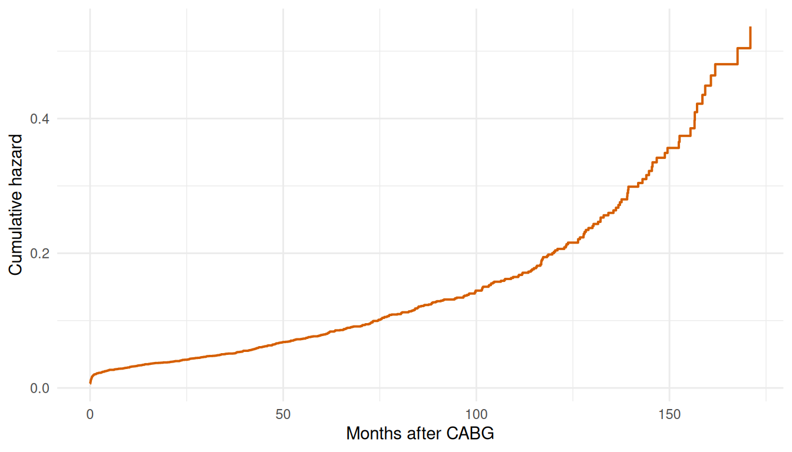

# Fitting Hazard Models

``` r

library(TemporalHazard)
library(survival)
library(ggplot2)
```

This vignette walks the core model-fitting workflow from the inside out:
intercept-only fits to establish the baseline hazard shape, then
covariates on top, then the multiphase decomposition, then
multi-endpoint analyses on the same cohort. Every example uses a
clinical dataset shipped with the package. If you haven’t seen the
basics — what a parametric hazard model is, why we use the
`Surv(time, status)` formula — start with
[`vignette("getting-started")`](https://ehrlinger.github.io/temporal_hazard/articles/getting-started.md)
first; this vignette assumes that context.

The progression matters. Single-distribution intercept-only fits tell
you whether the baseline hazard shape is monotone (Weibull territory) or
has structure that demands a multiphase decomposition. Multivariable
fits add covariate effects on top of a shape you already trust.
Multiphase fits split the baseline shape into clinically interpretable
phases. Multi-endpoint analyses reuse all the above for separate
clinical outcomes — death, reoperation, infection — on the same patient
cohort.

## 1 Intercept-only model: CABG survival (KU Leuven)

The `cabgkul` dataset contains 5,880 patients who underwent primary
isolated coronary artery bypass grafting at KU Leuven between 1971 and
1987. With only two columns — follow-up time and death indicator — it is
the simplest starting point.

``` r

data(cabgkul)
str(cabgkul)
#> 'data.frame':    5880 obs. of  2 variables:
#>  $ int_dead: num  201.83 195.06 7.13 126.36 187.57 ...
#>  $ dead    : int  0 0 1 1 0 0 1 1 0 1 ...
```

Fit an intercept-only Weibull. With no covariates on the right-hand side
of the formula the model estimates only the baseline hazard shape — the
scale `mu` and exponent `nu` of a Weibull curve fit to all 5,880
patients pooled. This is the right starting point for any new dataset:
before asking which covariates matter, ask whether a single monotone
hazard even fits the population-level pattern.

``` r

fit_kul <- hazard(
  Surv(int_dead, dead) ~ 1,
  data  = cabgkul,
  dist  = "weibull",
  theta = c(mu = 0.10, nu = 1.0),
  fit   = TRUE
)

fit_kul
#> hazard object
#>   observations: 5880 
#>   predictors:   0 
#>   dist:         weibull 
#>   engine:       native-r-m2 
#>   log-lik:      -3935.72 
#>   converged:    TRUE
```

The summary tells us where the optimizer landed; the picture tells us
whether that landing point matches the data. Plot the fitted survival
curve on a fine time grid and overlay the Kaplan-Meier step function
from the raw cohort.

``` r

t_grid <- seq(0.01, max(cabgkul$int_dead) * 0.9, length.out = 200)
nd     <- data.frame(time = t_grid)
surv   <- predict(fit_kul, newdata = nd, type = "survival") * 100

km     <- survfit(Surv(int_dead, dead) ~ 1, data = cabgkul)
km_df  <- data.frame(time = km$time, survival = km$surv * 100)

ggplot() +
  geom_step(data = km_df, aes(time, survival, colour = "Kaplan-Meier"),
            linewidth = 0.5) +
  geom_line(data = data.frame(time = t_grid, survival = surv),
            aes(time, survival, colour = "Weibull"), linewidth = 1) +
  scale_colour_manual(values = c("Weibull" = "#0072B2",
                                 "Kaplan-Meier" = "#D55E00")) +
  scale_y_continuous(limits = c(0, 100)) +
  labs(x = "Months after CABG", y = "Freedom from death (%)",
       colour = NULL) +
  theme_minimal() +
  theme(legend.position = "bottom")
```


Figure 1: Weibull parametric survival vs. Kaplan-Meier (CABG, KU Leuven)

A single Weibull captures the broad trend but misses the distinct early
operative risk and late attrition that the KM curve reveals. This
motivates the multiphase approach below.

## 2 Multivariable model: AVC repair

The `avc` dataset has 310 patients who underwent atrioventricular canal
repair, with 9 candidate covariates spanning patient demographics (age,
NYHA status), anatomical features (malalignment, orifice morphology),
intra-operative grading (`inc_surg` = surgical grade of AV valve
incompetence), and post-operative complications (`com_iv` = grade IV
complications). We drop incomplete rows so the design matrix is
rectangular, then look at the column types and ranges.

``` r

data(avc)
avc <- na.omit(avc)
str(avc)
#> 'data.frame':    305 obs. of  11 variables:
#>  $ study   : chr  "001C" "002C" "004C" "005C" ...
#>  $ status  : int  3 3 1 2 2 3 1 1 3 3 ...
#>  $ inc_surg: int  4 3 2 3 1 2 3 2 3 3 ...
#>  $ opmos   : num  9.46 34.07 51.58 55 60.65 ...
#>  $ age     : num  69.2 53.7 286.1 154.6 48.4 ...
#>  $ mal     : int  0 0 0 1 0 0 0 0 0 0 ...
#>  $ com_iv  : int  1 1 1 1 1 1 1 1 1 1 ...
#>  $ orifice : int  0 0 0 0 0 0 0 0 0 0 ...
#>  $ dead    : int  1 1 0 0 0 0 0 0 0 1 ...
#>  $ int_dead: num  0.0534 0.3778 91.5337 111.608 106.8112 ...
#>  $ op_age  : num  654 1828 14759 8505 2933 ...
#>  - attr(*, "na.action")= 'omit' Named int [1:5] 12 90 138 144 146
#>   ..- attr(*, "names")= chr [1:5] "12" "90" "138" "144" ...
```

Now we put covariates on the right-hand side of the formula and refit.
The `theta` vector grows: two Weibull shape parameters (`mu`, `nu`) plus
six covariate coefficients (`beta1`..`beta6`), each starting at zero.
The optimizer estimates a log-hazard-ratio for every covariate jointly
with the Weibull shape — so the shape and the covariate effects are
identified from the same likelihood, not sequentially.

``` r

fit_avc <- hazard(
  Surv(int_dead, dead) ~ age + status + mal + com_iv + inc_surg + orifice,
  data  = avc,
  dist  = "weibull",
  theta = c(mu = 0.20, nu = 1.0, rep(0, 6)),
  fit   = TRUE,
  control = list(maxit = 500)
)

fit_avc
#> hazard object
#>   observations: 305 
#>   predictors:   6 
#>   dist:         weibull 
#>   engine:       native-r-m2 
#>   log-lik:      -197.159 
#>   converged:    TRUE
```

Each coefficient is a log-hazard-ratio: positive means higher risk,
negative means lower, zero means no effect. The large positive
coefficients on `mal` (anatomical malalignment) and `com_iv` (grade IV
post-operative complications) flag these as the dominant risk markers in
this cohort. The standard errors and Wald z-statistics in the summary
tell you which effects are well identified and which are noise — a
coefficient with a z-statistic near zero contributes essentially nothing
the data can defend.

## 3 Multiphase model: additive hazard decomposition

The single-Weibull fits above gave us a curve that’s mediocre everywhere
instead of right anywhere. That’s a structural limitation of a monotone
parametric shape, not something more iterations will fix. The
Blackstone–Naftel–Turner framework’s key idea is to split the hazard
into a *sum* of phase-specific contributions, each with its own temporal
shape and its own scale:

\\H(t \mid x) = \sum\_{j=1}^{J} \mu_j(x) \cdot \Phi_j(t)\\

Each \\\Phi_j(t)\\ is a phase-specific unit-scaled curve (early-peaking
saturating, flat constant, late-rising polynomial) and each \\\mu_j(x)\\
is the phase-specific scale, possibly modulated by covariates. The
phases overlap and add — no switching, no thresholds — so the total
instantaneous hazard at any \\t\\ is the sum of the per-phase rates. See
[`vignette("getting-started")`](https://ehrlinger.github.io/temporal_hazard/articles/getting-started.md)
for the longer-form motivation; what follows here is the practical
workflow for *fitting* one.

For AVC we’ll use two phases — an early phase to absorb the
operative-window mortality, and a constant phase for the background
rate. AVC patients don’t have a clear late-deterioration regime over
this follow-up window, so a third (g3) phase would be unidentified. We
fix the shape parameters and estimate only the scales, matching the
workflow you’d run against a SAS HAZARD reference fit.

``` r

fit_mp <- hazard(
  Surv(int_dead, dead) ~ 1,
  data   = avc,
  dist   = "multiphase",
  phases = list(
    early    = hzr_phase("cdf", t_half = 0.5, nu = 1, m = 1,
                          fixed = "shapes"),
    constant = hzr_phase("constant")
  ),
  fit     = TRUE,
  control = list(n_starts = 5, maxit = 1000)
)
#> Warning in .hzr_optim_generic(logl_fn = logl_fn, gradient_fn = gradient_fn, :
#> hessian_fn returned a non-conformant result; using numerical Hessian
#> Warning in .hzr_optim_generic(logl_fn = logl_fn, gradient_fn = gradient_fn, :
#> hessian_fn returned a non-conformant result; using numerical Hessian
#> Warning in .hzr_optim_generic(logl_fn = logl_fn, gradient_fn = gradient_fn, :
#> hessian_fn returned a non-conformant result; using numerical Hessian
#> Warning in .hzr_optim_generic(logl_fn = logl_fn, gradient_fn = gradient_fn, :
#> hessian_fn returned a non-conformant result; using numerical Hessian
#> Warning in .hzr_optim_generic(logl_fn = logl_fn, gradient_fn = gradient_fn, :
#> hessian_fn returned a non-conformant result; using numerical Hessian

summary(fit_mp)
#> Multiphase hazard model (2 phases)
#>   observations: 305 
#>   predictors:   0 
#>   dist:         multiphase 
#>   phase 1:      early - cdf (early risk)
#>   phase 2:      constant - constant (flat rate)
#>   engine:       native-r-m2 
#>   converged:    TRUE 
#>   log-lik:      -228.029 
#>   evaluations: fn=32, gr=10
#> 
#> Coefficients (internal scale):
#> 
#>   Phase: early (cdf)
#>                estimate std_error    z_stat     p_value
#>   log_mu     -1.4132735 0.1290435 -10.95192 6.50568e-28
#>   log_t_half -0.6931472        NA        NA          NA
#>   nu          1.0000000        NA        NA          NA
#>   m           1.0000000        NA        NA          NA
#> 
#>   Phase: constant (constant)
#>           estimate std_error    z_stat      p_value
#>   log_mu -7.609476 0.4495827 -16.92564 2.911483e-64
```

The diagnostic that matters is whether the multiphase fit actually
out-performs the single Weibull against the data. Plot both parametric
curves against the same Kaplan-Meier reference so we can see, by eye,
where each model is honest and where each is reaching.

``` r

t_grid <- seq(0.01, max(avc$int_dead) * 0.95, length.out = 200)
nd     <- data.frame(time = t_grid)

km_avc <- survfit(Surv(int_dead, dead) ~ 1, data = avc)
km_df  <- data.frame(time = km_avc$time, survival = km_avc$surv * 100)

fit_wb <- hazard(
  Surv(int_dead, dead) ~ 1, data = avc, dist = "weibull",
  theta = c(mu = 0.20, nu = 1.0), fit = TRUE
)

surv_wb <- predict(fit_wb, newdata = nd, type = "survival") * 100
surv_mp <- predict(fit_mp, newdata = nd, type = "survival") * 100

plot_df <- rbind(
  data.frame(time = t_grid, survival = surv_wb, Model = "Single Weibull"),
  data.frame(time = t_grid, survival = surv_mp, Model = "Multiphase (2-phase)")
)

ggplot() +
  geom_step(data = km_df, aes(time, survival), colour = "grey50",
            linewidth = 0.5) +
  geom_line(data = plot_df, aes(time, survival, colour = Model),
            linewidth = 1) +
  scale_colour_manual(values = c("Single Weibull" = "#E69F00",
                                 "Multiphase (2-phase)" = "#0072B2")) +
  scale_y_continuous(limits = c(0, 100)) +
  annotate("text", x = max(t_grid) * 0.6, y = 95, label = "KM (grey)",
           size = 3, colour = "grey50") +
  labs(x = "Months after AVC repair", y = "Freedom from death (%)",
       colour = NULL) +
  theme_minimal() +
  theme(legend.position = "bottom")
```


Figure 2: Single-phase Weibull vs. multiphase model against Kaplan-Meier
(AVC)

The multiphase model tracks the KM curve much more closely than the
single Weibull, especially across the steep early-mortality window —
which is exactly where the single Weibull was forced to compromise. The
constant phase then carries the slow post-recovery attrition. The point
isn’t that multiphase always wins; it’s that *when the data has phase
structure*, fitting that structure explicitly is strictly more honest
than averaging it away into one monotone curve.

## 4 Multi-endpoint models: heart valve replacement

The `valves` dataset (1,533 patients) has multiple time-to-event
endpoints — death, prosthetic valve endocarditis (PVE), and reoperation
— each with its own follow-up time and event indicator. The same
[`hazard()`](https://ehrlinger.github.io/temporal_hazard/reference/hazard.md)
call fits each endpoint independently:

Start with the death endpoint. We use age at operation, NYHA class, and
mechanical-valve indicator as covariates — the clinically canonical set
for survival after valve replacement.

``` r

data(valves)
valves <- na.omit(valves)

fit_death <- hazard(
  Surv(int_dead, dead) ~ age_cop + nyha + mechvalv,
  data  = valves,
  dist  = "weibull",
  theta = c(mu = 0.10, nu = 1.0, rep(0, 3)),
  fit   = TRUE,
  control = list(maxit = 500)
)

fit_death
#> hazard object
#>   observations: 1523 
#>   predictors:   3 
#>   dist:         weibull 
#>   engine:       native-r-m2 
#>   log-lik:      -1820.55 
#>   converged:    TRUE
```

Switch endpoints. Same data, same package, but now we model time to
prosthetic valve endocarditis instead of death. The covariate list
shifts to match the clinical question: `nve` (native-valve endocarditis
history) replaces `nyha` because functional class is less informative
for infection risk than prior endocarditis exposure. The fit returns its
own MLE, coefficients, and standard errors completely independent of the
death model.

``` r

fit_pve <- hazard(
  Surv(int_pve, pve) ~ age_cop + nve + mechvalv,
  data  = valves,
  dist  = "weibull",
  theta = c(mu = 0.02, nu = 1.0, rep(0, 3)),
  fit   = TRUE,
  control = list(maxit = 500)
)

fit_pve
#> hazard object
#>   observations: 1523 
#>   predictors:   3 
#>   dist:         weibull 
#>   engine:       native-r-m2 
#>   log-lik:      -391.125 
#>   converged:    TRUE
```

Each endpoint gets its own model with its own covariates, but the hazard
model structure — temporal shape plus covariate effects — stays the same
whatever the clinical endpoint. Repeating the workflow for a third
endpoint (reoperation, for example) is mechanical: swap the `Surv(...)`
columns, swap the covariates, refit. The advantage over running three
separate analyses in different tools is that the predictions,
diagnostics, and uncertainty quantification all come from the same
package — there’s no risk of subtle differences in censoring handling or
estimator choice between endpoints.

## 5 Interval and left censoring

Right censoring is by far the most common censoring type in clinical
survival data — a patient is still alive at last follow-up, so all we
know is that their event time exceeds the observed window. Two other
types arise frequently enough to warrant explicit handling.

**Interval censoring** occurs when the event is known to have happened
*between* two observation times, but not at a specific time. The
canonical example is clinic-visit data: a patient is confirmed alive at
month 12 and found dead at month 24, so the event occurred somewhere in
\\(12, 24)\\. A naive analysis treats the event as right-censored at 12
or exactly observed at 24; both introduce bias.

**Left censoring** is the mirror: the event occurred *before* the first
observation time (time_upper), so it was already established at the
moment of first contact — \\T \leq t\_{\text{upper}}\\.

### 5.1 Status codes

The package encodes censoring type in the `status` vector:

| Status | Type              | Interpretation                               |
|-------:|-------------------|----------------------------------------------|
|    `1` | Exact event       | Observed at `time`                           |
|    `0` | Right-censored    | Event did not occur by `time`                |
|    `2` | Interval-censored | Event occurred in `(time_lower, time_upper)` |
|   `-1` | Left-censored     | Event occurred before `time` (upper bound)   |

For interval-censored rows, supply both `time_lower` and `time_upper`
directly to
[`hazard()`](https://ehrlinger.github.io/temporal_hazard/reference/hazard.md).
The formula interface handles `Surv(time, status)` for right-censored
data and `Surv(start, stop, event)` for counting-process
(repeating-event) data; interval censoring is passed via the direct
arguments.

### 5.2 Mixed censoring example

We simulate 400 cardiac surgery patients observed at semi-annual clinic
visits (every 6 months, 4–8 scheduled visits per patient). If the event
falls between two consecutive visits the observation is
interval-censored; if it falls after the last visit the patient is
right-censored.

``` r

set.seed(101)
n         <- 400
visit_gap <- 6   # months between visits

# True event times: Weibull mu = 0.025, nu = 1.0 (median ~28 months)
true_time <- rexp(n, rate = 0.025)  # nu=1 → exponential

n_visits  <- sample(4:8, n, replace = TRUE)

status     <- integer(n)
time       <- numeric(n)
time_lower <- numeric(n)
time_upper <- numeric(n)

for (i in seq_len(n)) {
  visits <- seq(visit_gap, n_visits[i] * visit_gap, by = visit_gap)
  t_ev   <- true_time[i]
  brk    <- findInterval(t_ev, c(0, visits))  # which interval contains t_ev

  if (brk > length(visits)) {
    # Event after last visit: right-censored.
    # time_lower = 0: with H(time_lower) = H(0) = 0, the right-censored
    # contribution reduces to -(H(time) - H(0)) = -H(time), which is correct.
    status[i]     <- 0L
    time[i]       <- max(visits)
    time_lower[i] <- 0
    time_upper[i] <- max(visits)
  } else {
    # Event within the visit window: interval-censored in (lower, upper)
    lower_bound   <- if (brk == 1L) 0 else visits[brk - 1L]
    upper_bound   <- visits[brk]
    status[i]     <- 2L
    time[i]       <- lower_bound
    time_lower[i] <- lower_bound
    time_upper[i] <- upper_bound
  }
}

table(status)
#> status
#>   0   2 
#> 168 232
```

> **Note**
>
> **`time_lower` as a counting-process entry time.** In the Weibull and
> multiphase likelihoods, `time_lower` doubles as the *entry*
> (left-truncation) time for right-censored and exact-event rows
> (`status %in% c(0, 1)`): when `0 < time_lower < time`, the row
> contributes H(stop) − H(start), the counting-process form used for
> epoch-decomposed repeated events. For an ordinary right-censored or
> event row with no entry time, leave `time_lower` at `0` or omit it.
> Setting `time_lower = time` is treated as *no entry* — `time_lower`
> acts as an entry time only when strictly less than `time`, so it no
> longer zeroes the row’s contribution. The exponential, log-logistic,
> and log-normal likelihoods do not use `time_lower` as an entry time
> and are unaffected.

Fit a Weibull model using both censoring types:

``` r

fit_ic <- hazard(
  time       = time,
  status     = status,
  time_lower = time_lower,
  time_upper = time_upper,
  dist  = "weibull",
  theta = c(mu = 0.025, nu = 1.0),
  fit   = TRUE
)

fit_ic
#> hazard object
#>   observations: 400 
#>   predictors:   0 
#>   dist:         weibull 
#>   engine:       native-r-m2 
#>   log-lik:      -674.374 
#>   converged:    TRUE
```

### 5.3 Interval-censored vs naive right-censored

A naive analyst who doesn’t have visit-bracket data would record the
death at the *discovery* visit (`time_upper`) rather than as an
interval. This overstates the event time — the patient appears to have
survived longer than they did — biasing the estimated hazard shape.

``` r

# Naive: treat each interval-censored row as an exact event at time_upper
# (the visit when the death was first recorded)
fit_naive <- hazard(
  time   = ifelse(status == 2L, time_upper, time),
  status = ifelse(status == 2L, 1L,         status),
  dist  = "weibull",
  theta = c(mu = 0.025, nu = 1.0),
  fit   = TRUE
)

# Compare MLEs; true parameters are mu = 0.025, nu = 1.0
rbind(
  interval_censored = round(coef(fit_ic)[1:2],   4),
  naive_exact_upper = round(coef(fit_naive)[1:2], 4),
  truth             = c(mu = 0.025, nu = 1.0)
)
#>                       mu     nu
#> interval_censored 0.0251 1.0345
#> naive_exact_upper 0.0259 1.4566
#> truth             0.0250 1.0000
```

The interval-censored fit recovers both parameters accurately. The naive
fit estimates \\\mu\\ comparably but introduces a substantial positive
bias in \\\nu\\ — it sees events consistently appearing at visit times
(every 6 months) and infers a sharper, more periodic hazard shape that
doesn’t match the underlying exponential structure.

## 6 Convergence troubleshooting

Multiphase models have more parameters than single-distribution fits,
and the likelihood surface can be flat or multimodal when the data
doesn’t strongly identify all of them. Most convergence problems trace
back to one of three causes: poor starting values, too many free
parameters for the data at hand, or a model that asks for a phase the
data doesn’t contain. This section shows how to diagnose each and what
to do about it.

### 6.1 Reading the KM cumulative hazard for starting values

For a Weibull model, the relationship between the starting values and
the data is direct: because \\H(t) = (\mu t)^\nu\\, taking logs gives
\\\log H(t) = \nu \log t + \nu \log \mu\\. Plot \\\log H(t)\\ (the
Nelson-Aalen cumulative hazard on the log scale) against \\\log t\\ and
fit a straight line; the slope is \\\hat\nu\\ and the intercept is
\\\hat\nu \log \hat\mu\\.

``` r

nel <- hzr_nelson(cabgkul$int_dead, cabgkul$dead)

# Drop the zero-time boundary point before log-transforming
nel_clean <- nel[nel$time > 0 & nel$cumhaz > 0, ]
log_t <- log(nel_clean$time)
log_H <- log(nel_clean$cumhaz)

lm_fit  <- lm(log_H ~ log_t)
nu_hat  <- unname(coef(lm_fit)[2])
mu_hat  <- exp(unname(coef(lm_fit)[1]) / nu_hat)
c(mu = round(mu_hat, 4), nu = round(nu_hat, 4))
#>     mu     nu 
#> 0.0001 0.4793
```

Those values are the Weibull starting point the data itself suggests.
They won’t be the MLEs — the log-log line uses every event time equally,
whereas the MLE weights by the likelihood — but they land the optimizer
in a sensible neighbourhood and prevent false-convergence to a
degenerate solution.

For multiphase models the reading is qualitative. Plot the KM cumulative
hazard on the natural scale and look for kinks: a steep-then-flattening
shape in the first few months signals an early phase whose `t_half`
should sit in that early window; a steady linear rise afterwards signals
a constant phase; a late upward curve beyond the flat region signals a
late phase. Set `t_half` to roughly the time at which the early kink
levels off, and set the constant phase scale mu to approximate the slope
of the linear mid-section.

``` r

ggplot(data.frame(time = nel$time, cumhaz = nel$cumhaz),
       aes(time, cumhaz)) +
  geom_step(colour = "#D55E00", linewidth = 0.7) +
  labs(x = "Months after CABG", y = "Cumulative hazard") +
  theme_minimal()
```



Figure 3: Nelson-Aalen cumulative hazard for CABGKUL — three-phase shape
visible as two kinks

The early steep rise, the mid-range roughly-linear section, and the late
upward acceleration map directly onto the three phases in the CABGKUL
model.

### 6.2 When to fix shape parameters

`fixed = "shapes"` locks the temporal shape parameters (e.g., `t_half`,
`nu`, `m` for a CDF phase; `tau`, `gamma`, `alpha`, `eta` for a g3
phase) and lets the optimizer estimate only the scale (`log_mu`) for
each phase. This cuts the parameter count substantially and is almost
always what you want in two situations:

- **You have a reference fit.** If a SAS HAZARD run already produced
  shape estimates, replicate those shapes exactly and re-estimate only
  the scale. This is the standard parity workflow.
- **Your sample is small relative to the number of phases.** A rough
  guide is 50 or more events per free shape parameter. Below that
  threshold the shapes are weakly identified and the optimizer wanders.

Estimate shapes freely (`fixed = "none"`, the default) only when you are
exploring a new dataset for the first time and have no prior on the
temporal structure — and even then, start with `fixed = "shapes"` and
release the shapes one at a time if the fixed-shapes fit shows
systematic misfit.

### 6.3 Signs of overparameterization

When a model has more phases than the data supports, the symptoms are
recognizable:

| Symptom | What it means |
|----|----|
| `fit$fit$converged == FALSE` | Optimizer hit `maxit` without satisfying the gradient tolerance |
| [`vcov()`](https://rdrr.io/r/stats/vcov.html) returns `NA` | Hessian is singular — parameters are not jointly identified |
| A phase scale (`log_mu`) at a boundary value | That phase is contributing essentially zero hazard; it isn’t needed |
| Enormous standard errors on one or more parameters | Flat likelihood in that direction — weak identification |
| Two phases with nearly identical shapes | One can be collapsed into the other |

The AVC dataset has a clear two-phase structure (early CDF plus
constant). Adding a third late-rising phase asks the data for a pattern
it doesn’t contain over this follow-up window:

``` r

set.seed(42)
fit_3ph <- hazard(
  Surv(int_dead, dead) ~ 1,
  data   = avc,
  dist   = "multiphase",
  phases = list(
    early    = hzr_phase("cdf", t_half = 0.5, nu = 1, m = 1,
                          fixed = "shapes"),
    constant = hzr_phase("constant"),
    late     = hzr_phase("g3", tau = 5, gamma = 3, alpha = 1, eta = 1,
                          fixed = "shapes")
  ),
  fit = TRUE, control = list(n_starts = 5, maxit = 1000)
)
#> Warning in .hzr_safe_solve(H_unc): Hessian is ill-conditioned (rcond =
#> 4.46e-11); standard errors may be unreliable

# Scale magnitudes: exp(log_mu) ≈ 0 for any phase the data doesn't support
log_mu_idx <- grep("log_mu", names(coef(fit_3ph)))
round(exp(coef(fit_3ph)[log_mu_idx]), 6)
#>    early.log_mu constant.log_mu     late.log_mu 
#>        0.248869        0.000000        0.000006
```

The constant and late phase scales are both near zero — the optimizer
found no evidence in the AVC data for either of those temporal shapes
over this follow-up window. The early phase is absorbing all the
identifiable structure. Any phase whose fitted scale is \\\mu \lesssim
10^{-4}\\ is not contributing meaningful hazard and is a candidate for
removal. The right diagnostic question is not “did the AIC improve?” but
“does this phase represent real clinical biology?” — late deterioration
after AVC repair requires long follow-up to observe; this dataset
doesn’t have it.

When shapes are also free (`fixed = "none"`), a redundant phase can make
the Hessian rank-deficient and
[`vcov()`](https://rdrr.io/r/stats/vcov.html) will return `NA` (the
Hessian inversion failed). Fix by adding `fixed = "shapes"` to each
phase to reduce the free-parameter count, then release shapes one at a
time if the fixed-shapes fit shows systematic misfit.

### 6.4 Optimizer options

Three `control` arguments address most remaining convergence problems:

**`n_starts`** (default 5 for multiphase; single-distribution models run
one optimizer call and ignore this parameter) runs the optimizer from
`n_starts` randomly jittered copies of the initial `theta`, then keeps
the best solution. The default of 5 is sufficient for two-phase models;
increase to 8–10 for three or more phases where the likelihood surface
has more local minima.

``` r

set.seed(42)
fit_robust <- hazard(
  Surv(int_dead, dead) ~ 1,
  data   = avc,
  dist   = "multiphase",
  phases = list(
    early    = hzr_phase("cdf", t_half = 0.5, nu = 1, m = 1,
                          fixed = "shapes"),
    constant = hzr_phase("constant")
  ),
  fit     = TRUE,
  control = list(n_starts = 10, maxit = 1000)
)
#> Warning in .hzr_optim_generic(logl_fn = logl_fn, gradient_fn = gradient_fn, :
#> hessian_fn returned a non-conformant result; using numerical Hessian
#> Warning in .hzr_optim_generic(logl_fn = logl_fn, gradient_fn = gradient_fn, :
#> hessian_fn returned a non-conformant result; using numerical Hessian
#> Warning in .hzr_optim_generic(logl_fn = logl_fn, gradient_fn = gradient_fn, :
#> hessian_fn returned a non-conformant result; using numerical Hessian
#> Warning in .hzr_optim_generic(logl_fn = logl_fn, gradient_fn = gradient_fn, :
#> hessian_fn returned a non-conformant result; using numerical Hessian
#> Warning in .hzr_optim_generic(logl_fn = logl_fn, gradient_fn = gradient_fn, :
#> hessian_fn returned a non-conformant result; using numerical Hessian
#> Warning in .hzr_optim_generic(logl_fn = logl_fn, gradient_fn = gradient_fn, :
#> hessian_fn returned a non-conformant result; using numerical Hessian
#> Warning in .hzr_optim_generic(logl_fn = logl_fn, gradient_fn = gradient_fn, :
#> hessian_fn returned a non-conformant result; using numerical Hessian
#> Warning in .hzr_optim_generic(logl_fn = logl_fn, gradient_fn = gradient_fn, :
#> hessian_fn returned a non-conformant result; using numerical Hessian
#> Warning in .hzr_optim_generic(logl_fn = logl_fn, gradient_fn = gradient_fn, :
#> hessian_fn returned a non-conformant result; using numerical Hessian
#> Warning in .hzr_optim_generic(logl_fn = logl_fn, gradient_fn = gradient_fn, :
#> hessian_fn returned a non-conformant result; using numerical Hessian
fit_robust$fit$converged
#> [1] TRUE
```

**Optimizer strategy (automatic).** The package always uses BFGS as the
primary optimizer. For fixed-shape multiphase models with 2–10 free
parameters, a Nelder-Mead pass runs first on each start to find a good
basin, then BFGS polishes the solution. This warm-up is transparent — it
happens automatically when the conditions are met and there is no
user-facing control to switch it on or off.

**`maxit`** (default 1000) sets the BFGS iteration cap. Hitting `maxit`
without converging usually means either the starting values are far from
the optimum (fix with better starts or `n_starts`) or the model is
overparameterized (fix by fixing shapes or dropping a phase). Raising
`maxit` beyond 2000 rarely helps if the optimizer is genuinely stuck.

## 7 Phase types reference

You’ve now seen each phase type in use: a `"cdf"` early phase for AVC
operative mortality, a `"constant"` phase for AVC background rate, and
the implicit single shape of every Weibull fit. The package supports
three phase types in total, summarized here for quick reference:

| Type | Description | Typical use |
|----|----|----|
| `"cdf"` | Sigmoidal CDF shape (parameterized by `t_half`, `nu`, `m`) | Early or late phases with transient risk |
| `"constant"` | Flat hazard (no temporal shape parameters) | Ongoing background risk |
| `"g3"` | Late-phase G3 parameterization (4 parameters: `tau`, `gamma`, `alpha`, `eta`) | Late-rising risk matching C/SAS G3 output |

The `"cdf"` type covers the widest range of shapes: setting `t_half`
small (e.g., 0.5) creates an early-peaking phase; setting it large
(e.g., 10) creates a late-rising phase. The `"constant"` phase needs no
shape parameters. The `"g3"` shape is the explicit late-rising
parameterization that matches the SAS HAZARD “late” library; use it when
you need parity against a C/SAS reference fit, or when the late rise has
a clear lag-then-accelerate pattern that a delayed `"cdf"` doesn’t
capture cleanly. See
[`vignette("mf-mathematical-foundations")`](https://ehrlinger.github.io/temporal_hazard/articles/mf-mathematical-foundations.md)
for the full mathematical treatment of each, including the parameter
identifiability constraints.
