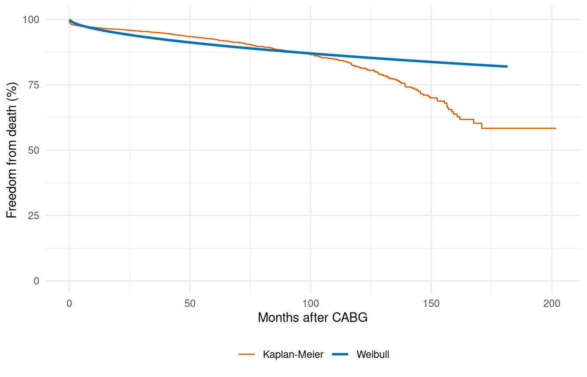
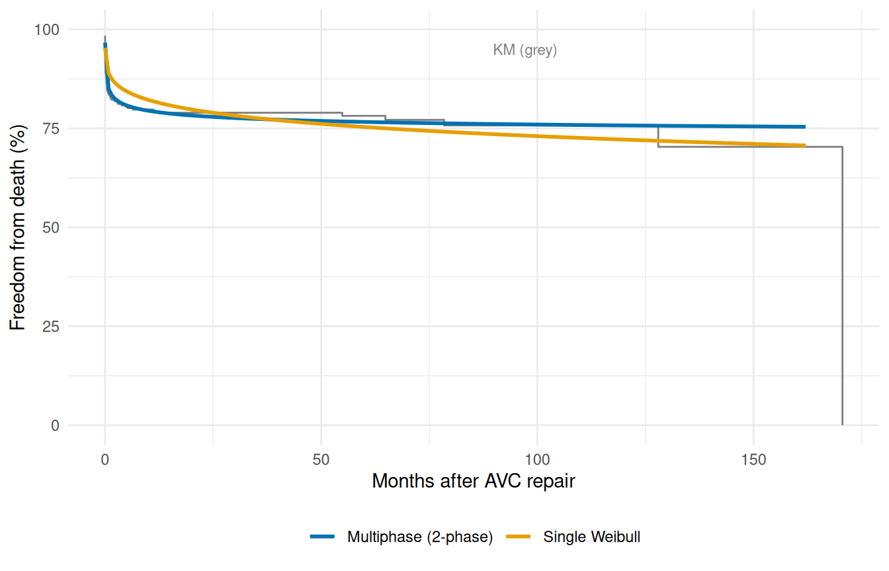

# Fitting Hazard Models

``` r
library(TemporalHazard)
library(survival)
library(ggplot2)
```

This vignette demonstrates the core model-fitting workflow, progressing
from the simplest case (intercept-only, single distribution) through
multivariable models to multiphase additive hazard decomposition. All
examples use the clinical datasets shipped with the package.

## 1 Intercept-only model: CABG survival (KU Leuven)

The `cabgkul` dataset contains 5,880 patients who underwent primary
isolated coronary artery bypass grafting at KU Leuven between 1971 and
1987. With only two columns — follow-up time and death indicator — it is
the simplest starting point.

``` r
data(cabgkul)
str(cabgkul)
#> 'data.frame':    5880 obs. of  2 variables:
#>  $ int_dead: num  201.83 195.06 7.13 126.36 187.57 ...
#>  $ dead    : int  0 0 1 1 0 0 1 1 0 1 ...
```

Fit an intercept-only Weibull hazard (no covariates):

``` r
fit_kul <- hazard(
  Surv(int_dead, dead) ~ 1,
  data  = cabgkul,
  dist  = "weibull",
  theta = c(mu = 0.10, nu = 1.0),
  fit   = TRUE
)

fit_kul
#> hazard object
#>   observations: 5880 
#>   predictors:   0 
#>   dist:         weibull 
#>   engine:       native-r-m2 
#>   log-lik:      -3935.72 
#>   converged:    TRUE
```

Compare the parametric fit to the Kaplan-Meier estimate:

``` r
t_grid <- seq(0.01, max(cabgkul$int_dead) * 0.9, length.out = 200)
nd     <- data.frame(time = t_grid)
surv   <- predict(fit_kul, newdata = nd, type = "survival") * 100

km     <- survfit(Surv(int_dead, dead) ~ 1, data = cabgkul)
km_df  <- data.frame(time = km$time, survival = km$surv * 100)

ggplot() +
  geom_step(data = km_df, aes(time, survival, colour = "Kaplan-Meier"),
            linewidth = 0.5) +
  geom_line(data = data.frame(time = t_grid, survival = surv),
            aes(time, survival, colour = "Weibull"), linewidth = 1) +
  scale_colour_manual(values = c("Weibull" = "#0072B2",
                                 "Kaplan-Meier" = "#D55E00")) +
  scale_y_continuous(limits = c(0, 100)) +
  labs(x = "Months after CABG", y = "Freedom from death (%)",
       colour = NULL) +
  theme_minimal() +
  theme(legend.position = "bottom")
```



Figure 1: Weibull parametric survival vs. Kaplan-Meier (CABG, KU Leuven)

A single Weibull captures the broad trend but misses the distinct early
operative risk and late attrition that the KM curve reveals. This
motivates the multiphase approach below.

## 2 Multivariable model: AVC repair

The `avc` dataset has 310 patients with 9 covariates. We can use the
formula interface to fit a multivariable Weibull model.

``` r
data(avc)
avc <- na.omit(avc)
str(avc)
#> 'data.frame':    305 obs. of  11 variables:
#>  $ study   : chr  "001C" "002C" "004C" "005C" ...
#>  $ status  : int  3 3 1 2 2 3 1 1 3 3 ...
#>  $ inc_surg: int  4 3 2 3 1 2 3 2 3 3 ...
#>  $ opmos   : num  9.46 34.07 51.58 55 60.65 ...
#>  $ age     : num  69.2 53.7 286.1 154.6 48.4 ...
#>  $ mal     : int  0 0 0 1 0 0 0 0 0 0 ...
#>  $ com_iv  : int  1 1 1 1 1 1 1 1 1 1 ...
#>  $ orifice : int  0 0 0 0 0 0 0 0 0 0 ...
#>  $ dead    : int  1 1 0 0 0 0 0 0 0 1 ...
#>  $ int_dead: num  0.0534 0.3778 91.5337 111.608 106.8112 ...
#>  $ op_age  : num  654 1828 14759 8505 2933 ...
#>  - attr(*, "na.action")= 'omit' Named int [1:5] 12 90 138 144 146
#>   ..- attr(*, "names")= chr [1:5] "12" "90" "138" "144" ...
```

``` r
fit_avc <- hazard(
  Surv(int_dead, dead) ~ age + status + mal + com_iv + inc_surg + orifice,
  data  = avc,
  dist  = "weibull",
  theta = c(mu = 0.20, nu = 1.0, rep(0, 6)),
  fit   = TRUE,
  control = list(maxit = 500)
)

fit_avc
#> hazard object
#>   observations: 305 
#>   predictors:   6 
#>   dist:         weibull 
#>   engine:       native-r-m2 
#>   log-lik:      -197.159 
#>   converged:    TRUE
```

The coefficient estimates give the log-hazard-ratio for each covariate.
Covariates with large positive coefficients (`mal`, `com_iv`) are
associated with higher operative risk.

## 3 Multiphase model: additive hazard decomposition

The key innovation of the Blackstone–Naftel–Turner framework is
decomposing the hazard into additive temporal phases:

$$H(t \mid x) = \sum\limits_{j = 1}^{J}\mu_{j}(x) \cdot \Phi_{j}(t)$$

Each phase has its own temporal shape (early peaking, constant, late
rising) and its own intercept. We specify phases with
[`hzr_phase()`](https://ehrlinger.github.io/temporal_hazard/reference/hzr_phase.md):

``` r
fit_mp <- hazard(
  Surv(int_dead, dead) ~ 1,
  data   = avc,
  dist   = "multiphase",
  phases = list(
    early    = hzr_phase("cdf",      t_half = 0.5, nu = 1, m = 1),
    constant = hzr_phase("constant")
  ),
  fit     = TRUE,
  control = list(n_starts = 5, maxit = 1000)
)

summary(fit_mp)
#> Multiphase hazard model (2 phases)
#>   observations: 305 
#>   predictors:   0 
#>   dist:         multiphase 
#>   phase 1:      early - cdf (early risk)
#>   phase 2:      constant - constant (flat rate)
#>   engine:       native-r-m2 
#>   converged:    TRUE 
#>   log-lik:      -215.944 
#>   evaluations: fn=64, gr=29
#> 
#> Coefficients (internal scale):
#> 
#>   Phase: early (cdf)
#>                estimate std_error z_stat p_value
#>   log_mu     -1.0294341        NA     NA      NA
#>   log_t_half  0.3374701        NA     NA      NA
#>   nu          4.5735652        NA     NA      NA
#>   m          -0.1823975        NA     NA      NA
#> 
#>   Phase: constant (constant)
#>           estimate std_error z_stat p_value
#>   log_mu -1761.351        NA     NA      NA
```

Comparing the single-phase Weibull to the multiphase fit:

``` r
t_grid <- seq(0.01, max(avc$int_dead) * 0.95, length.out = 200)
nd     <- data.frame(time = t_grid)

km_avc <- survfit(Surv(int_dead, dead) ~ 1, data = avc)
km_df  <- data.frame(time = km_avc$time, survival = km_avc$surv * 100)

fit_wb <- hazard(
  Surv(int_dead, dead) ~ 1, data = avc, dist = "weibull",
  theta = c(mu = 0.20, nu = 1.0), fit = TRUE
)

surv_wb <- predict(fit_wb, newdata = nd, type = "survival") * 100
surv_mp <- predict(fit_mp, newdata = nd, type = "survival") * 100

plot_df <- rbind(
  data.frame(time = t_grid, survival = surv_wb, Model = "Single Weibull"),
  data.frame(time = t_grid, survival = surv_mp, Model = "Multiphase (2-phase)")
)

ggplot() +
  geom_step(data = km_df, aes(time, survival), colour = "grey50",
            linewidth = 0.5) +
  geom_line(data = plot_df, aes(time, survival, colour = Model),
            linewidth = 1) +
  scale_colour_manual(values = c("Single Weibull" = "#E69F00",
                                 "Multiphase (2-phase)" = "#0072B2")) +
  scale_y_continuous(limits = c(0, 100)) +
  annotate("text", x = max(t_grid) * 0.6, y = 95, label = "KM (grey)",
           size = 3, colour = "grey50") +
  labs(x = "Months after AVC repair", y = "Freedom from death (%)",
       colour = NULL) +
  theme_minimal() +
  theme(legend.position = "bottom")
```



Figure 2: Single-phase Weibull vs. multiphase model against Kaplan-Meier
(AVC)

The multiphase model tracks the KM curve much more closely, capturing
both the steep early decline and the gradual late attrition that a
single Weibull cannot represent.

## 4 Multi-endpoint models: heart valve replacement

The `valves` dataset (1,533 patients) has multiple time-to-event
endpoints — death, prosthetic valve endocarditis (PVE), and reoperation
— each with its own follow-up time and event indicator. The same
[`hazard()`](https://ehrlinger.github.io/temporal_hazard/reference/hazard.md)
call fits each endpoint independently:

``` r
data(valves)
valves <- na.omit(valves)

fit_death <- hazard(
  Surv(int_dead, dead) ~ age_cop + nyha + mechvalv,
  data  = valves,
  dist  = "weibull",
  theta = c(mu = 0.10, nu = 1.0, rep(0, 3)),
  fit   = TRUE,
  control = list(maxit = 500)
)

fit_death
#> hazard object
#>   observations: 1523 
#>   predictors:   3 
#>   dist:         weibull 
#>   engine:       native-r-m2 
#>   log-lik:      -1820.55 
#>   converged:    TRUE
```

``` r
fit_pve <- hazard(
  Surv(int_pve, pve) ~ age_cop + nve + mechvalv,
  data  = valves,
  dist  = "weibull",
  theta = c(mu = 0.02, nu = 1.0, rep(0, 3)),
  fit   = TRUE,
  control = list(maxit = 500)
)

fit_pve
#> hazard object
#>   observations: 1523 
#>   predictors:   3 
#>   dist:         weibull 
#>   engine:       native-r-m2 
#>   log-lik:      -391.125 
#>   converged:    TRUE
```

Each endpoint can be modeled independently with appropriate covariates.
The hazard model structure — temporal shape + covariate effects — is the
same regardless of the clinical endpoint.

## 5 Phase types reference

The
[`hzr_phase()`](https://ehrlinger.github.io/temporal_hazard/reference/hzr_phase.md)
constructor supports three temporal shapes:

| Type         | Description                                                                   | Typical use                               |
|--------------|-------------------------------------------------------------------------------|-------------------------------------------|
| `"cdf"`      | Sigmoidal CDF shape (parameterized by `t_half`, `nu`, `m`)                    | Early or late phases with transient risk  |
| `"constant"` | Flat hazard (no temporal shape parameters)                                    | Ongoing background risk                   |
| `"g3"`       | Late-phase G3 parameterization (4 parameters: `tau`, `gamma`, `alpha`, `eta`) | Late-rising risk matching C/SAS G3 output |

The `"cdf"` type covers the widest range of shapes. Setting `t_half`
small (e.g., 0.5) creates an early-peaking phase; setting it large
(e.g., 10) creates a late-rising phase. The `"constant"` phase needs no
shape parameters. See
[`vignette("mf-mathematical-foundations")`](https://ehrlinger.github.io/temporal_hazard/articles/mf-mathematical-foundations.md)
for the full mathematical treatment.
