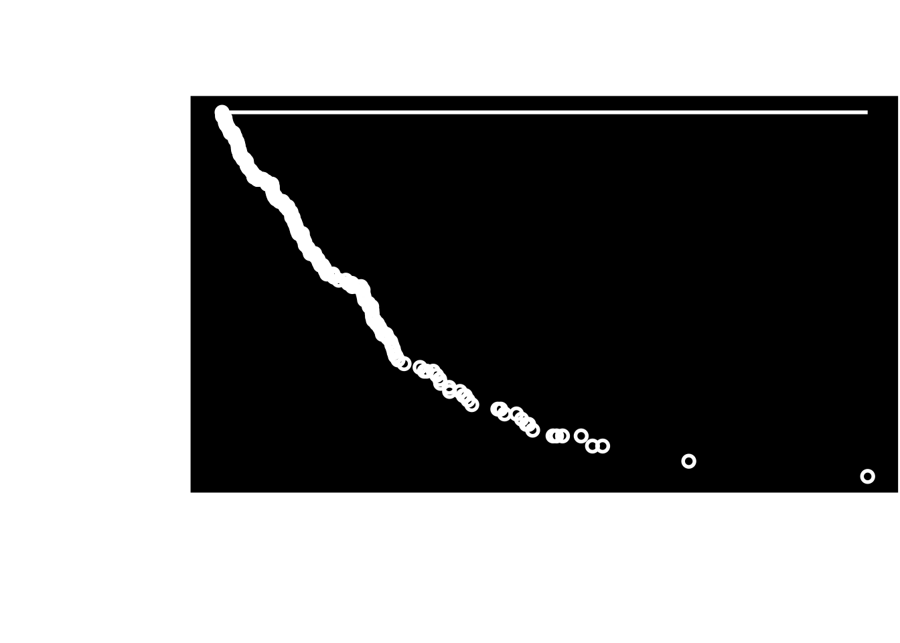

# Getting Started with TemporalHazard

This vignette shows the minimal workflow for fitting a parametric hazard
model, summarizing the fit, and generating predictions.

``` r
library(TemporalHazard)
library(survival)

set.seed(1001)
n <- 180
dat <- data.frame(
  time = rexp(n, rate = 0.35) + 0.05,
  status = rbinom(n, size = 1, prob = 0.6),
  age = rnorm(n, mean = 62, sd = 11),
  nyha = sample(1:4, n, replace = TRUE),
  shock = rbinom(n, size = 1, prob = 0.18)
)

fit <- TemporalHazard::hazard(
  Surv(time, status) ~ age + nyha + shock,
  data = dat,
  theta = c(mu = 0.25, nu = 1.10, beta1 = 0, beta2 = 0, beta3 = 0),
  dist = "weibull",
  fit = TRUE,
  control = list(maxit = 300)
)

summary(fit)
#> hazard model summary
#>   observations: 180 
#>   predictors:   3 
#>   dist:         weibull 
#>   engine:       native-r-m2 
#>   converged:    FALSE 
#>   log-lik:      28089.8 
#>   evaluations: fn=135, gr=135
#>   message:      ERROR: ABNORMAL_TERMINATION_IN_LNSRCH 
#> 
#> Coefficients:
#>           estimate std_error z_stat p_value
#> mu    3.126462e-03        NA     NA      NA
#> nu    2.101821e+02        NA     NA      NA
#> beta1 1.544198e+00        NA     NA      NA
#> beta2 4.913602e-01        NA     NA      NA
#> beta3 2.438124e-02        NA     NA      NA
```

## Prediction workflow

``` r
new_patients <- data.frame(
  time = c(0.5, 1.5, 3.0),
  age = c(50, 65, 75),
  nyha = c(1, 3, 4),
  shock = c(0, 0, 1)
)

pred_input <- new_patients

new_patients$linear_predictor <- predict(fit, newdata = pred_input, type = "linear_predictor")
new_patients$hazard_multiplier <- predict(fit, newdata = pred_input, type = "hazard")
new_patients$survival <- predict(fit, newdata = pred_input, type = "survival")
new_patients$cumulative_hazard <- predict(fit, newdata = pred_input, type = "cumulative_hazard")

new_patients
#>   time age nyha shock linear_predictor hazard_multiplier survival
#> 1  0.5  50    1     0         77.70128      5.562084e+33        1
#> 2  1.5  65    3     0        101.84698      1.704435e+44        1
#> 3  3.0  75    4     1        117.80470      1.451886e+51        1
#>   cumulative_hazard
#> 1                 0
#> 2                 0
#> 3                 0
```

## Visualizing predicted survival

The `hvtiPlotR` package provides publication-quality plotting for
parametric hazard models via
[`hv_hazard()`](https://ehrlinger.github.io/hvtiPlotR/reference/hv_hazard.html)
and its [`plot()`](https://rdrr.io/r/graphics/plot.default.html) method.
Here we build a survival curve over a fine time grid for a
median-profile patient and overlay the Kaplan-Meier nonparametric
estimate from the raw data.

``` r
if (requireNamespace("hvtiPlotR", quietly = TRUE)) {
  library(hvtiPlotR)

  # Parametric curve on a fine grid
  t_grid <- seq(0.05, max(dat$time), length.out = 80)
  curve_df <- data.frame(
    time = t_grid,
    AGE = median(dat$age),
    nyha = 2,
    shock = 0
  )
  curve_df$survival <- predict(fit, newdata = curve_df, type = "survival")

  # Kaplan-Meier empirical overlay
  km <- survival::survfit(survival::Surv(time, status) ~ 1, data = dat)
  km_df <- data.frame(
    time = km$time,
    estimate = km$surv * 100
  )

  # Build plot with hv_hazard + plot
  hz_obj <- hv_hazard(
    curve_data   = transform(curve_df, survival = survival * 100),
    x_col        = "time",
    estimate_col = "survival",
    empirical    = km_df,
    emp_x_col    = "time",
    emp_estimate_col = "estimate"
  )

  plot(hz_obj) +
    ggplot2::scale_y_continuous(limits = c(0, 100)) +
    ggplot2::labs(
      x = "Years after surgery",
      y = "Freedom from death (%)",
      title = "Parametric survival vs Kaplan-Meier"
    ) +
    hv_theme()
}
```



Figure 1: Parametric Weibull survival curve with Kaplan-Meier overlay

## Numerical helpers

The numerical helper functions remain available directly when you need
stable log-scale calculations for custom work or debugging.

``` r
TemporalHazard::hzr_log1pexp(c(-2, 0, 2))
#> [1] 0.1269280 0.6931472 2.1269280
```
