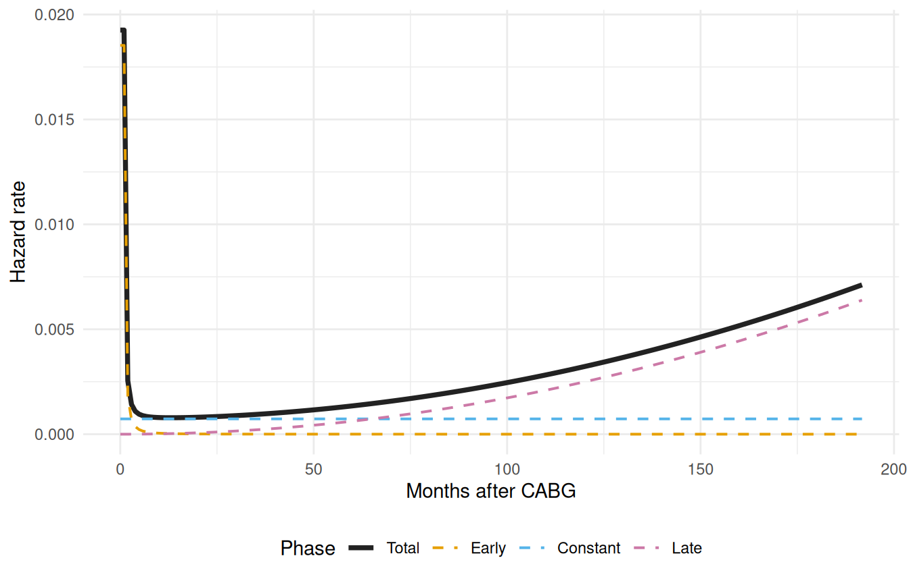
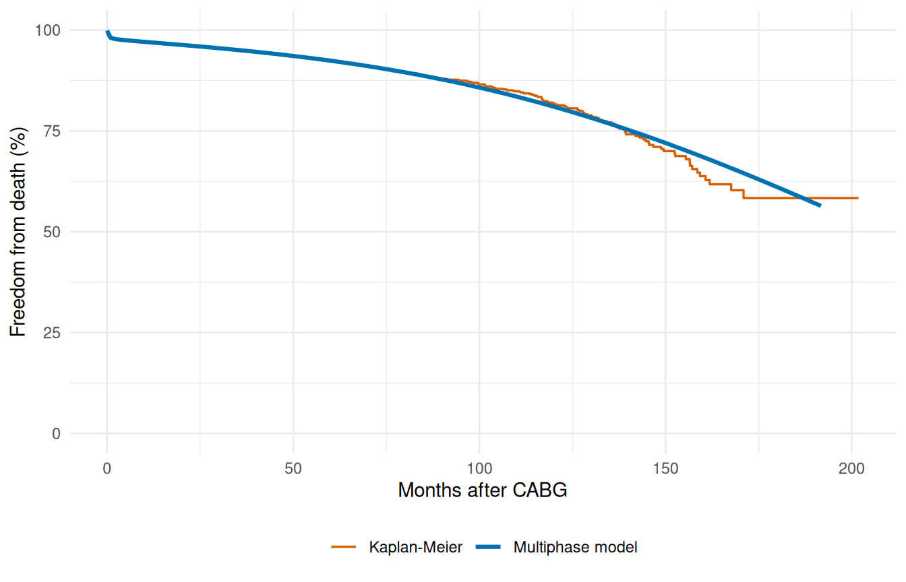

# Getting Started with TemporalHazard

This vignette shows the minimal workflow for fitting a parametric hazard
model, summarizing the fit, and generating predictions.

``` r
library(TemporalHazard)
library(survival)

set.seed(1001)
n <- 180
dat <- data.frame(
  time = rexp(n, rate = 0.35) + 0.05,
  status = rbinom(n, size = 1, prob = 0.6),
  age = rnorm(n, mean = 62, sd = 11),
  nyha = sample(1:4, n, replace = TRUE),
  shock = rbinom(n, size = 1, prob = 0.18)
)

fit <- TemporalHazard::hazard(
  Surv(time, status) ~ age + nyha + shock,
  data = dat,
  theta = c(mu = 0.25, nu = 1.10, beta1 = 0, beta2 = 0, beta3 = 0),
  dist = "weibull",
  fit = TRUE,
  control = list(maxit = 300)
)

summary(fit)
#> hazard model summary
#>   observations: 180 
#>   predictors:   3 
#>   dist:         weibull 
#>   engine:       native-r-m2 
#>   converged:    TRUE 
#>   log-lik:      -293.553 
#>   evaluations: fn=36, gr=8
#> 
#> Coefficients:
#>          estimate   std_error      z_stat      p_value
#> mu    0.121860518 0.062260594  1.95726558 5.031625e-02
#> nu    1.143730632 0.084302528 13.56697905 6.285984e-42
#> beta1 0.001716551 0.008807986  0.19488579 8.454824e-01
#> beta2 0.156208724 0.090597558  1.72420457 8.467092e-02
#> beta3 0.017352702 0.362918437  0.04781433 9.618642e-01
```

## Prediction workflow

``` r
new_patients <- data.frame(
  time = c(0.5, 1.5, 3.0),
  age = c(50, 65, 75),
  nyha = c(1, 3, 4),
  shock = c(0, 0, 1)
)

pred_input <- new_patients

new_patients$linear_predictor <- predict(fit, newdata = pred_input, type = "linear_predictor")
new_patients$hazard_multiplier <- predict(fit, newdata = pred_input, type = "hazard")
new_patients$survival <- predict(fit, newdata = pred_input, type = "survival")
new_patients$cumulative_hazard <- predict(fit, newdata = pred_input, type = "cumulative_hazard")

new_patients
#>   time age nyha shock linear_predictor hazard_multiplier  survival
#> 1  0.5  50    1     0        0.2420363          1.273840 0.9494097
#> 2  1.5  65    3     0        0.5802020          1.786399 0.7743185
#> 3  3.0  75    4     1        0.7709289          2.161774 0.5046535
#>   cumulative_hazard
#> 1        0.05191482
#> 2        0.25577202
#> 3        0.68388317
```

## Visualizing predicted survival

Here we build a survival curve over a fine time grid for a
median-profile patient and overlay the Kaplan-Meier nonparametric
estimate from the raw data.

``` r
library(ggplot2)

# Parametric curve on a fine grid
t_grid <- seq(0.05, max(dat$time), length.out = 80)
curve_df <- data.frame(
  time  = t_grid,
  age   = median(dat$age),
  nyha  = 2,
  shock = 0
)
curve_df$survival <- predict(fit, newdata = curve_df, type = "survival") * 100

# Kaplan-Meier empirical overlay
km <- survival::survfit(survival::Surv(time, status) ~ 1, data = dat)
km_df <- data.frame(time = km$time, survival = km$surv * 100)

ggplot() +
  geom_step(data = km_df, aes(time, survival, colour = "Kaplan-Meier")) +
  geom_line(data = curve_df, aes(time, survival,
                                  colour = "Parametric (Weibull)")) +
  scale_colour_manual(
    values = c("Parametric (Weibull)" = "#0072B2",
               "Kaplan-Meier"         = "#D55E00")
  ) +
  scale_y_continuous(limits = c(0, 100)) +
  labs(x = "Months after surgery", y = "Freedom from death (%)",
       colour = NULL) +
  theme_minimal() +
  theme(legend.position = "bottom")
```


Figure 1: Parametric Weibull survival curve with Kaplan-Meier overlay

## Multiphase models

Real clinical hazard patterns are rarely monotone. After cardiac
surgery, the risk of death starts high (early post-operative risk),
drops to a low background rate, and eventually rises again as patients
age. A single Weibull curve cannot capture this — but a multiphase
additive hazard model can.

The total hazard is decomposed into additive phases, each with its own
temporal shape:

$$H(t \mid x) = \sum\limits_{j = 1}^{J}\mu_{j}(x) \cdot \Phi_{j}(t)$$

Each phase is specified with
[`hzr_phase()`](https://ehrlinger.github.io/temporal_hazard/reference/hzr_phase.md),
which sets the temporal shape type and starting values for the
optimizer.

``` r
# CABGKUL is the benchmark dataset for 3-phase decomposition (n = 5,880)
data(cabgkul)

fit_mp <- hazard(
  Surv(int_dead, dead) ~ 1,
  data   = cabgkul,
  dist   = "multiphase",
  phases = list(
    early    = hzr_phase("cdf", t_half = 0.2, nu = 1, m = 1,
                          fixed = "shapes"),
    constant = hzr_phase("constant"),
    late     = hzr_phase("g3",  tau = 1, gamma = 3, alpha = 1, eta = 1,
                          fixed = "shapes")
  ),
  fit     = TRUE,
  control = list(n_starts = 5, maxit = 1000)
)

summary(fit_mp)
#> Multiphase hazard model (3 phases)
#>   observations: 5880 
#>   predictors:   0 
#>   dist:         multiphase 
#>   phase 1:      early - cdf (early risk)
#>   phase 2:      constant - constant (flat rate)
#>   phase 3:      late - g3 (late risk)
#>   engine:       native-r-m2 
#>   converged:    TRUE 
#>   log-lik:      -3740.52 
#>   evaluations: fn=5, gr=1
#> 
#> Coefficients (internal scale):
#> 
#>   Phase: early (cdf)
#>               estimate  std_error    z_stat p_value
#>   log_mu     -3.779643 0.09381473 -40.28837       0
#>   log_t_half -1.609438         NA        NA      NA
#>   nu          1.000000         NA        NA      NA
#>   m           1.000000         NA        NA      NA
#> 
#>   Phase: constant (constant)
#>           estimate  std_error    z_stat p_value
#>   log_mu -7.224008 0.09299137 -77.68471       0
#> 
#>   Phase: late (g3)
#>            estimate std_error    z_stat p_value
#>   log_mu  -16.65919 0.1158934 -143.7458       0
#>   log_tau   0.00000        NA        NA      NA
#>   gamma     3.00000        NA        NA      NA
#>   alpha     1.00000        NA        NA      NA
#>   eta       1.00000        NA        NA      NA
```

### Decomposed hazard visualization

The `decompose = TRUE` argument returns per-phase cumulative hazard
contributions. We numerically differentiate these to visualize the
instantaneous hazard rate for each phase.

``` r
t_grid <- seq(0.01, max(cabgkul$int_dead) * 0.95, length.out = 200)
nd     <- data.frame(time = t_grid)

# decompose = TRUE returns per-phase cumulative hazard columns
decomp <- predict(fit_mp, newdata = nd, type = "cumulative_hazard",
                  decompose = TRUE)

# Numerical differentiation: h(t) ≈ ΔH(t) / Δt
num_hazard <- function(cumhaz, time) {
  dt <- diff(time)
  dH <- diff(cumhaz)
  c(dH[1] / dt[1], dH / dt)
}

h_long <- rbind(
  data.frame(time = t_grid, hazard = num_hazard(decomp$early, t_grid),
             Phase = "Early"),
  data.frame(time = t_grid, hazard = num_hazard(decomp$constant, t_grid),
             Phase = "Constant"),
  data.frame(time = t_grid, hazard = num_hazard(decomp$late, t_grid),
             Phase = "Late"),
  data.frame(time = t_grid, hazard = num_hazard(decomp$total, t_grid),
             Phase = "Total")
)
h_long$Phase <- factor(h_long$Phase,
                       levels = c("Total", "Early", "Constant", "Late"))

ggplot(h_long, aes(time, hazard, colour = Phase, linetype = Phase)) +
  geom_line(aes(linewidth = Phase)) +
  scale_colour_manual(values = c(Total = "#222222", Early = "#E69F00",
                                 Constant = "#56B4E9", Late = "#CC79A7")) +
  scale_linetype_manual(values = c(Total = "solid", Early = "dashed",
                                   Constant = "dashed", Late = "dashed")) +
  scale_linewidth_manual(values = c(Total = 1.3, Early = 0.7,
                                    Constant = 0.7, Late = 0.7)) +
  labs(x = "Months after CABG", y = "Hazard rate",
       colour = "Phase", linetype = "Phase", linewidth = "Phase") +
  theme_minimal() +
  theme(legend.position = "bottom")
```



Figure 2: Additive phase decomposition: the total hazard (solid) is the
sum of early, constant, and late components (dashed)

### Multiphase survival with Kaplan-Meier overlay

``` r
surv_df <- data.frame(
  time     = t_grid,
  survival = predict(fit_mp, newdata = nd, type = "survival") * 100
)

km    <- survfit(Surv(int_dead, dead) ~ 1, data = cabgkul)
km_df <- data.frame(time = km$time, survival = km$surv * 100)

ggplot() +
  geom_step(data = km_df, aes(time, survival, colour = "Kaplan-Meier"),
            linewidth = 0.6) +
  geom_line(data = surv_df, aes(time, survival, colour = "Multiphase model"),
            linewidth = 1.1) +
  scale_colour_manual(
    values = c("Multiphase model" = "#0072B2", "Kaplan-Meier" = "#D55E00")
  ) +
  scale_y_continuous(limits = c(0, 100)) +
  labs(x = "Months after CABG", y = "Freedom from death (%)",
       colour = NULL) +
  theme_minimal() +
  theme(legend.position = "bottom")
```



Figure 3: Multiphase parametric survival vs. Kaplan-Meier

### Phase types

TemporalHazard supports several phase types:

``` r
hzr_phase("cdf",      t_half = 0.5, nu = 2, m = 1)   # Early risk (bounded)
hzr_phase("constant")                                   # Flat background rate
hzr_phase("cdf",      t_half = 10,  nu = 1, m = 0)    # Late risk (CDF-based)
hzr_phase("g3",       tau = 1, gamma = 3, alpha = 1,   # Late risk (G3 power law)
                       eta = 1)
```

The `"g3"` type uses the four-parameter G3 decomposition from the
original C/SAS HAZARD program, providing unbounded power-law growth for
late-phase hazards. See
[`vignette("mf-mathematical-foundations")`](https://ehrlinger.github.io/temporal_hazard/articles/mf-mathematical-foundations.md)
for the full mathematical treatment.

## Numerical helpers

The numerical helper functions remain available directly when you need
stable log-scale calculations for custom work or debugging.

``` r
TemporalHazard::hzr_log1pexp(c(-2, 0, 2))
#> [1] 0.1269280 0.6931472 2.1269280
```
