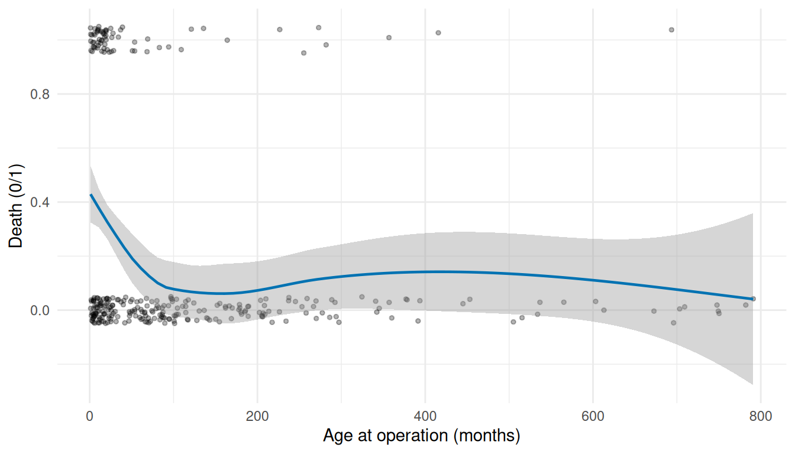
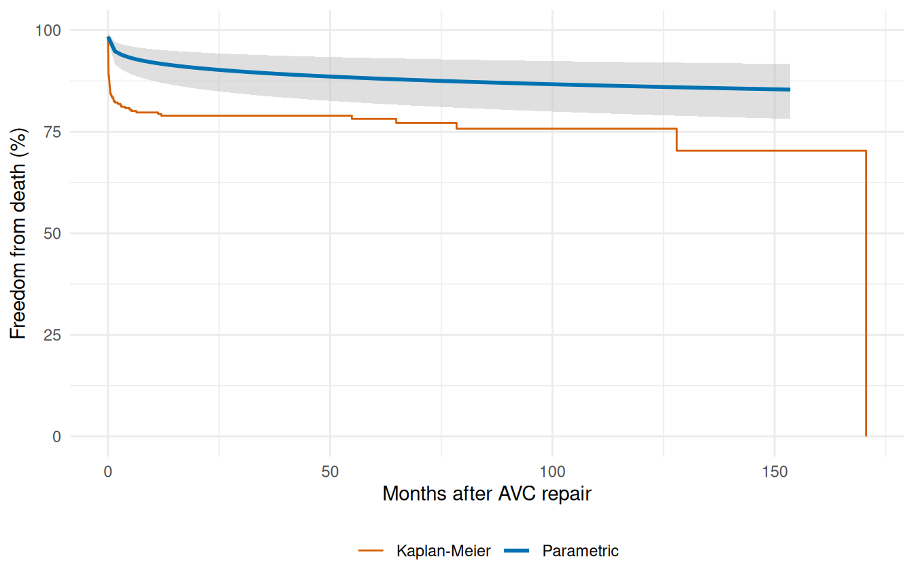
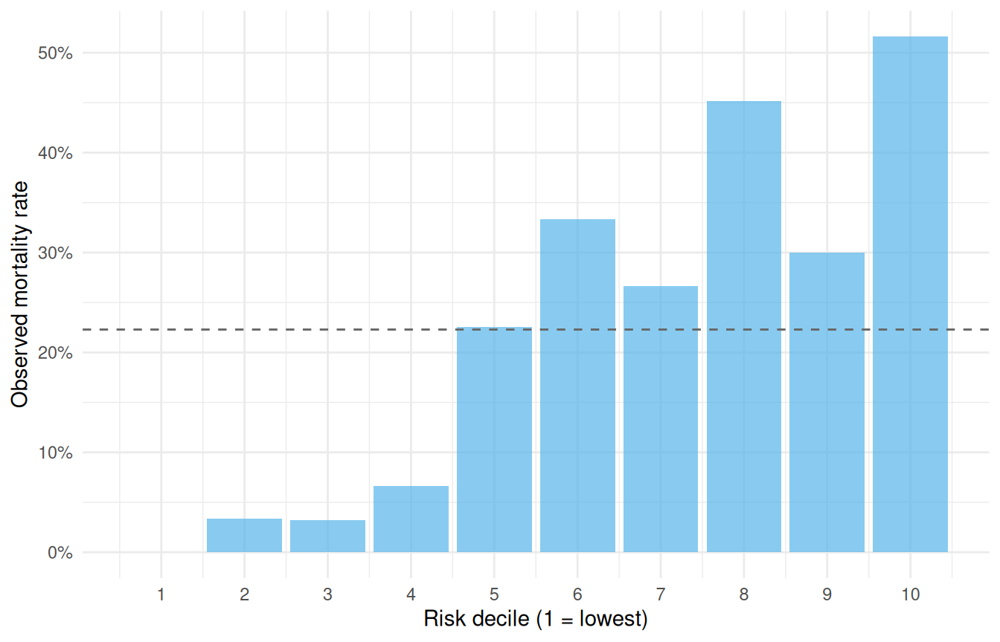
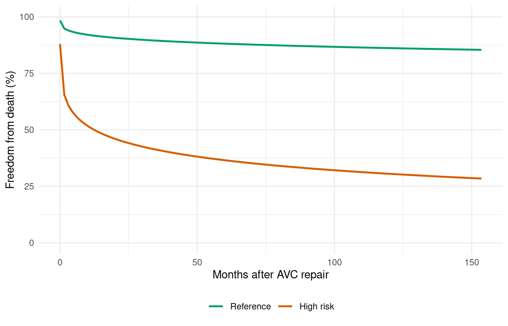

# Inference & Diagnostics

``` r
library(TemporalHazard)
library(survival)
library(ggplot2)
```

This vignette covers the diagnostic and inferential tools surrounding
hazard model fitting: exploratory covariate screening, bootstrap
confidence intervals, decile-of-risk validation, and sensitivity
analysis across covariate scenarios. These correspond to the `lg.*`,
`bs.*`, and `hs.*` steps in the classic HAZARD analysis workflow.

## 1 Exploratory covariate screening

Before fitting the parametric hazard model, it is useful to screen
candidate covariates with simple logistic models. This identifies
transformations and functional forms that should enter the final model.

``` r
data(avc)
avc <- na.omit(avc)

# Candidate covariates
candidates <- c("age", "status", "mal", "com_iv", "inc_surg", "orifice")
```

Fit a univariable logistic regression for each covariate against the
death indicator:

``` r
logit_fits <- lapply(candidates, function(var) {
  fmla <- as.formula(paste("dead ~", var))
  glm(fmla, data = avc, family = binomial())
})
names(logit_fits) <- candidates

# Which covariates are significant univariably?
p_values <- vapply(logit_fits, function(f) {
  coef(summary(f))[2, "Pr(>|z|)"]
}, numeric(1))

data.frame(covariate = names(p_values),
           p_value   = round(p_values, 4),
           row.names = NULL)
#>   covariate p_value
#> 1       age  0.0017
#> 2    status  0.0000
#> 3       mal  0.0006
#> 4    com_iv  0.0000
#> 5  inc_surg  0.0114
#> 6   orifice  0.0034
```

``` r
ggplot(avc, aes(age, dead)) +
  geom_jitter(height = 0.05, width = 0, alpha = 0.3, size = 1) +
  geom_smooth(method = "loess", se = TRUE, colour = "#0072B2",
              linewidth = 0.8) +
  labs(x = "Age at operation (months)", y = "Death (0/1)") +
  theme_minimal()
#> `geom_smooth()` using formula = 'y ~ x'
```



Figure 1: Exploratory: age vs. mortality with LOESS smooth

The LOESS smooth reveals the functional form of each covariate’s
relationship to mortality, guiding decisions about transformations (log,
polynomial) before the hazard model.

## 2 Bootstrap confidence intervals

Bootstrap resampling is the primary uncertainty quantification method in
the HAZARD workflow. Each replicate refits the model on a resampled
dataset and accumulates prediction curves; the CI is summarized across
replicates.

``` r
# Fit the base model that bootstrapping will use
fit <- hazard(
  Surv(int_dead, dead) ~ age + status + mal + com_iv,
  data  = avc,
  dist  = "weibull",
  theta = c(mu = 0.20, nu = 1.0, rep(0, 4)),
  fit   = TRUE,
  control = list(maxit = 500)
)

# Prediction grid at a median-risk profile
t_grid <- seq(0.01, max(avc$int_dead) * 0.9, length.out = 100)
base_nd <- data.frame(time = t_grid, age = median(avc$age),
                      status = 2, mal = 0, com_iv = 0)

surv_point <- predict(fit, newdata = base_nd, type = "survival")
```

``` r
set.seed(42)
n_boot <- 50  # kept small for vignette build time

boot_surv <- matrix(NA_real_, nrow = n_boot, ncol = length(t_grid))

for (b in seq_len(n_boot)) {
  idx    <- sample(nrow(avc), replace = TRUE)
  boot_d <- avc[idx, ]

  boot_fit <- tryCatch(
    hazard(
      Surv(int_dead, dead) ~ age + status + mal + com_iv,
      data    = boot_d,
      dist    = "weibull",
      theta   = coef(fit),
      fit     = TRUE,
      control = list(maxit = 300)
    ),
    error = function(e) NULL
  )

  if (!is.null(boot_fit)) {
    boot_surv[b, ] <- predict(boot_fit, newdata = base_nd,
                               type = "survival")
  }
}

# Remove failed replicates
ok <- !is.na(boot_surv[, 1])
boot_surv <- boot_surv[ok, , drop = FALSE]
message(sum(ok), " of ", n_boot, " bootstrap replicates converged")
#> 50 of 50 bootstrap replicates converged
```

``` r
ci_lo <- apply(boot_surv, 2, quantile, probs = 0.025) * 100
ci_hi <- apply(boot_surv, 2, quantile, probs = 0.975) * 100

ci_df <- data.frame(time = t_grid,
                    survival = surv_point * 100,
                    lower = ci_lo, upper = ci_hi)

km     <- survfit(Surv(int_dead, dead) ~ 1, data = avc)
km_df  <- data.frame(time = km$time, survival = km$surv * 100)

ggplot() +
  geom_ribbon(data = ci_df, aes(time, ymin = lower, ymax = upper),
              fill = "grey75", alpha = 0.5) +
  geom_step(data = km_df, aes(time, survival, colour = "Kaplan-Meier"),
            linewidth = 0.5) +
  geom_line(data = ci_df, aes(time, survival, colour = "Parametric"),
            linewidth = 1) +
  scale_colour_manual(values = c("Parametric" = "#0072B2",
                                 "Kaplan-Meier" = "#D55E00")) +
  scale_y_continuous(limits = c(0, 100)) +
  labs(x = "Months after AVC repair", y = "Freedom from death (%)",
       colour = NULL) +
  theme_minimal() +
  theme(legend.position = "bottom")
```



Figure 2: Parametric survival with bootstrap 95% confidence interval

## 3 Decile-of-risk validation

A standard model diagnostic: partition patients into deciles of
predicted risk and compare observed vs. predicted event rates. Good
calibration means the two track each other.

``` r
# Linear predictor = log-relative-hazard for each patient
lp <- predict(fit, type = "linear_predictor")

# Create deciles (handle ties gracefully)
decile <- cut(rank(lp, ties.method = "average"),
              breaks = quantile(rank(lp, ties.method = "average"),
                                probs = seq(0, 1, by = 0.1)),
              include.lowest = TRUE, labels = 1:10)

cal <- aggregate(avc$dead, by = list(Decile = decile), FUN = mean)
names(cal)[2] <- "observed"
cal$Decile <- as.integer(as.character(cal$Decile))

ggplot(cal, aes(Decile, observed)) +
  geom_col(fill = "#56B4E9", alpha = 0.7) +
  geom_hline(yintercept = mean(avc$dead), linetype = "dashed",
             colour = "grey40") +
  scale_x_continuous(breaks = 1:10) +
  scale_y_continuous(labels = scales::percent_format(accuracy = 1)) +
  labs(x = "Risk decile (1 = lowest)", y = "Observed mortality rate") +
  theme_minimal()
```



Figure 3: Observed vs. predicted mortality by decile of risk

## 4 Sensitivity analysis

Sensitivity analysis compares predictions across different covariate
configurations to assess how the model responds to risk factor changes.

``` r
# Define reference and high-risk profiles
ref_profile <- data.frame(
  age    = median(avc$age),
  status = 2,
  mal    = 0,
  com_iv = 0
)

high_risk <- data.frame(
  age    = quantile(avc$age, 0.90),
  status = 4,
  mal    = 1,
  com_iv = 1
)
```

``` r
sens_curves <- do.call(rbind, lapply(
  list("Reference" = ref_profile, "High risk" = high_risk),
  function(p) {
    nd <- p[rep(1, length(t_grid)), ]
    nd$time <- t_grid
    data.frame(time = t_grid,
               survival = predict(fit, newdata = nd, type = "survival") * 100,
               Profile = deparse(substitute(p)))
  }
))
# Fix profile labels
sens_curves$Profile <- rep(c("Reference", "High risk"),
                           each = length(t_grid))
sens_curves$Profile <- factor(sens_curves$Profile,
                              levels = c("Reference", "High risk"))

ggplot(sens_curves, aes(time, survival, colour = Profile)) +
  geom_line(linewidth = 0.9) +
  scale_colour_manual(values = c("Reference" = "#009E73",
                                 "High risk" = "#D55E00")) +
  scale_y_continuous(limits = c(0, 100)) +
  labs(x = "Months after AVC repair", y = "Freedom from death (%)",
       colour = NULL) +
  theme_minimal() +
  theme(legend.position = "bottom")
```



Figure 4: Sensitivity analysis: reference vs. high-risk profile

The gap between the curves quantifies the clinical impact of the risk
factors. The sensitivity analysis is most informative when combined with
bootstrap confidence intervals on each curve, showing whether the
difference is statistically meaningful.

## 5 Analysis workflow summary

The complete HAZARD analysis sequence, now implemented in
TemporalHazard:

1.  **Exploratory screening** (`glm`) — identify covariate
    transformations and functional forms
2.  **Kaplan-Meier baseline** (`survfit`) — nonparametric reference
    curve
3.  **Fit hazard model**
    ([`hazard()`](https://ehrlinger.github.io/temporal_hazard/reference/hazard.md))
    — parametric shape + covariates
4.  **Predict & visualize**
    ([`predict()`](https://rdrr.io/r/stats/predict.html)) — survival,
    hazard, risk profiles
5.  **Bootstrap CIs** — uncertainty quantification via resampling
6.  **Sensitivity analysis** — compare scenarios across covariate
    settings
7.  **Decile validation** — calibration check

See
[`vignette("getting-started")`](https://ehrlinger.github.io/temporal_hazard/articles/getting-started.md)
for the minimal workflow and
[`vignette("fitting-hazard-models")`](https://ehrlinger.github.io/temporal_hazard/articles/fitting-hazard-models.md)
for the model-fitting details.
