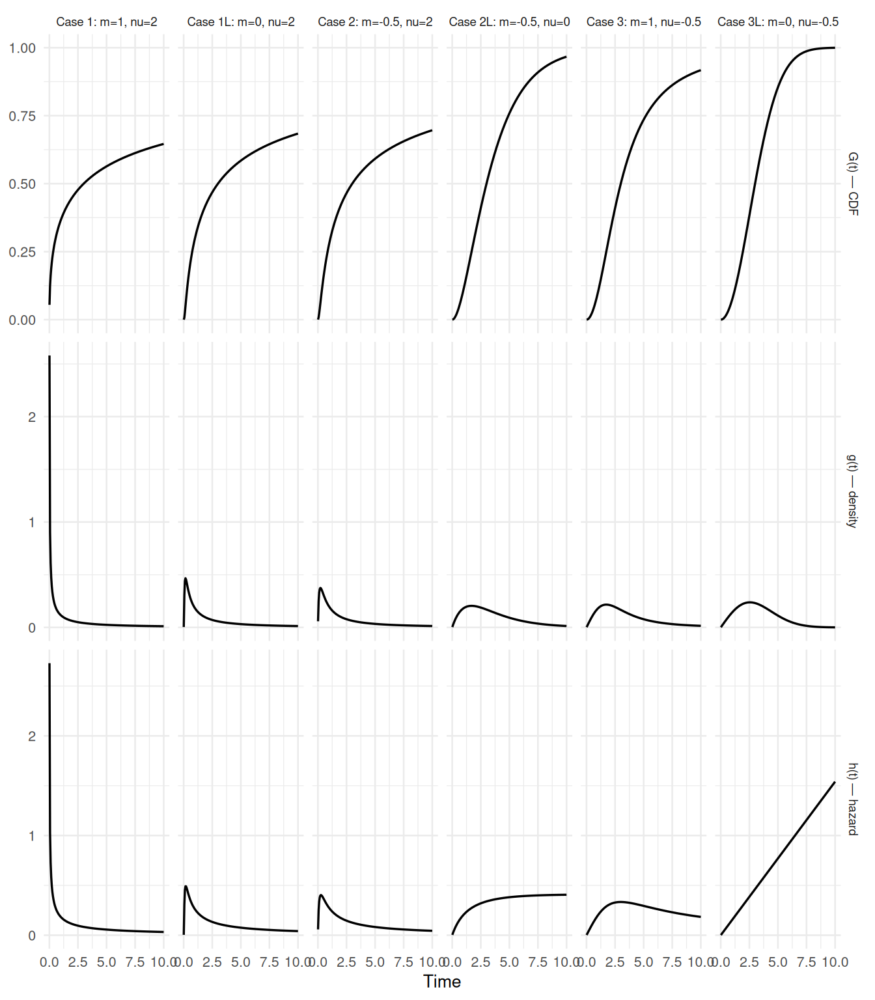
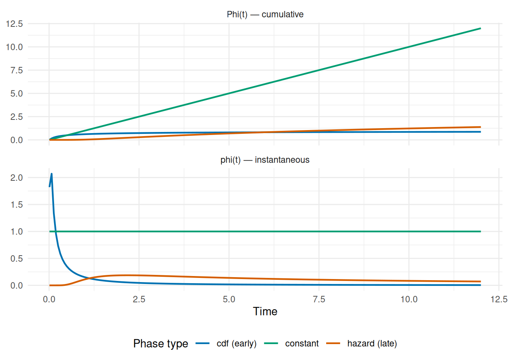
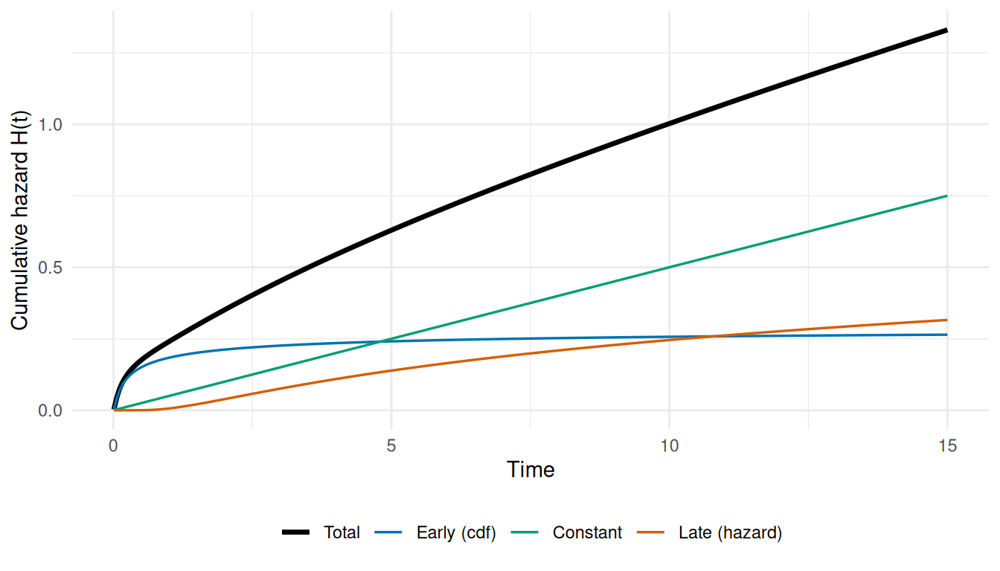

# Mathematical Foundations of TemporalHazard

``` r
library(TemporalHazard)
```

This vignette provides the mathematical foundation for the models
implemented in TemporalHazard. It covers the generalized temporal
decomposition family (Blackstone, Naftel, and Turner 1986), the additive
multiphase hazard model, maximum likelihood estimation under mixed
censoring, and extensions for time-varying covariates. The decomposition
framework extends naturally to longitudinal mixed-effects settings
(Rajeswaran et al. 2018).

For users migrating from the legacy SAS/C HAZARD program, each section
notes how the R parameterization relates to the original parameter
names. For the full translation table, see
[`vignette("sas-to-r-migration")`](https://ehrlinger.github.io/temporal_hazard/articles/sas-to-r-migration.md)
or call
[`hzr_argument_mapping()`](https://ehrlinger.github.io/temporal_hazard/reference/hzr_argument_mapping.md).

## 1 Generalized Temporal Decomposition

### 1.1 The parametric family

Every temporal phase in TemporalHazard is built from a single parametric
family, `decompos(t; t_half, nu, m)`, introduced by Blackstone, Naftel,
and Turner (1986) that produces three linked quantities from just three
parameters:

- $G(t)$ — cumulative distribution function (CDF), bounded
  $\lbrack 0,1\rbrack$
- $g(t) = dG/dt$ — probability density function
- $h(t) = g(t)/(1 - G(t))$ — hazard function

The three parameters control the shape of the distribution:

| Parameter | Meaning                                       | Constraint       |
|-----------|-----------------------------------------------|------------------|
| `t_half`  | Half-life: time at which $G(t_{1/2}) = 0.5$   | $> 0$            |
| `nu`      | Time exponent — controls rate dynamics        | any finite value |
| `m`       | Shape exponent — controls distributional form | any finite value |

> **SAS/C parameter bridge**
>
> The original C code used different parameter names per phase:
>
> - **Early phase (G1):** `DELTA`, `RHO`/`THALF`, `NU`, `M`
>   $\rightarrow$`t_half`, `nu`, `m`
> - **Late phase (G3):** `TAU`, `GAMMA`, `ALPHA`, `ETA`
>   $\rightarrow$`t_half`, `nu`, `m`
>
> Both collapse onto the same 3-parameter decomposition family. The C
> `DELTA` parameter controlled a time transformation
> $B(t) = ({\exp}(\delta t) - 1)/\delta$ that is absorbed into the
> shape.

In R,
[`hzr_decompos()`](https://ehrlinger.github.io/temporal_hazard/reference/hzr_decompos.md)
computes all three quantities:

``` r
t_grid <- seq(0.01, 10, length.out = 200)

# Standard sigmoidal (Case 1: m > 0, nu > 0)
d <- hzr_decompos(t_grid, t_half = 3, nu = 2, m = 1)

# Verify the half-life property: G(t_half) = 0.5
d_half <- hzr_decompos(3, t_half = 3, nu = 2, m = 1)
cat("G(t_half) =", round(d_half$G, 6), "\n")
#> G(t_half) = 0.5

# Verify the identity: h(t) = g(t) / (1 - G(t))
h_check <- d$g / (1 - d$G)
cat("Max |h - g/(1-G)| =", max(abs(d$h - h_check)), "\n")
#> Max |h - g/(1-G)| = 0
```

### 1.2 The six valid cases

The signs of `nu` and `m` determine six distinct distributional shapes.
The combination $m < 0$**and** $\nu < 0$ is undefined and raises an
error.

| Case | m    | nu   | Behavior                                    |
|:-----|:-----|:-----|:--------------------------------------------|
| 1    | \> 0 | \> 0 | Standard sigmoidal                          |
| 1L   | = 0  | \> 0 | Weibull-like (exponential limit as m -\> 0) |
| 2    | \< 0 | \> 0 | Heavy-tailed                                |
| 2L   | \< 0 | = 0  | Exponential decay                           |
| 3    | \> 0 | \< 0 | Bounded cumulative                          |
| 3L   | = 0  | \< 0 | Bounded exponential                         |

Six valid parameter sign combinations

The following plot shows the CDF $G(t)$, density $g(t)$, and hazard
$h(t)$ for each case, all with `t_half = 3`:

``` r
if (has_ggplot) {
  library(ggplot2)

  params <- list(
    "Case 1: m=1, nu=2"     = list(nu = 2,   m = 1),
    "Case 1L: m=0, nu=2"    = list(nu = 2,   m = 0),
    "Case 2: m=-0.5, nu=2"  = list(nu = 2,   m = -0.5),
    "Case 2L: m=-0.5, nu=0" = list(nu = 0,   m = -0.5),
    "Case 3: m=1, nu=-0.5"  = list(nu = -0.5, m = 1),
    "Case 3L: m=0, nu=-0.5" = list(nu = -0.5, m = 0)
  )

  t_grid <- seq(0.01, 10, length.out = 200)
  rows <- list()

  for (nm in names(params)) {
    p <- params[[nm]]
    d <- hzr_decompos(t_grid, t_half = 3, nu = p$nu, m = p$m)
    rows <- c(rows, list(data.frame(
      time = rep(t_grid, 3),
      value = c(d$G, d$g, d$h),
      quantity = rep(c("G(t) — CDF", "g(t) — density", "h(t) — hazard"),
                     each = length(t_grid)),
      case = nm
    )))
  }

  df <- do.call(rbind, rows)

  # Cap hazard display at reasonable values for readability
  df$value[df$quantity == "h(t) — hazard" & df$value > 5] <- NA

  ggplot(df, aes(x = time, y = value)) +
    geom_line(linewidth = 0.6) +
    facet_grid(quantity ~ case, scales = "free_y") +
    labs(x = "Time", y = NULL) +
    theme_minimal(base_size = 10) +
    theme(strip.text = element_text(size = 7))
}
```



Figure 1: G(t), g(t), and h(t) for all six valid decomposition cases

### 1.3 Derivation sketch

The construction begins with a rate function $\rho$ chosen so that
$G(t_{1/2}) = 0.5$ exactly. For Case 1 ($m > 0,\nu > 0$):

$$\rho = \nu\, t_{1/2}\left( \frac{2^{m} - 1}{m} \right)^{\!\nu}$$

Then, with the dimensionless time $b(t) = \nu t/\rho$:

$$G(t) = \left( 1 + m\, b(t)^{-1/\nu} \right)^{-1/m}$$

$$g(t) = \left( 1 + m\, b(t)^{-1/\nu} \right)^{-1/m - 1} \cdot b(t)^{-1/\nu - 1}/\rho$$

The other five cases arise as limits ($\left. m\rightarrow 0 \right.$,
$\left. \nu\rightarrow 0 \right.$) or sign reflections of this base
form. The implementation in
[`hzr_decompos()`](https://ehrlinger.github.io/temporal_hazard/reference/hzr_decompos.md)
dispatches to the appropriate branch after checking the signs of `nu`
and `m`.

## 2 Additive Multiphase Hazard Model

### 2.1 Model specification

The total cumulative hazard decomposes additively across $J$ phases:

$$H(t \mid \mathbf{x}) = \sum\limits_{j = 1}^{J}\mu_{j}(\mathbf{x}) \cdot \Phi_{j}(t;\, t_{1/2,j},\,\nu_{j},\, m_{j})$$

where:

- $\mu_{j}(\mathbf{x}) = {\exp}(\alpha_{j} + \mathbf{x}_{j}{\mathbf{β}}_{j})$
  is the phase-specific log-linear scale with covariates
- $\Phi_{j}(t)$ is the temporal shape, determined by the phase type

The three phase types correspond to different uses of the decomposition
output:

| Phase type   | $\Phi_{j}(t)$       | Domain               | Interpretation                             |
|--------------|---------------------|----------------------|--------------------------------------------|
| `"cdf"`      | $G(t)$              | $\lbrack 0,1\rbrack$ | Early risk that resolves over time         |
| `"hazard"`   | $-{\log}(1 - G(t))$ | $\lbrack 0,\infty)$  | Late or aging risk that accumulates        |
| `"constant"` | $t$                 | $\lbrack 0,\infty)$  | Flat background rate (no shape parameters) |

> **SAS/C bridge**
>
> The classic three-phase HAZARD model used:
>
> - **G1** (early) $\rightarrow$`hzr_phase("cdf", ...)`
> - **G2** (constant) $\rightarrow$`hzr_phase("constant")`
> - **G3** (late) $\rightarrow$`hzr_phase("hazard", ...)`
>
> TemporalHazard generalizes this to $N$ phases of any type.

### 2.2 Derived quantities

From the cumulative hazard, the instantaneous hazard and survival are:

$$h(t \mid \mathbf{x}) = \sum\limits_{j = 1}^{J}\mu_{j}(\mathbf{x}) \cdot \varphi_{j}(t)\qquad{\text{where}\mspace{6mu}}\varphi_{j} = d\Phi_{j}/dt$$

$$S(t \mid \mathbf{x}) = {\exp}\!\left( - H(t \mid \mathbf{x}) \right)$$

The derivative $\varphi_{j}(t)$ depends on phase type:

- `"cdf"`: $\varphi(t) = g(t)$ (the density)
- `"hazard"`: $\varphi(t) = h(t) = g(t)/(1 - G(t))$
- `"constant"`: $\varphi(t) = 1$

### 2.3 Constructing phases in R

Each phase is specified with
[`hzr_phase()`](https://ehrlinger.github.io/temporal_hazard/reference/hzr_phase.md)
and passed to
[`hazard()`](https://ehrlinger.github.io/temporal_hazard/reference/hazard.md):

``` r
# Classic three-phase pattern
early <- hzr_phase("cdf",      t_half = 0.5, nu = 2, m = 0)
const <- hzr_phase("constant")
late  <- hzr_phase("hazard",   t_half = 5,   nu = 1, m = 0)

print(early)
#> <hzr_phase> cdf (early risk) 
#>   t_half = 0.5  nu = 2  m = 0
print(const)
#> <hzr_phase> constant (flat rate)
print(late)
#> <hzr_phase> hazard (late risk) 
#>   t_half = 5  nu = 1  m = 0
```

The cumulative hazard contribution $\Phi(t)$ and instantaneous hazard
$\varphi(t)$ for each phase can be computed directly:

``` r
if (has_ggplot) {
  t_grid <- seq(0.01, 12, length.out = 200)

  phi_early <- hzr_phase_cumhaz(t_grid, t_half = 0.5, nu = 2, m = 0,
                                 type = "cdf")
  phi_late  <- hzr_phase_cumhaz(t_grid, t_half = 5, nu = 1, m = 0,
                                 type = "hazard")
  phi_const <- hzr_phase_cumhaz(t_grid, type = "constant")

  dphi_early <- hzr_phase_hazard(t_grid, t_half = 0.5, nu = 2, m = 0,
                                  type = "cdf")
  dphi_late  <- hzr_phase_hazard(t_grid, t_half = 5, nu = 1, m = 0,
                                  type = "hazard")
  dphi_const <- hzr_phase_hazard(t_grid, type = "constant")

  df <- data.frame(
    time = rep(t_grid, 6),
    value = c(phi_early, phi_late, phi_const,
              dphi_early, dphi_late, dphi_const),
    phase = rep(rep(c("cdf (early)", "hazard (late)", "constant"),
                    each = length(t_grid)), 2),
    quantity = rep(c("Phi(t) — cumulative", "phi(t) — instantaneous"),
                   each = 3 * length(t_grid))
  )

  ggplot(df, aes(x = time, y = value, colour = phase)) +
    geom_line(linewidth = 0.8) +
    facet_wrap(~ quantity, scales = "free_y", ncol = 1) +
    scale_colour_manual(values = c(
      "cdf (early)" = "#0072B2",
      "hazard (late)" = "#D55E00",
      "constant" = "#009E73"
    )) +
    labs(x = "Time", y = NULL, colour = "Phase type") +
    theme_minimal(base_size = 11) +
    theme(legend.position = "bottom")
}
```



Figure 2: Phi(t) and phi(t) for each phase type

### 2.4 Additive composition example

To build intuition, here is how three phases combine into a total
hazard. The key insight is that phases contribute additively to the
**cumulative hazard** $H(t)$, not to the survival directly.

``` r
if (has_ggplot) {
  t_grid <- seq(0.01, 15, length.out = 300)

  mu_early <- 0.3
  mu_const <- 0.05
  mu_late  <- 0.2

  H_early <- mu_early * hzr_phase_cumhaz(t_grid, t_half = 0.5, nu = 2,
                                           m = 0, type = "cdf")
  H_const <- mu_const * hzr_phase_cumhaz(t_grid, type = "constant")
  H_late  <- mu_late  * hzr_phase_cumhaz(t_grid, t_half = 5, nu = 1,
                                           m = 0, type = "hazard")
  H_total <- H_early + H_const + H_late

  df <- data.frame(
    time = rep(t_grid, 4),
    cumhaz = c(H_early, H_const, H_late, H_total),
    component = rep(c("Early (cdf)", "Constant", "Late (hazard)", "Total"),
                    each = length(t_grid))
  )
  df$component <- factor(df$component,
    levels = c("Total", "Early (cdf)", "Constant", "Late (hazard)"))

  ggplot(df, aes(x = time, y = cumhaz, colour = component,
                 linewidth = component)) +
    geom_line() +
    scale_colour_manual(values = c(
      "Total" = "black", "Early (cdf)" = "#0072B2",
      "Constant" = "#009E73", "Late (hazard)" = "#D55E00"
    )) +
    scale_linewidth_manual(values = c(
      "Total" = 1.2, "Early (cdf)" = 0.6,
      "Constant" = 0.6, "Late (hazard)" = 0.6
    )) +
    labs(x = "Time", y = "Cumulative hazard H(t)",
         colour = NULL, linewidth = NULL) +
    theme_minimal(base_size = 11) +
    theme(legend.position = "bottom")
}
```



Figure 3: Three-phase additive cumulative hazard: total = early +
constant + late

## 3 Maximum Likelihood Estimation

### 3.1 Log-likelihood under mixed censoring

TemporalHazard supports four censoring types in a single dataset, coded
by the `status` indicator:

| Code              | Type              | Contribution to log-likelihood                                                            |
|-------------------|-------------------|-------------------------------------------------------------------------------------------|
| $\delta_{i} = 1$  | Exact event       | ${\log}h(t_{i} \mid \mathbf{x}_{i}) - H(t_{i} \mid \mathbf{x}_{i})$                       |
| $\delta_{i} = 0$  | Right-censored    | $-H(t_{i} \mid \mathbf{x}_{i})$                                                           |
| $\delta_{i} = -1$ | Left-censored     | ${\log}\left( 1 - {\exp}(-H(u_{i} \mid \mathbf{x}_{i})) \right)$                          |
| $\delta_{i} = 2$  | Interval-censored | $-H(l_{i} \mid \mathbf{x}_{i}) + {\log}\left( 1 - {\exp}(-(H(u_{i}) - H(l_{i}))) \right)$ |

where $l_{i}$ and $u_{i}$ are the lower and upper bounds of the
censoring interval.

The full log-likelihood is:

$$\ell({\mathbf{θ}}) = \sum\limits_{i:\,\delta_{i} = 1}\left\lbrack {\log}h(t_{i} \mid \mathbf{x}_{i}) - H(t_{i} \mid \mathbf{x}_{i}) \right\rbrack - \sum\limits_{i:\,\delta_{i} = 0}H(t_{i} \mid \mathbf{x}_{i})$$$$+\sum\limits_{i:\,\delta_{i} = -1}{\log}\!\left( 1 - e^{-H(u_{i} \mid \mathbf{x}_{i})} \right) + \sum\limits_{i:\,\delta_{i} = 2}\left\lbrack - H(l_{i} \mid \mathbf{x}_{i}) + {\log}\!\left( 1 - e^{-(H(u_{i}) - H(l_{i}))} \right) \right\rbrack$$

The ${\log}(1 - e^{-x})$ terms are computed using the numerically stable
primitive
[`hzr_log1mexp()`](https://ehrlinger.github.io/temporal_hazard/reference/hzr_log1mexp.md),
which avoids catastrophic cancellation when $x$ is near zero.

``` r
# Naive log(1 - exp(-x)) fails near zero
x_small <- 1e-15
cat("Naive:  ", log(1 - exp(-x_small)), "\n")
#> Naive:   -34.53958
cat("Stable: ", hzr_log1mexp(x_small), "\n")
#> Stable:  -34.53878
```

### 3.2 Internal parameterization

During optimization, shape parameters are reparameterized for
unconstrained search. For each phase $j$, the internal parameter
sub-vector is:

| Parameter     | Internal (estimation)                | User-facing (reported)                |
|---------------|--------------------------------------|---------------------------------------|
| Scale         | ${\log}\mu_{j}$                      | $\mu_{j} = {\exp}({\log}\mu_{j})$     |
| Half-life     | ${\log}t_{1/2,j}$                    | $t_{1/2,j} = {\exp}({\log}t_{1/2,j})$ |
| Time exponent | $\nu_{j}$ (unconstrained)            | $\nu_{j}$                             |
| Shape         | $m_{j}$ (unconstrained)              | $m_{j}$                               |
| Covariates    | $\beta_{j,1},\ldots,\beta_{j,p_{j}}$ | same                                  |

Constant phases omit `log_t_half`, `nu`, and `m`, contributing only one
shape-free parameter (`log_mu`). The full $\mathbf{θ}$ is the
concatenation of all phase sub-vectors.

### 3.3 Optimization strategy

The optimizer uses
[`stats::optim()`](https://rdrr.io/r/stats/optim.html) with BFGS on the
unconstrained internal scale, wrapped by `.hzr_optim_generic()`. Key
features:

- **Multi-start**: the optimizer runs from $k$ random perturbations
  around the user-supplied starting values (default $k = 5$, controlled
  by `control$n_starts`). The run with the highest log-likelihood is
  kept.
- **Feasibility guard**: any parameter vector where $m < 0$**and**
  $\nu < 0$ for the same phase returns $-\infty$ immediately.
- **Post-fit Hessian**: the numerical Hessian at the solution is
  inverted to produce the variance-covariance matrix. Standard errors
  are $\sqrt{\text{diag}(\widehat{V})}$.

## 4 Covariates and Phase-Specific Formulas

### 4.1 Global covariates

By default, every phase shares the same covariate vector from the model
formula. Each phase gets its own coefficient vector ${\mathbf{β}}_{j}$:

$$\mu_{j}(\mathbf{x}) = {\exp}\!\left( \alpha_{j} + \mathbf{x}\,{\mathbf{β}}_{j} \right)$$

This means the same predictors can have different effects on early
vs. late risk — a core feature of multiphase models.

``` r
# Both phases use age and nyha from the global formula
hazard(
  survival::Surv(time, status) ~ age + nyha,
  data   = dat,
  dist   = "multiphase",
  phases = list(
    early = hzr_phase("cdf",    t_half = 0.5, nu = 2, m = 0),
    late  = hzr_phase("hazard", t_half = 5,   nu = 1, m = 0)
  ),
  fit = TRUE
)
```

### 4.2 Phase-specific covariates

When different phases are driven by different risk factors, each phase
can specify its own one-sided formula:

``` r
# Early risk depends on surgical factors; late risk on chronic conditions
hazard(
  survival::Surv(time, status) ~ age + nyha + shock,
  data   = dat,
  dist   = "multiphase",
  phases = list(
    early = hzr_phase("cdf",    t_half = 0.5, nu = 2, m = 0,
                      formula = ~ age + shock),
    late  = hzr_phase("hazard", t_half = 5,   nu = 1, m = 0,
                      formula = ~ age + nyha)
  ),
  fit = TRUE
)
```

When a phase has a `formula`, it gets its own design matrix built from
the data, and only those covariates appear in its ${\mathbf{β}}_{j}$.
The parameter vector is shorter for phases with fewer covariates, which
can improve identifiability and convergence.

### 4.3 Time-varying coefficients

For single-distribution models, TemporalHazard supports piecewise
time-varying coefficients via the `time_windows` argument. This expands
the design matrix into window-specific blocks:

$$\eta_{i} = \sum\limits_{k = 1}^{K}\mathbf{x}_{i}{\mathbf{β}}_{k} \cdot \mathbf{1}(t_{i} \in W_{k})$$

where $W_{1},\ldots,W_{K}$ are the time windows defined by the cut
points. Each predictor gets a separate coefficient in each window,
allowing effects to change over follow-up time.

``` r
# Two windows: [0, 2] and (2, infinity)
hazard(
  survival::Surv(time, status) ~ age + nyha,
  data         = dat,
  theta        = c(mu = 0.25, nu = 1.1,
                   age_w1 = 0, nyha_w1 = 0,
                   age_w2 = 0, nyha_w2 = 0),
  dist         = "weibull",
  time_windows = 2,
  fit          = TRUE
)
```

> **Multiphase vs. time-varying coefficients**
>
> For multiphase models, the phase structure itself captures
> time-varying effects: early phases dominate at small $t$ and late
> phases at large $t$. The `time_windows` mechanism is a complementary
> approach for single-distribution models.

## 5 Identifiability and Practical Considerations

### 5.1 Parameter identifiability

Multiphase models with many free parameters can have flat or multi-modal
likelihood surfaces. Practical guidelines:

1.  **Fix shape parameters when possible.** If clinical knowledge
    suggests a specific temporal pattern (e.g. early mortality follows a
    Weibull shape with $m = 0$), fix `m` in the
    [`hzr_phase()`](https://ehrlinger.github.io/temporal_hazard/reference/hzr_phase.md)
    starting values and inspect whether the optimizer moves it.

2.  **Start from the SAS/C estimates.** If legacy results are available,
    translate them using
    [`hzr_argument_mapping()`](https://ehrlinger.github.io/temporal_hazard/reference/hzr_argument_mapping.md)
    and supply as starting values.

3.  **Use multi-start optimization.** The default `control$n_starts = 5`
    helps escape local optima, but complex models may benefit from more
    starts.

4.  **Phase-specific covariates improve identifiability.** Restricting
    each phase to clinically relevant predictors reduces the parameter
    count and sharpens the likelihood surface.

### 5.2 Numerical stability

The decomposition engine applies several guards:

- Time is clamped above `.Machine$double.xmin` to avoid
  $0^{\text{negative}}$
- $1 - G(t)$ is clamped above `.Machine$double.xmin` before computing
  the hazard $h(t) = g(t)/(1 - G(t))$
- Left- and interval-censored contributions use
  [`hzr_log1mexp()`](https://ehrlinger.github.io/temporal_hazard/reference/hzr_log1mexp.md)
  to avoid ${\log}(0)$ when $H(t)$ is very small

These guards ensure finite gradients throughout the optimization, even
in regions of parameter space far from the optimum.

## 6 Summary of Key Functions

| Function                                                                                                  | Purpose                                           |
|-----------------------------------------------------------------------------------------------------------|---------------------------------------------------|
| `hzr_decompos(t, t_half, nu, m)`                                                                          | Core decomposition: returns $G$, $g$, $h$         |
| `hzr_phase_cumhaz(t, ..., type)`                                                                          | Phase cumulative hazard $\Phi(t)$                 |
| `hzr_phase_hazard(t, ..., type)`                                                                          | Phase instantaneous hazard $\varphi(t)$           |
| `hzr_phase(type, t_half, nu, m, formula)`                                                                 | Construct a phase specification                   |
| `hazard(..., dist = "multiphase", phases = ...)`                                                          | Fit a multiphase model                            |
| `predict(fit, type, decompose = TRUE)`                                                                    | Per-phase decomposed predictions                  |
| [`hzr_argument_mapping()`](https://ehrlinger.github.io/temporal_hazard/reference/hzr_argument_mapping.md) | SAS/C $\rightarrow$ R parameter translation table |
| `hzr_log1mexp(x)`                                                                                         | Stable ${\log}(1 - e^{-x})$                       |

For a worked clinical example, see
[`vignette("getting-started")`](https://ehrlinger.github.io/temporal_hazard/articles/getting-started.md).
For migration from SAS HAZARD, see
[`vignette("sas-to-r-migration")`](https://ehrlinger.github.io/temporal_hazard/articles/sas-to-r-migration.md).

## References

Blackstone EH, Naftel DC, Turner ME Jr. The decomposition of
time-varying hazard into phases, each incorporating a separate stream of
concomitant information. *J Am Stat Assoc.* 1986;81(395):615–624. doi:
[10.1080/01621459.1986.10478314](https://doi.org/10.1080/01621459.1986.10478314)

Rajeswaran J, Blackstone EH, Ehrlinger J, Li L, Ishwaran H, Parides MK.
Probability of atrial fibrillation after ablation: Using a parametric
nonlinear temporal decomposition mixed effects model. *Stat Methods Med
Res.* 2018;27(1):126–141. doi:
[10.1177/0962280215623583](https://doi.org/10.1177/0962280215623583)
