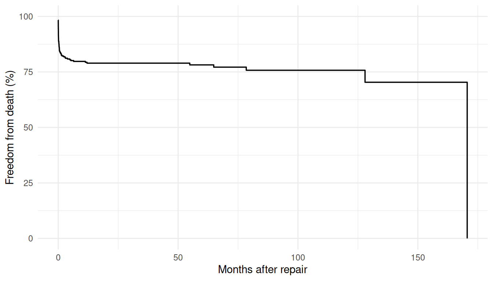
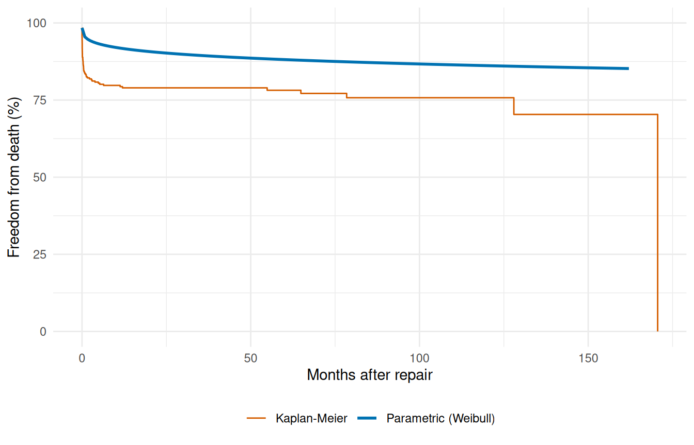
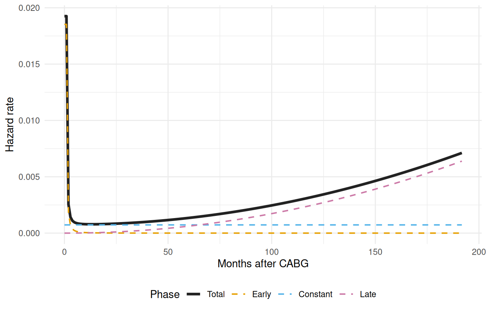
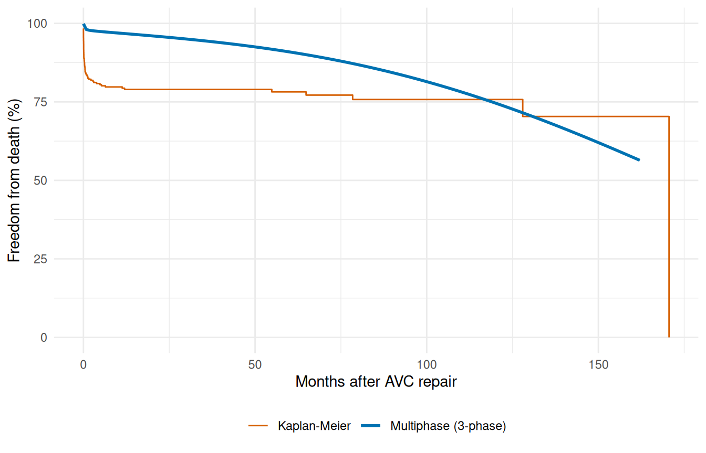
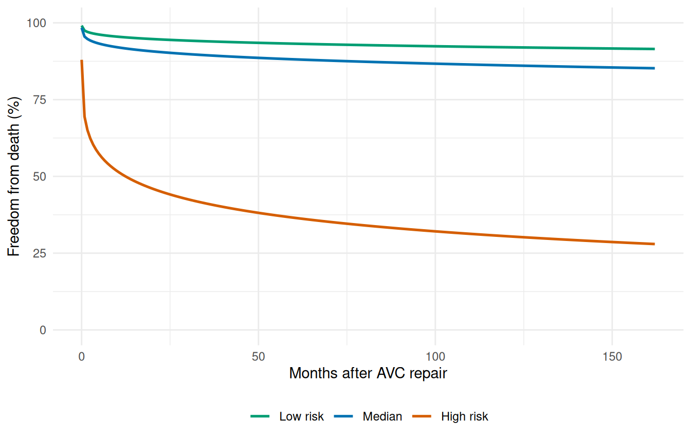
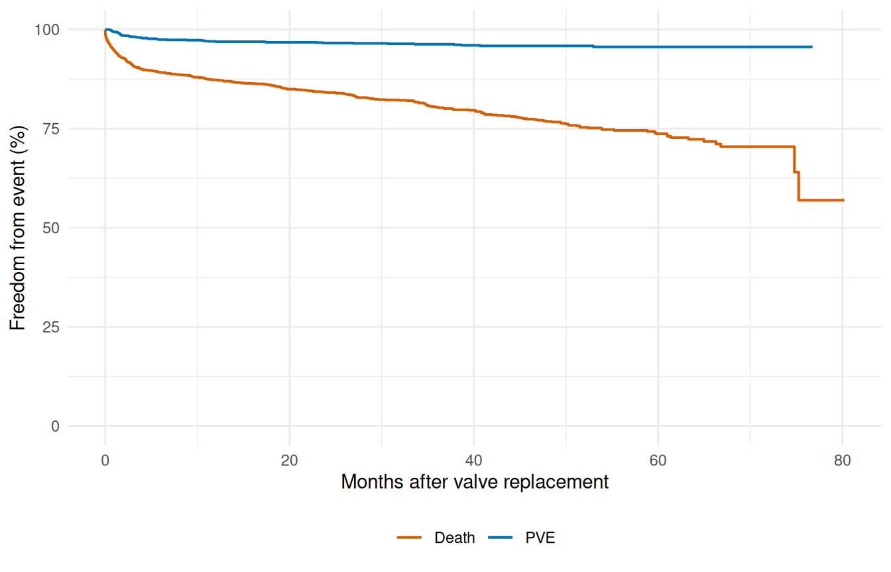

# Prediction & Visualization

``` r
library(TemporalHazard)
library(survival)
library(ggplot2)
```

This vignette covers prediction from fitted hazard models: generating
survival curves, decomposing the multiphase hazard, comparing risk
profiles, and overlaying parametric fits with Kaplan-Meier estimates.

## 1 Kaplan-Meier baseline

Before any parametric modeling, the Kaplan-Meier curve establishes a
nonparametric reference. All subsequent parametric predictions should be
compared against this baseline to assess goodness-of-fit.

``` r
data(avc)
avc <- na.omit(avc)
km <- survfit(Surv(int_dead, dead) ~ 1, data = avc)
```

``` r
km_df <- data.frame(time = km$time, survival = km$surv * 100)

ggplot(km_df, aes(time, survival)) +
  geom_step(linewidth = 0.6) +
  scale_y_continuous(limits = c(0, 100)) +
  labs(x = "Months after repair", y = "Freedom from death (%)") +
  theme_minimal()
```



Figure 1: Kaplan-Meier survival estimate: death after AVC repair

## 2 Prediction types

The [`predict()`](https://rdrr.io/r/stats/predict.html) method supports
several output types. For a multivariable Weibull model on the AVC data:

``` r
fit <- hazard(
  Surv(int_dead, dead) ~ age + status + mal + com_iv,
  data  = avc,
  dist  = "weibull",
  theta = c(mu = 0.20, nu = 1.0, rep(0, 4)),
  fit   = TRUE,
  control = list(maxit = 500)
)
```

Generate predictions at a median-risk profile over a time grid:

``` r
t_grid <- seq(0.01, max(avc$int_dead) * 0.95, length.out = 200)
profile <- data.frame(
  time   = t_grid,
  age    = median(avc$age),
  status = 2,
  mal    = 0,
  com_iv = 0
)

surv   <- predict(fit, newdata = profile, type = "survival")
cumhaz <- predict(fit, newdata = profile, type = "cumulative_hazard")

profile$survival          <- surv
profile$cumulative_hazard <- cumhaz

head(profile[, c("time", "survival", "cumulative_hazard")])
#>        time  survival cumulative_hazard
#> 1 0.0100000 0.9840245        0.01610446
#> 2 0.8242888 0.9552402        0.04579243
#> 3 1.6385776 0.9475408        0.05388532
#> 4 2.4528664 0.9424348        0.05928850
#> 5 3.2671552 0.9385173        0.06345398
#> 6 4.0814440 0.9352997        0.06688831
```

## 3 Parametric survival with KM overlay

The fundamental diagnostic: does the parametric model track the
Kaplan-Meier?

``` r
ggplot() +
  geom_step(data = km_df, aes(time, survival, colour = "Kaplan-Meier"),
            linewidth = 0.5) +
  geom_line(data = profile,
            aes(time, survival * 100, colour = "Parametric (Weibull)"),
            linewidth = 1) +
  scale_colour_manual(
    values = c("Parametric (Weibull)" = "#0072B2",
               "Kaplan-Meier"         = "#D55E00")
  ) +
  scale_y_continuous(limits = c(0, 100)) +
  labs(x = "Months after repair", y = "Freedom from death (%)",
       colour = NULL) +
  theme_minimal() +
  theme(legend.position = "bottom")
```



Figure 2: Weibull parametric survival vs. Kaplan-Meier (AVC death)

## 4 Decomposed multiphase hazard

The multiphase model decomposes the cumulative hazard into per-phase
contributions. Using `decompose = TRUE` with
`type = "cumulative_hazard"` returns a data frame with columns for each
phase.

``` r
data(cabgkul)

fit_mp <- hazard(
  Surv(int_dead, dead) ~ 1,
  data   = cabgkul,
  dist   = "multiphase",
  phases = list(
    early    = hzr_phase("cdf", t_half = 0.2, nu = 1, m = 1,
                          fixed = "shapes"),
    constant = hzr_phase("constant"),
    late     = hzr_phase("g3",  tau = 1, gamma = 3, alpha = 1, eta = 1,
                          fixed = "shapes")
  ),
  fit     = TRUE,
  control = list(n_starts = 5, maxit = 1000)
)
```

``` r
t_mp <- seq(0.01, max(cabgkul$int_dead) * 0.95, length.out = 200)
nd   <- data.frame(time = t_mp)

decomp <- predict(fit_mp, newdata = nd, type = "cumulative_hazard",
                  decompose = TRUE)

# Numerical differentiation: h(t) ≈ ΔH(t) / Δt
num_hazard <- function(cumhaz, time) {
  dt <- diff(time)
  dH <- diff(cumhaz)
  c(dH[1] / dt[1], dH / dt)
}

h_long <- rbind(
  data.frame(time = t_mp, hazard = num_hazard(decomp$early, t_mp),
             Phase = "Early"),
  data.frame(time = t_mp, hazard = num_hazard(decomp$constant, t_mp),
             Phase = "Constant"),
  data.frame(time = t_mp, hazard = num_hazard(decomp$late, t_mp),
             Phase = "Late"),
  data.frame(time = t_mp, hazard = num_hazard(decomp$total, t_mp),
             Phase = "Total")
)
h_long$Phase <- factor(h_long$Phase,
                       levels = c("Total", "Early", "Constant", "Late"))

ggplot(h_long, aes(time, hazard, colour = Phase, linetype = Phase)) +
  geom_line(aes(linewidth = Phase)) +
  scale_colour_manual(values = c(Total = "#222222", Early = "#E69F00",
                                 Constant = "#56B4E9", Late = "#CC79A7")) +
  scale_linetype_manual(values = c(Total = "solid", Early = "dashed",
                                   Constant = "dashed", Late = "dashed")) +
  scale_linewidth_manual(values = c(Total = 1.3, Early = 0.7,
                                    Constant = 0.7, Late = 0.7)) +
  labs(x = "Months after CABG", y = "Hazard rate",
       colour = "Phase", linetype = "Phase", linewidth = "Phase") +
  theme_minimal() +
  theme(legend.position = "bottom")
```



Figure 3: Additive phase decomposition: total hazard rate (solid) =
early + constant + late (dashed)

The early phase captures the steep post-operative risk that peaks within
the first year. The constant phase represents ongoing background
mortality. The late phase captures the gradually increasing risk of late
attrition.

## 5 Multiphase survival with KM overlay

``` r
surv_mp <- predict(fit_mp, newdata = nd, type = "survival") * 100

ggplot() +
  geom_step(data = km_df, aes(time, survival, colour = "Kaplan-Meier"),
            linewidth = 0.5) +
  geom_line(data = data.frame(time = t_grid, survival = surv_mp),
            aes(time, survival, colour = "Multiphase (3-phase)"),
            linewidth = 1) +
  scale_colour_manual(
    values = c("Multiphase (3-phase)" = "#0072B2",
               "Kaplan-Meier"         = "#D55E00")
  ) +
  scale_y_continuous(limits = c(0, 100)) +
  labs(x = "Months after AVC repair", y = "Freedom from death (%)",
       colour = NULL) +
  theme_minimal() +
  theme(legend.position = "bottom")
```



Figure 4: Multiphase parametric survival vs. Kaplan-Meier

## 6 Patient-specific risk profiles

The multivariable model generates patient-specific survival curves by
varying the covariate profile:

``` r
profiles <- list(
  "Low risk"  = data.frame(age = quantile(avc$age, 0.25),
                            status = 1, mal = 0, com_iv = 0),
  "Median"    = data.frame(age = median(avc$age),
                            status = 2, mal = 0, com_iv = 0),
  "High risk" = data.frame(age = quantile(avc$age, 0.90),
                            status = 4, mal = 1, com_iv = 1)
)

curves <- do.call(rbind, lapply(names(profiles), function(nm) {
  nd <- profiles[[nm]][rep(1, length(t_grid)), ]
  nd$time <- t_grid
  data.frame(time = t_grid,
             survival = predict(fit, newdata = nd, type = "survival") * 100,
             Profile = nm)
}))
curves$Profile <- factor(curves$Profile,
                         levels = c("Low risk", "Median", "High risk"))

ggplot(curves, aes(time, survival, colour = Profile)) +
  geom_line(linewidth = 0.9) +
  scale_colour_manual(values = c("Low risk" = "#009E73",
                                 "Median"   = "#0072B2",
                                 "High risk" = "#D55E00")) +
  scale_y_continuous(limits = c(0, 100)) +
  labs(x = "Months after AVC repair", y = "Freedom from death (%)",
       colour = NULL) +
  theme_minimal() +
  theme(legend.position = "bottom")
```



Figure 5: Predicted survival by risk profile

The separation between curves quantifies the prognostic discrimination
of the model. A wider spread indicates stronger covariate effects.

## 7 Multi-endpoint visualization: valves

The `valves` dataset has multiple endpoints that can be visualized
together:

``` r
data(valves)
valves <- na.omit(valves)

km_death <- survfit(Surv(int_dead, dead) ~ 1, data = valves)
km_pve   <- survfit(Surv(int_pve, pve) ~ 1, data = valves)

ep_df <- rbind(
  data.frame(time = km_death$time, survival = km_death$surv * 100,
             Endpoint = "Death"),
  data.frame(time = km_pve$time, survival = km_pve$surv * 100,
             Endpoint = "PVE")
)

ggplot(ep_df, aes(time, survival, colour = Endpoint)) +
  geom_step(linewidth = 0.7) +
  scale_y_continuous(limits = c(0, 100)) +
  scale_colour_manual(values = c("Death" = "#D55E00", "PVE" = "#0072B2")) +
  labs(x = "Months after valve replacement",
       y = "Freedom from event (%)", colour = NULL) +
  theme_minimal() +
  theme(legend.position = "bottom")
```



Figure 6: Freedom from death and PVE after valve replacement
