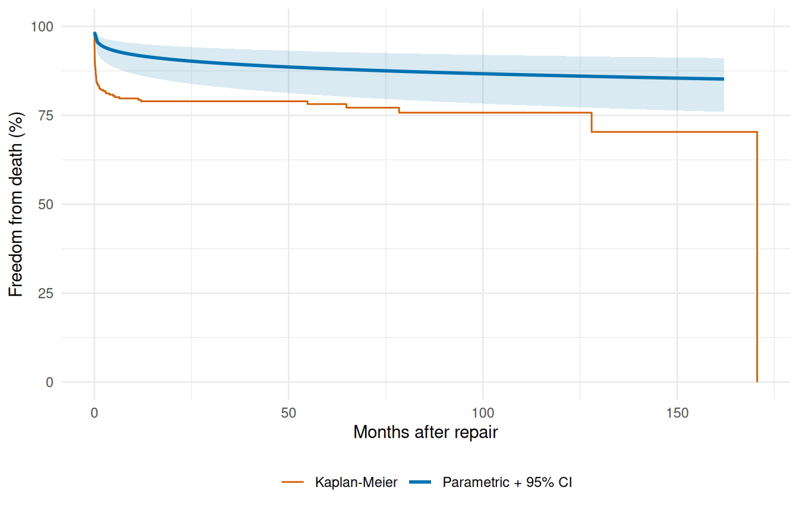

# Prediction & Visualization

``` r

library(TemporalHazard)
library(survival)
library(ggplot2)
```

A fitted hazard model is only useful insofar as you can extract answers
from it. This vignette covers the predict-and-visualize half of the
workflow: pulling survival probabilities, cumulative hazards, and
patient-level risk scores out of a fitted model, attaching delta-method
uncertainty to those predictions, and plotting them in the formats that
come up in actual clinical analyses.

The structure mirrors how a real analysis unfolds. We start with the
Kaplan-Meier baseline (the nonparametric reference every parametric fit
gets judged against), enumerate the prediction types the model exposes,
plot the parametric survival curve against KM as a goodness-of-fit
check, layer on confidence bands, then move to the multiphase
decomposition and patient-specific risk profiles where the covariate
machinery pays off. The last section reuses the workflow across multiple
endpoints on the same cohort. If you haven’t seen the fitting workflow
yet,
[`vignette("fitting-hazard-models")`](https://ehrlinger.github.io/temporal_hazard/articles/fitting-hazard-models.md)
is the prerequisite.

## 1 Kaplan-Meier baseline

The Kaplan-Meier curve is what the data itself says about survival
before any parametric model intervenes. It makes no assumption about the
shape of the hazard, handles censoring honestly, and gives you a
nonparametric step function that’s the gold-standard reference for any
follow-up fit. Every parametric prediction that follows gets compared
back to this curve — if a model’s smooth prediction can’t track the KM
step function, the model is missing something the data has been telling
you all along.

``` r

data(avc)
avc <- na.omit(avc)
km <- survfit(Surv(int_dead, dead) ~ 1, data = avc)
```

``` r

km_df <- data.frame(time = km$time, survival = km$surv * 100)

ggplot(km_df, aes(time, survival)) +
  geom_step(linewidth = 0.6) +
  scale_y_continuous(limits = c(0, 100)) +
  labs(x = "Months after repair", y = "Freedom from death (%)") +
  theme_minimal()
```


Figure 1: Kaplan-Meier survival estimate: death after AVC repair

## 2 Prediction types

The [`predict()`](https://rdrr.io/r/stats/predict.html) method exposes
four quantities through its `type=` argument, each useful for a
different downstream question:

- `"linear_predictor"` — $`x^\top \beta`$, the covariate-driven
  log-hazard shift. Use it to rank patients on relative risk without
  pinning down absolute survival probabilities.
- `"hazard"` — $`\exp(x^\top \beta)`$, the multiplicative hazard ratio
  relative to the baseline. Use it when you want hazard ratios for
  reporting or for further calculation.
- `"cumulative_hazard"` — $`H(t \mid x)`$, the integrated hazard up to
  time $`t`$ for each row. Use it when you need the raw integrated
  intensity (decomposing it by phase, for example, or computing derived
  quantities like the expected number of events).
- `"survival"` — $`S(t \mid x) = \exp(-H(t \mid x))`$, the probability
  of surviving past time $`t`$. This is what clinicians and patients
  actually want to see; it’s also what we plot for diagnostics.

The two predictions we extract below are `"survival"` and
`"cumulative_hazard"` — survival for the clinical communication, and the
cumulative hazard so we can sanity-check the relationship
$`S = \exp(-H)`$ holds row-by-row. We fit a multivariable Weibull on the
AVC death endpoint first.

``` r

fit <- hazard(
  Surv(int_dead, dead) ~ age + status + mal + com_iv,
  data  = avc,
  dist  = "weibull",
  theta = c(mu = 0.20, nu = 1.0, rep(0, 4)),
  fit   = TRUE,
  control = list(maxit = 500)
)
```

Pick a representative patient — here a median-aged, mid-status,
no-malalignment, no-grade-IV-complication profile — and evaluate the
prediction types over a fine time grid. The result is a data frame with
one row per time point, ready for plotting or downstream analysis.

``` r

t_grid <- seq(0.01, max(avc$int_dead) * 0.95, length.out = 200)
profile <- data.frame(
  time   = t_grid,
  age    = median(avc$age),
  status = 2,
  mal    = 0,
  com_iv = 0
)

surv   <- predict(fit, newdata = profile, type = "survival")
cumhaz <- predict(fit, newdata = profile, type = "cumulative_hazard")

profile$survival          <- surv
profile$cumulative_hazard <- cumhaz

head(profile[, c("time", "survival", "cumulative_hazard")])
#>        time  survival cumulative_hazard
#> 1 0.0100000 0.9840245        0.01610446
#> 2 0.8242888 0.9552402        0.04579243
#> 3 1.6385776 0.9475408        0.05388532
#> 4 2.4528664 0.9424348        0.05928850
#> 5 3.2671552 0.9385173        0.06345398
#> 6 4.0814440 0.9352997        0.06688831
```

## 3 Parametric survival with KM overlay

The fundamental diagnostic for any parametric survival fit is whether
its predictions track the Kaplan-Meier step function. Plot the
median-profile survival curve from the previous chunk on top of the KM
estimate from the raw cohort. Where the parametric curve hugs the steps,
the model is faithful to the data; where it drifts, it’s imposing a
shape the data doesn’t support. This isn’t a hypothesis test, it’s an
eyeball check — and it’s the single most informative thing you can do
with a fitted model before trusting its predictions.

``` r

ggplot() +
  geom_step(data = km_df, aes(time, survival, colour = "Kaplan-Meier"),
            linewidth = 0.5) +
  geom_line(data = profile,
            aes(time, survival * 100, colour = "Parametric (Weibull)"),
            linewidth = 1) +
  scale_colour_manual(
    values = c("Parametric (Weibull)" = "#0072B2",
               "Kaplan-Meier"         = "#D55E00")
  ) +
  scale_y_continuous(limits = c(0, 100)) +
  labs(x = "Months after repair", y = "Freedom from death (%)",
       colour = NULL) +
  theme_minimal() +
  theme(legend.position = "bottom")
```


Figure 2: Weibull parametric survival vs. Kaplan-Meier (AVC death)

## 4 Confidence limits on predictions

A point estimate without an uncertainty band tells you what the model
thinks, not how confident it is. For patient-level survival predictions
that distinction matters: a survival probability of 0.85 with a tight
band around it is a fundamentally different number than a survival
probability of 0.85 with a 0.4–0.97 band around it, even though both
round to “85%”. Delta-method confidence limits let you plot the second
case honestly instead of pretending it’s the first.

As of v0.9.8,
[`predict.hazard()`](https://ehrlinger.github.io/temporal_hazard/reference/predict.hazard.md)
accepts `se.fit = TRUE` (default `FALSE`) and `level = 0.95` to return
delta-method standard errors and confidence limits alongside the point
estimate. The return value changes shape: a plain numeric vector with
`se.fit = FALSE`, a data frame with columns `fit`, `se.fit`, `lower`,
and `upper` with `se.fit = TRUE`.

``` r

# Build a clean newdata frame (the earlier chunk appended result
# columns to `profile`, which would confuse predict()'s column count).
profile_ci <- data.frame(
  time   = t_grid,
  age    = median(avc$age),
  status = 2,
  mal    = 0,
  com_iv = 0
)
surv_ci <- predict(fit, newdata = profile_ci,
                   type = "survival", se.fit = TRUE, level = 0.95)
head(surv_ci)
#>         fit      se.fit     lower     upper
#> 1 0.9840245 0.005670665 0.9683980 0.9919560
#> 2 0.9552402 0.013469177 0.9217319 0.9745990
#> 3 0.9475408 0.015528659 0.9095625 0.9698327
#> 4 0.9424348 0.016905898 0.9015154 0.9666641
#> 5 0.9385173 0.017970625 0.8953492 0.9642310
#> 6 0.9352997 0.018851038 0.8902883 0.9622320
```

Confidence limits use SAS-matched transformations chosen so the interval
respects the natural range of each quantity: log-scale for `hazard` and
`cumulative_hazard` (keeps the lower bound positive), and `log(-log(S))`
for `survival` (keeps the interval inside $`[0, 1]`$). The linear
predictor uses symmetric natural-scale CLs. The point isn’t notational
fussiness — it’s that a symmetric CI on survival probability would
frequently dip below 0 or rise above 1, giving nonsense values that the
transformed form avoids by construction.

``` r

ci_df <- data.frame(
  time     = profile_ci$time,
  survival = surv_ci$fit * 100,
  lower    = surv_ci$lower * 100,
  upper    = surv_ci$upper * 100
)

ggplot() +
  geom_step(data = km_df, aes(time, survival, colour = "Kaplan-Meier"),
            linewidth = 0.5) +
  geom_ribbon(data = ci_df,
              aes(time, ymin = lower, ymax = upper),
              fill = "#0072B2", alpha = 0.15) +
  geom_line(data = ci_df,
            aes(time, survival, colour = "Parametric + 95% CI"),
            linewidth = 1) +
  scale_colour_manual(
    values = c("Parametric + 95% CI" = "#0072B2",
               "Kaplan-Meier"        = "#D55E00")
  ) +
  scale_y_continuous(limits = c(0, 100)) +
  labs(x = "Months after repair", y = "Freedom from death (%)",
       colour = NULL) +
  theme_minimal() +
  theme(legend.position = "bottom")
```



Figure 3: Parametric survival with 95% delta-method confidence band

Implementation detail worth knowing: Weibull and multiphase use a
closed-form Jacobian for the delta-method calculation. Exponential,
log-logistic, and log-normal fall back to
[`numDeriv::jacobian()`](https://rdrr.io/pkg/numDeriv/man/jacobian.html)
on a per-call cumulative-hazard closure — identical results, just
slightly slower because the Jacobian is computed numerically per
prediction point. The user-facing API is the same regardless of
distribution.

## 5 Decomposed multiphase hazard

The multiphase model’s whole point is that the total hazard is a sum of
phase contributions. [`predict()`](https://rdrr.io/r/stats/predict.html)
with `decompose = TRUE` and `type = "cumulative_hazard"` exposes those
contributions row by row, returning a data frame with one column per
phase plus a `total` column. Numerically differentiating each column
gives you the instantaneous hazard rate for each phase — which is the
diagnostic that tells you whether the multiphase model is doing what you
asked of it. The early phase should dominate near $`t = 0`$ and fall
off, the constant phase should be a flat floor, and the late phase
should sit near zero early and rise after a lag.

``` r

data(cabgkul)

fit_mp <- hazard(
  Surv(int_dead, dead) ~ 1,
  data   = cabgkul,
  dist   = "multiphase",
  phases = list(
    early    = hzr_phase("cdf", t_half = 0.2, nu = 1, m = 1,
                          fixed = "shapes"),
    constant = hzr_phase("constant"),
    late     = hzr_phase("g3",  tau = 1, gamma = 3, alpha = 1, eta = 1,
                          fixed = "shapes")
  ),
  fit     = TRUE,
  control = list(n_starts = 5, maxit = 1000)
)
```

``` r

t_mp <- seq(0.01, max(cabgkul$int_dead) * 0.95, length.out = 200)
nd   <- data.frame(time = t_mp)

decomp <- predict(fit_mp, newdata = nd, type = "cumulative_hazard",
                  decompose = TRUE)

# Numerical differentiation: h(t) ≈ ΔH(t) / Δt
num_hazard <- function(cumhaz, time) {
  dt <- diff(time)
  dH <- diff(cumhaz)
  c(dH[1] / dt[1], dH / dt)
}

h_long <- rbind(
  data.frame(time = t_mp, hazard = num_hazard(decomp$early, t_mp),
             Phase = "Early"),
  data.frame(time = t_mp, hazard = num_hazard(decomp$constant, t_mp),
             Phase = "Constant"),
  data.frame(time = t_mp, hazard = num_hazard(decomp$late, t_mp),
             Phase = "Late"),
  data.frame(time = t_mp, hazard = num_hazard(decomp$total, t_mp),
             Phase = "Total")
)
h_long$Phase <- factor(h_long$Phase,
                       levels = c("Total", "Early", "Constant", "Late"))

ggplot(h_long, aes(time, hazard, colour = Phase, linetype = Phase)) +
  geom_line(aes(linewidth = Phase)) +
  scale_colour_manual(values = c(Total = "#222222", Early = "#E69F00",
                                 Constant = "#56B4E9", Late = "#CC79A7")) +
  scale_linetype_manual(values = c(Total = "solid", Early = "dashed",
                                   Constant = "dashed", Late = "dashed")) +
  scale_linewidth_manual(values = c(Total = 1.3, Early = 0.7,
                                    Constant = 0.7, Late = 0.7)) +
  labs(x = "Months after CABG", y = "Hazard rate",
       colour = "Phase", linetype = "Phase", linewidth = "Phase") +
  theme_minimal() +
  theme(legend.position = "bottom")
```


Figure 4: Additive phase decomposition: total hazard rate (solid) =
early + constant + late (dashed)

Each phase is doing its job. The early (orange) phase captures the steep
post-operative risk that peaks within the first months. The constant
(blue) phase represents the ongoing background mortality that persists
once patients are past the operative window. The late (pink) phase
captures the gradually increasing risk of late attrition — graft
failure, comorbidity progression, the aging cohort. Crucially, none of
these shapes was specified by hand; the optimizer landed on them given
the data and the phase-type choices we made up front. If a phase looked
wrong here (a constant phase dominating where we expected an early peak,
or a late phase that never rose) that would be a signal to revisit
either the starting values, the shape parameters, or the data itself.

## 6 Multiphase survival with KM overlay

The decomposed-hazard plot above tells us the model has the right
*shape* per phase. To check that the *total* fit also tracks the data,
we collapse back to the overall survival curve and overlay it on the KM
estimate — same diagnostic as the single-Weibull case earlier in this
vignette, but now against a model that has the structural flexibility to
follow the cohort’s actual mortality pattern.

``` r

surv_mp <- predict(fit_mp, newdata = nd, type = "survival") * 100

ggplot() +
  geom_step(data = km_df, aes(time, survival, colour = "Kaplan-Meier"),
            linewidth = 0.5) +
  geom_line(data = data.frame(time = t_grid, survival = surv_mp),
            aes(time, survival, colour = "Multiphase (3-phase)"),
            linewidth = 1) +
  scale_colour_manual(
    values = c("Multiphase (3-phase)" = "#0072B2",
               "Kaplan-Meier"         = "#D55E00")
  ) +
  scale_y_continuous(limits = c(0, 100)) +
  labs(x = "Months after AVC repair", y = "Freedom from death (%)",
       colour = NULL) +
  theme_minimal() +
  theme(legend.position = "bottom")
```


Figure 5: Multiphase parametric survival vs. Kaplan-Meier

## 7 Patient-specific risk profiles

This is the payoff of having covariates in the model. A population-level
curve is fine for cohort-level reporting, but the question a clinician
usually wants answered is: *what does the model predict for this
particular patient, given their risk factors?* Holding the fitted model
fixed and varying the covariate profile generates patient-specific
survival curves you can show side by side. Below we score three
plausible profiles drawn from the cohort’s own quantiles — a low-risk
patient (young, mild status, no malalignment, no grade-IV
complications), a median patient, and a high-risk patient (older, severe
status, with both adverse anatomical and post-operative findings).

``` r

profiles <- list(
  "Low risk"  = data.frame(age = quantile(avc$age, 0.25),
                            status = 1, mal = 0, com_iv = 0),
  "Median"    = data.frame(age = median(avc$age),
                            status = 2, mal = 0, com_iv = 0),
  "High risk" = data.frame(age = quantile(avc$age, 0.90),
                            status = 4, mal = 1, com_iv = 1)
)

curves <- do.call(rbind, lapply(names(profiles), function(nm) {
  nd <- profiles[[nm]][rep(1, length(t_grid)), ]
  nd$time <- t_grid
  data.frame(time = t_grid,
             survival = predict(fit, newdata = nd, type = "survival") * 100,
             Profile = nm)
}))
curves$Profile <- factor(curves$Profile,
                         levels = c("Low risk", "Median", "High risk"))

ggplot(curves, aes(time, survival, colour = Profile)) +
  geom_line(linewidth = 0.9) +
  scale_colour_manual(values = c("Low risk" = "#009E73",
                                 "Median"   = "#0072B2",
                                 "High risk" = "#D55E00")) +
  scale_y_continuous(limits = c(0, 100)) +
  labs(x = "Months after AVC repair", y = "Freedom from death (%)",
       colour = NULL) +
  theme_minimal() +
  theme(legend.position = "bottom")
```


Figure 6: Predicted survival by risk profile

The gap between the three curves is the model’s *prognostic
discrimination*: a wider spread means the covariates are doing real
work, separating patients with different actual risk levels. A collapsed
plot (all three curves on top of each other) means the covariate effects
are too weak to distinguish patients meaningfully, even if they’re
statistically significant.

## 8 Multi-endpoint visualization: valves

When a cohort has multiple clinical endpoints — death, valve
endocarditis, reoperation — putting them on the same survival axis gives
an immediate comparative picture of which event the cohort is most at
risk for, and over what time horizon. The `valves` dataset has separate
event-time pairs for each endpoint, so we can plot all of them as
Kaplan-Meier curves on shared axes without needing a parametric fit at
all. (You’d parametrize them in the next step, one endpoint per
[`hazard()`](https://ehrlinger.github.io/temporal_hazard/reference/hazard.md)
call, as we did in
[`vignette("fitting-hazard-models")`](https://ehrlinger.github.io/temporal_hazard/articles/fitting-hazard-models.md).)

``` r

data(valves)
valves <- na.omit(valves)

km_death <- survfit(Surv(int_dead, dead) ~ 1, data = valves)
km_pve   <- survfit(Surv(int_pve, pve) ~ 1, data = valves)

ep_df <- rbind(
  data.frame(time = km_death$time, survival = km_death$surv * 100,
             Endpoint = "Death"),
  data.frame(time = km_pve$time, survival = km_pve$surv * 100,
             Endpoint = "PVE")
)

ggplot(ep_df, aes(time, survival, colour = Endpoint)) +
  geom_step(linewidth = 0.7) +
  scale_y_continuous(limits = c(0, 100)) +
  scale_colour_manual(values = c("Death" = "#D55E00", "PVE" = "#0072B2")) +
  labs(x = "Months after valve replacement",
       y = "Freedom from event (%)", colour = NULL) +
  theme_minimal() +
  theme(legend.position = "bottom")
```


Figure 7: Freedom from death and PVE after valve replacement
